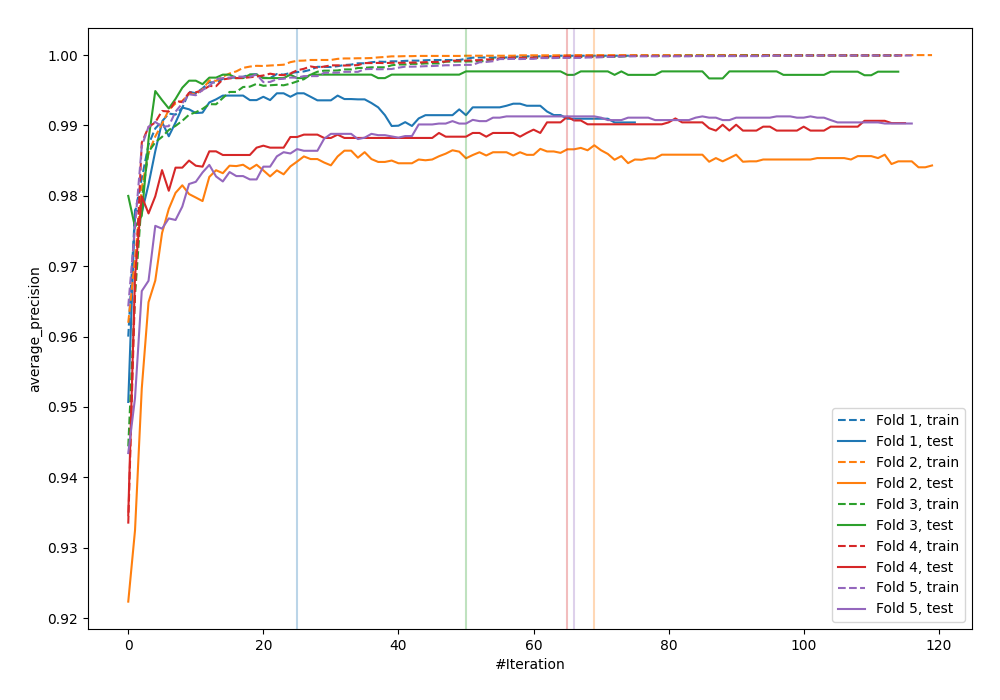
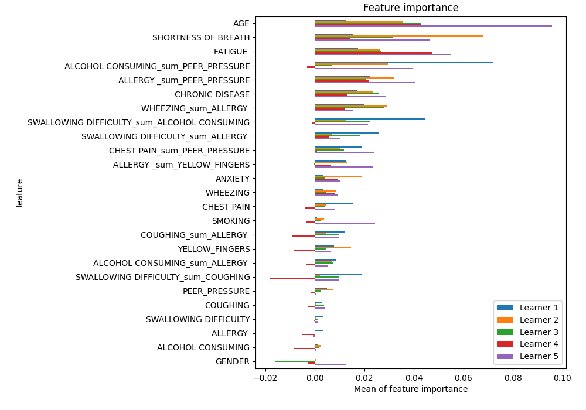
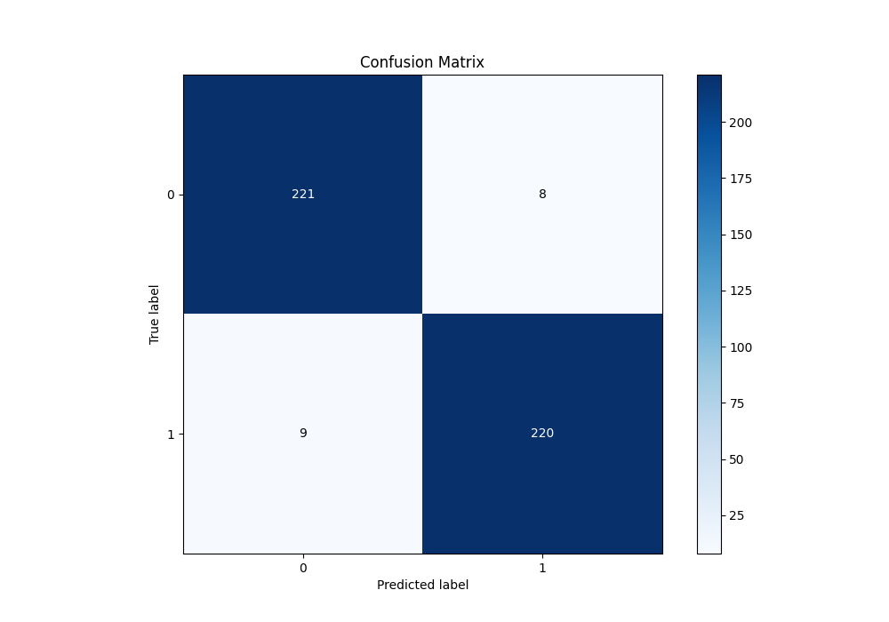
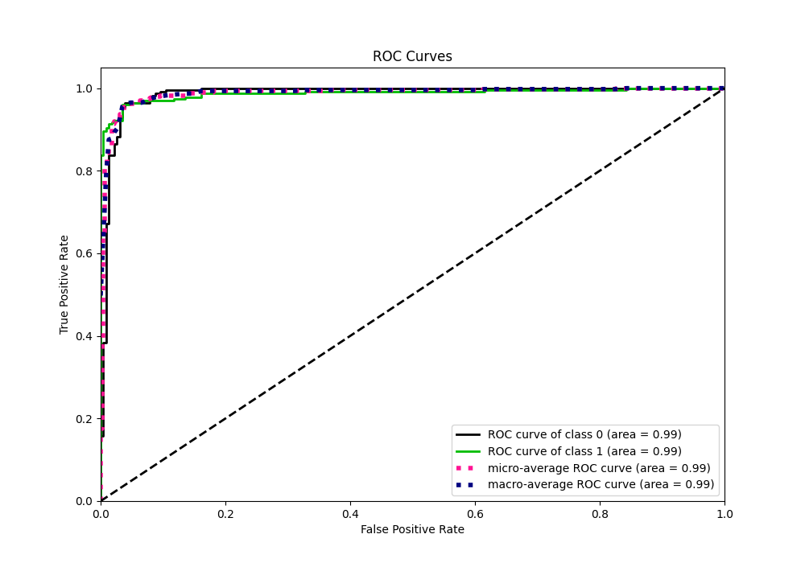
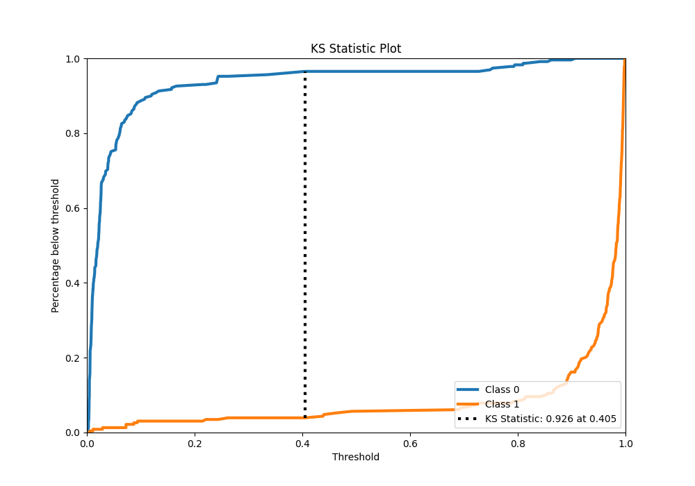
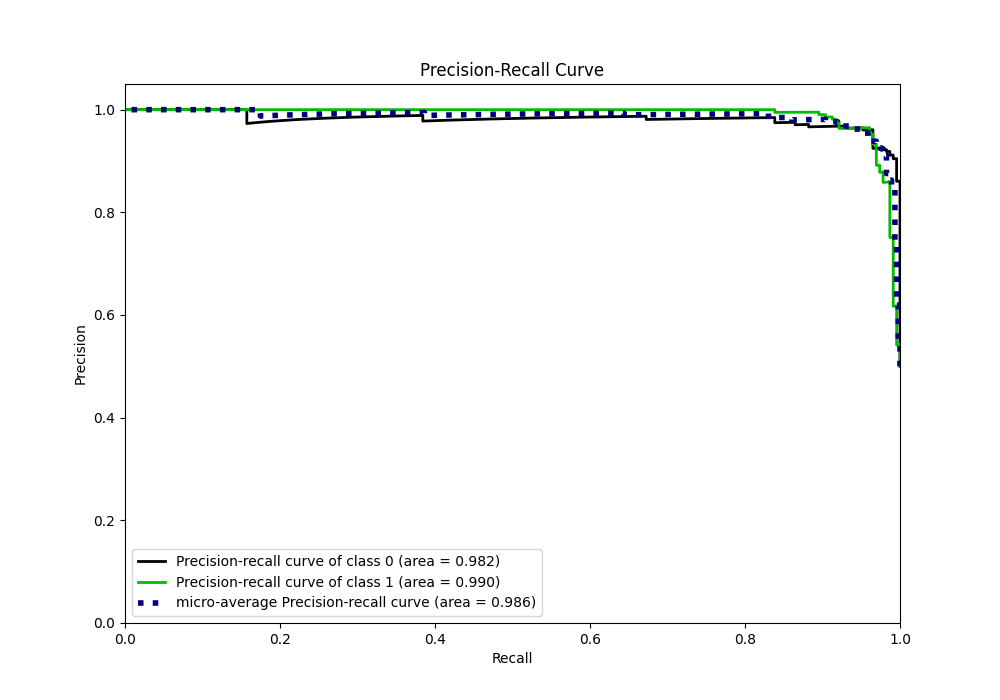
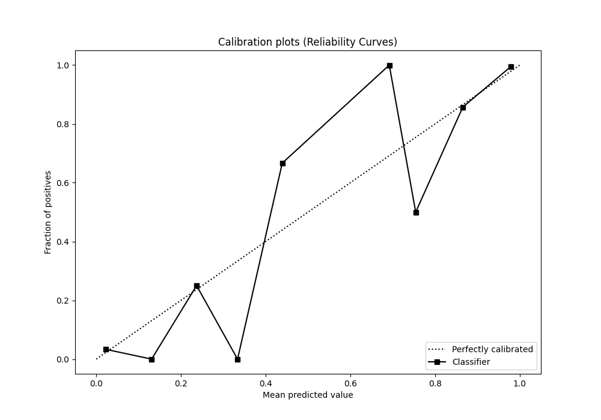
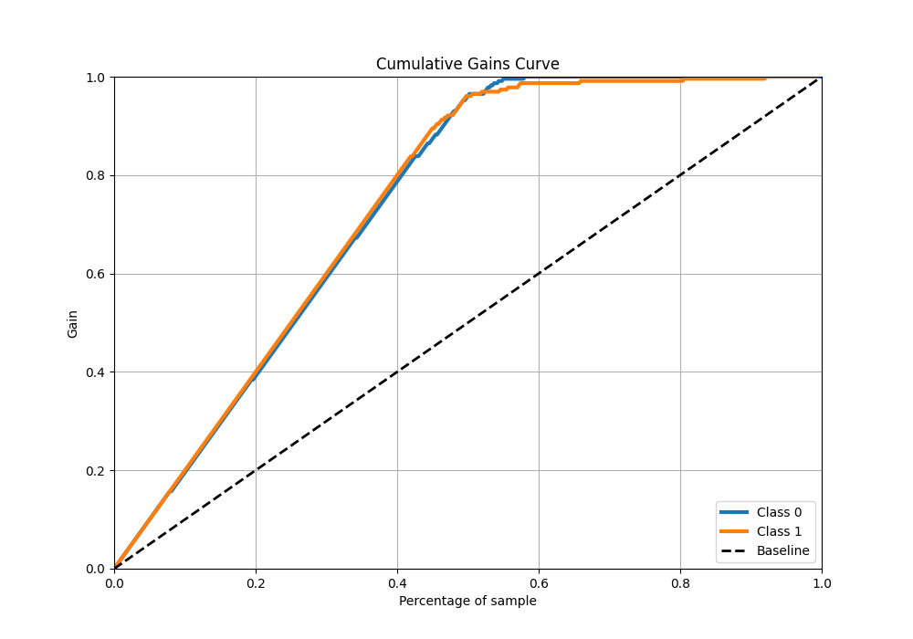
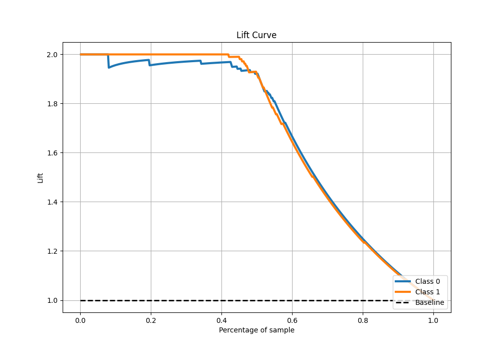

# Summary of 27_CatBoost_GoldenFeatures

[<< Go back](../README.md)

## CatBoost
- **n_jobs**: -1
- **learning_rate**: 0.1
- **depth**: 6
- **rsm**: 0.9
- **loss_function**: Logloss
- **eval_metric**: average_precision
- **explain_level**: 1

## Validation
 - **validation_type**: kfold
 - **k_folds**: 5
 - **shuffle**: True
 - **stratify**: True

## Optimized metric
average_precision

## Training time

36.2 seconds

## Metric details
|           |    score |    threshold |
|:----------|---------:|-------------:|
| logloss   | 0.133128 | nan          |
| auc       | 0.987186 | nan          |
| f1        | 0.962801 |   0.40466    |
| accuracy  | 0.962882 |   0.40466    |
| precision | 1        |   0.91199    |
| recall    | 1        |   0.00263693 |
| mcc       | 0.925773 |   0.40466    |

## Metric details with threshold from accuracy metric
|           |    score |   threshold |
|:----------|---------:|------------:|
| logloss   | 0.133128 |   nan       |
| auc       | 0.987186 |   nan       |
| f1        | 0.962801 |     0.40466 |
| accuracy  | 0.962882 |     0.40466 |
| precision | 0.964912 |     0.40466 |
| recall    | 0.960699 |     0.40466 |
| mcc       | 0.925773 |     0.40466 |

## Confusion matrix (at threshold=0.40466)
|              |   Predicted as 0 |   Predicted as 1 |
|:-------------|-----------------:|-----------------:|
| Labeled as 0 |              221 |                8 |
| Labeled as 1 |                9 |              220 |

## Learning curves

## Permutation-based Importance

## Confusion Matrix

## Normalized Confusion Matrix

## ROC Curve

## Kolmogorov-Smirnov Statistic

## Precision-Recall Curve

## Calibration Curve

## Cumulative Gains Curve

## Lift Curve

[<< Go back](../README.md)
