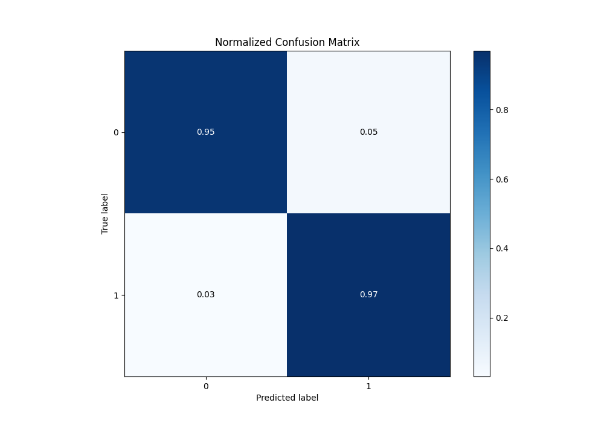

# Summary of 28_CatBoost

[<< Go back](../README.md)

## CatBoost
- **n_jobs**: -1
- **learning_rate**: 0.05
- **depth**: 8
- **rsm**: 0.7
- **loss_function**: Logloss
- **eval_metric**: average_precision
- **explain_level**: 1

## Validation
 - **validation_type**: kfold
 - **k_folds**: 5
 - **shuffle**: True
 - **stratify**: True

## Optimized metric
average_precision

## Training time

36.7 seconds

## Metric details
|           |    score |   threshold |
|:----------|---------:|------------:|
| logloss   | 0.304858 | nan         |
| auc       | 0.979196 | nan         |
| f1        | 0.95671  |   0.456     |
| accuracy  | 0.956332 |   0.456     |
| precision | 1        |   0.85841   |
| recall    | 1        |   0.0111083 |
| mcc       | 0.913221 |   0.505393  |

## Metric details with threshold from accuracy metric
|           |    score |   threshold |
|:----------|---------:|------------:|
| logloss   | 0.304858 |     nan     |
| auc       | 0.979196 |     nan     |
| f1        | 0.95671  |       0.456 |
| accuracy  | 0.956332 |       0.456 |
| precision | 0.948498 |       0.456 |
| recall    | 0.965066 |       0.456 |
| mcc       | 0.912803 |       0.456 |

## Confusion matrix (at threshold=0.456)
|              |   Predicted as 0 |   Predicted as 1 |
|:-------------|-----------------:|-----------------:|
| Labeled as 0 |              217 |               12 |
| Labeled as 1 |                8 |              221 |

## Learning curves

## Permutation-based Importance

## Confusion Matrix

## Normalized Confusion Matrix

## ROC Curve

## Kolmogorov-Smirnov Statistic

## Precision-Recall Curve

## Calibration Curve

## Cumulative Gains Curve

## Lift Curve

[<< Go back](../README.md)
