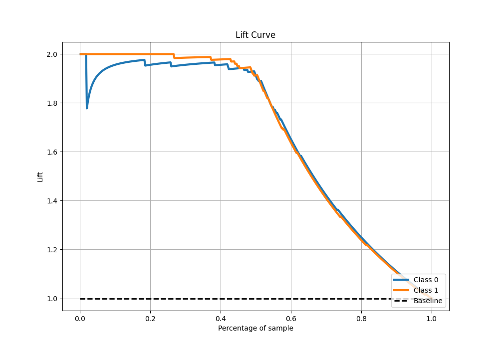

# Summary of 32_LightGBM

[<< Go back](../README.md)

## LightGBM
- **n_jobs**: -1
- **objective**: binary
- **num_leaves**: 63
- **learning_rate**: 0.05
- **feature_fraction**: 0.8
- **bagging_fraction**: 1.0
- **min_data_in_leaf**: 20
- **metric**: custom
- **custom_eval_metric_name**: average_precision
- **explain_level**: 1

## Validation
 - **validation_type**: kfold
 - **k_folds**: 5
 - **shuffle**: True
 - **stratify**: True

## Optimized metric
average_precision

## Training time

36.9 seconds

## Metric details
|           |    score |     threshold |
|:----------|---------:|--------------:|
| logloss   | 0.218303 | nan           |
| auc       | 0.982485 | nan           |
| f1        | 0.95671  |   0.479353    |
| accuracy  | 0.956332 |   0.479353    |
| precision | 1        |   0.88041     |
| recall    | 1        |   0.000316717 |
| mcc       | 0.913221 |   0.528092    |

## Metric details with threshold from accuracy metric
|           |    score |   threshold |
|:----------|---------:|------------:|
| logloss   | 0.218303 |  nan        |
| auc       | 0.982485 |  nan        |
| f1        | 0.95671  |    0.479353 |
| accuracy  | 0.956332 |    0.479353 |
| precision | 0.948498 |    0.479353 |
| recall    | 0.965066 |    0.479353 |
| mcc       | 0.912803 |    0.479353 |

## Confusion matrix (at threshold=0.479353)
|              |   Predicted as 0 |   Predicted as 1 |
|:-------------|-----------------:|-----------------:|
| Labeled as 0 |              217 |               12 |
| Labeled as 1 |                8 |              221 |

## Learning curves

## Permutation-based Importance

## Confusion Matrix

## Normalized Confusion Matrix

## ROC Curve

## Kolmogorov-Smirnov Statistic

## Precision-Recall Curve

## Calibration Curve

## Cumulative Gains Curve

## Lift Curve

[<< Go back](../README.md)
