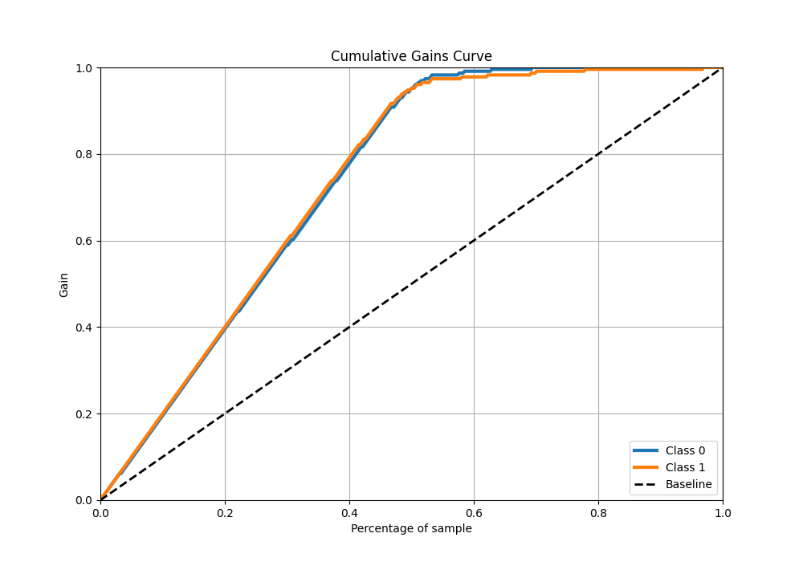

# Summary of 34_LightGBM

[<< Go back](../README.md)

## LightGBM
- **n_jobs**: -1
- **objective**: binary
- **num_leaves**: 15
- **learning_rate**: 0.05
- **feature_fraction**: 0.5
- **bagging_fraction**: 0.5
- **min_data_in_leaf**: 50
- **metric**: custom
- **custom_eval_metric_name**: average_precision
- **explain_level**: 1

## Validation
 - **validation_type**: kfold
 - **k_folds**: 5
 - **shuffle**: True
 - **stratify**: True

## Optimized metric
average_precision

## Training time

36.3 seconds

## Metric details
|           |    score |    threshold |
|:----------|---------:|-------------:|
| logloss   | 0.183978 | nan          |
| auc       | 0.982323 | nan          |
| f1        | 0.952381 |   0.417404   |
| accuracy  | 0.951965 |   0.417404   |
| precision | 1        |   0.91976    |
| recall    | 1        |   0.00294066 |
| mcc       | 0.904482 |   0.537173   |

## Metric details with threshold from accuracy metric
|           |    score |   threshold |
|:----------|---------:|------------:|
| logloss   | 0.183978 |  nan        |
| auc       | 0.982323 |  nan        |
| f1        | 0.952381 |    0.417404 |
| accuracy  | 0.951965 |    0.417404 |
| precision | 0.944206 |    0.417404 |
| recall    | 0.960699 |    0.417404 |
| mcc       | 0.904068 |    0.417404 |

## Confusion matrix (at threshold=0.417404)
|              |   Predicted as 0 |   Predicted as 1 |
|:-------------|-----------------:|-----------------:|
| Labeled as 0 |              216 |               13 |
| Labeled as 1 |                9 |              220 |

## Learning curves

## Permutation-based Importance

## Confusion Matrix

## Normalized Confusion Matrix

## ROC Curve

## Kolmogorov-Smirnov Statistic

## Precision-Recall Curve

## Calibration Curve

## Cumulative Gains Curve

## Lift Curve

[<< Go back](../README.md)
