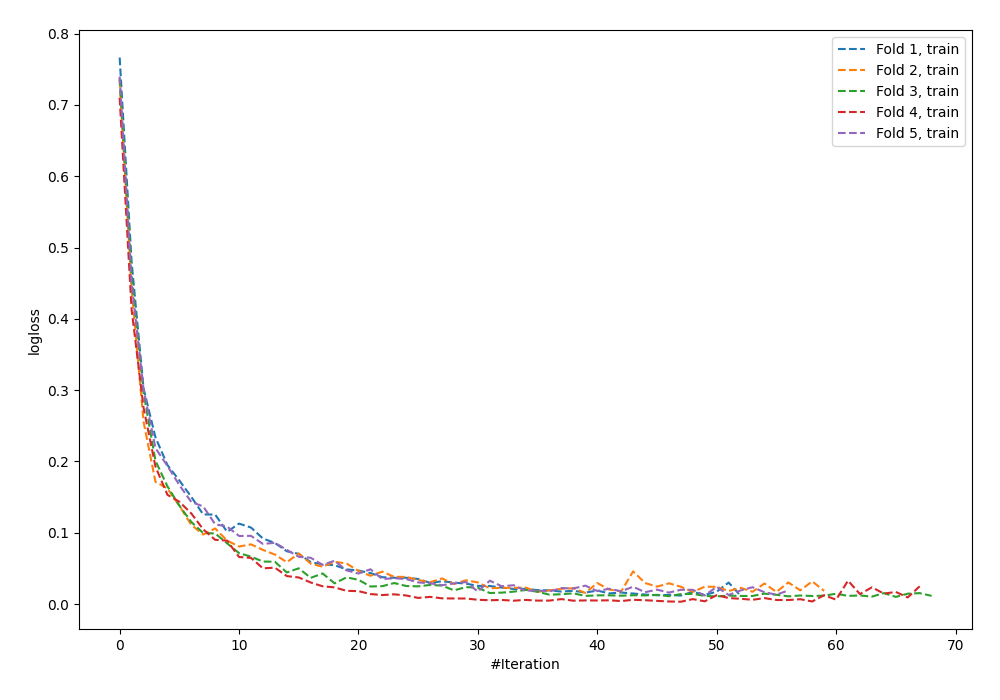
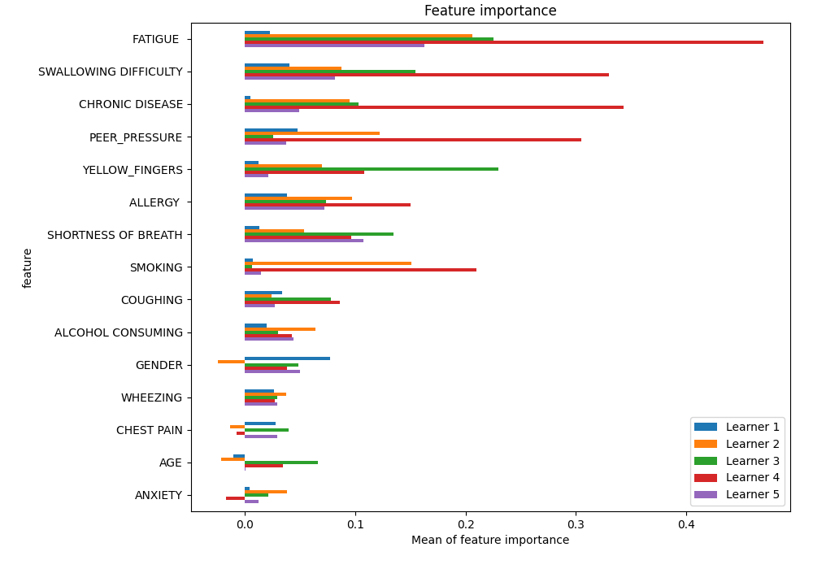
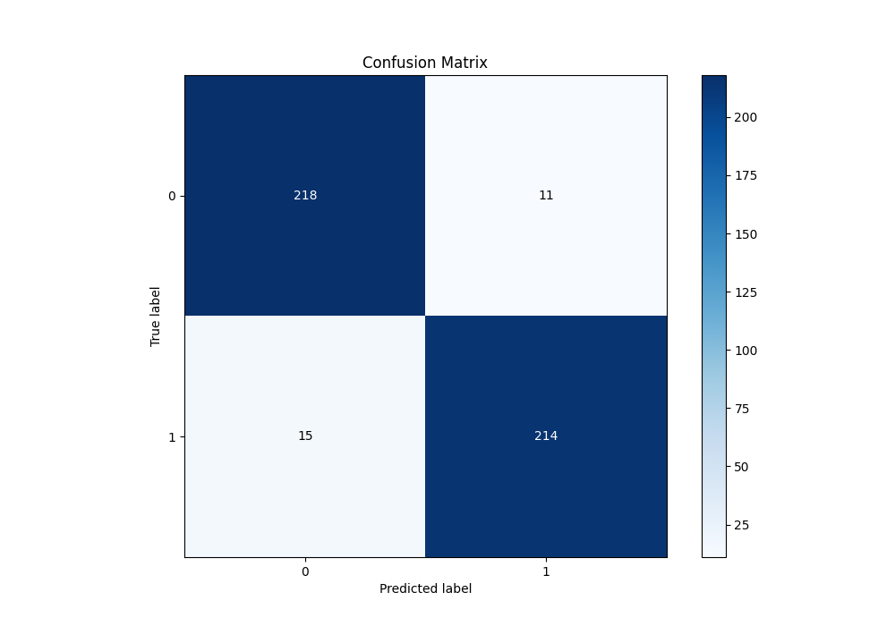
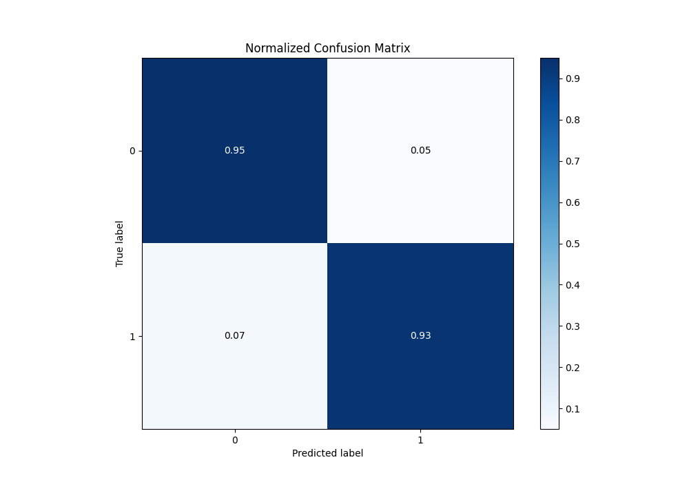
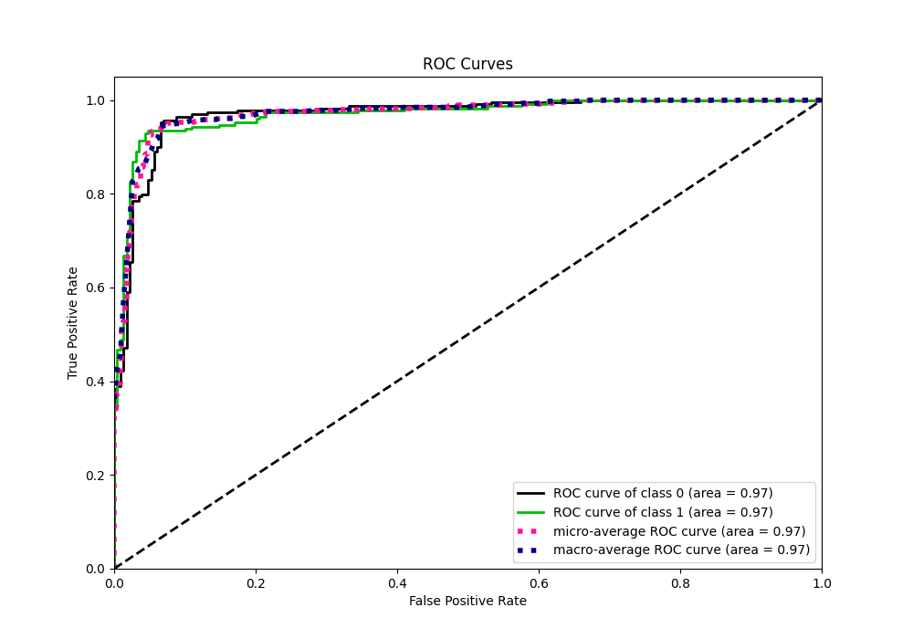
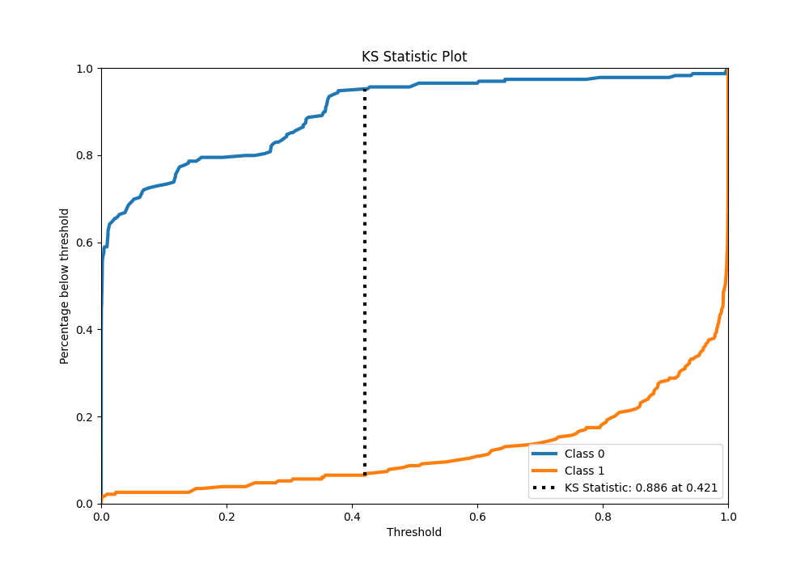
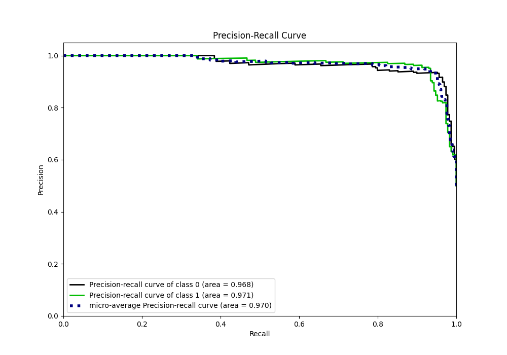
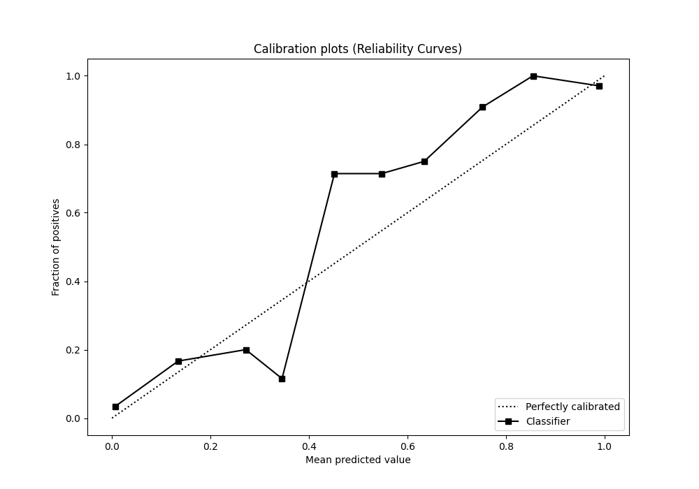
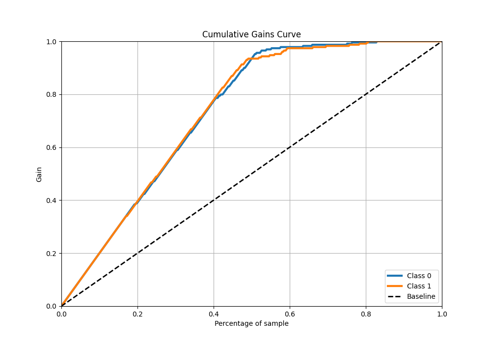
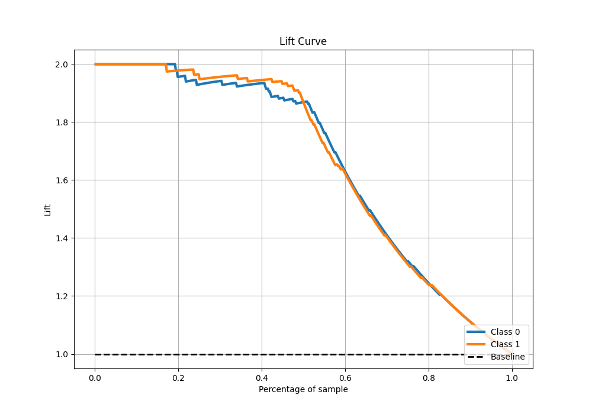

# Summary of 5_Default_NeuralNetwork

[<< Go back](../README.md)

## Neural Network
- **n_jobs**: -1
- **dense_1_size**: 32
- **dense_2_size**: 16
- **learning_rate**: 0.05
- **explain_level**: 1

## Validation
 - **validation_type**: kfold
 - **k_folds**: 5
 - **shuffle**: True
 - **stratify**: True

## Optimized metric
average_precision

## Training time

31.5 seconds

## Metric details
|           |    score |     threshold |
|:----------|---------:|--------------:|
| logloss   | 0.261498 | nan           |
| auc       | 0.969814 | nan           |
| f1        | 0.942731 |   0.422963    |
| accuracy  | 0.943231 |   0.422963    |
| precision | 1        |   0.999584    |
| recall    | 1        |   2.82294e-13 |
| mcc       | 0.886598 |   0.422963    |

## Metric details with threshold from accuracy metric
|           |    score |   threshold |
|:----------|---------:|------------:|
| logloss   | 0.261498 |  nan        |
| auc       | 0.969814 |  nan        |
| f1        | 0.942731 |    0.422963 |
| accuracy  | 0.943231 |    0.422963 |
| precision | 0.951111 |    0.422963 |
| recall    | 0.934498 |    0.422963 |
| mcc       | 0.886598 |    0.422963 |

## Confusion matrix (at threshold=0.422963)
|              |   Predicted as 0 |   Predicted as 1 |
|:-------------|-----------------:|-----------------:|
| Labeled as 0 |              218 |               11 |
| Labeled as 1 |               15 |              214 |

## Learning curves

## Permutation-based Importance

## Confusion Matrix

## Normalized Confusion Matrix

## ROC Curve

## Kolmogorov-Smirnov Statistic

## Precision-Recall Curve

## Calibration Curve

## Cumulative Gains Curve

## Lift Curve

[<< Go back](../README.md)
