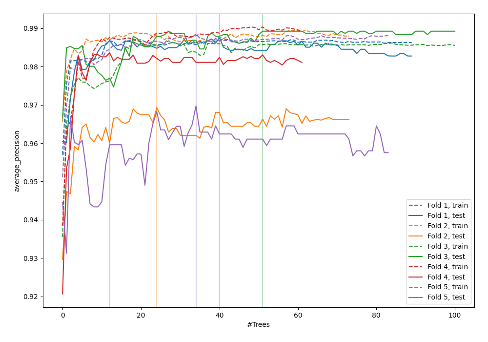
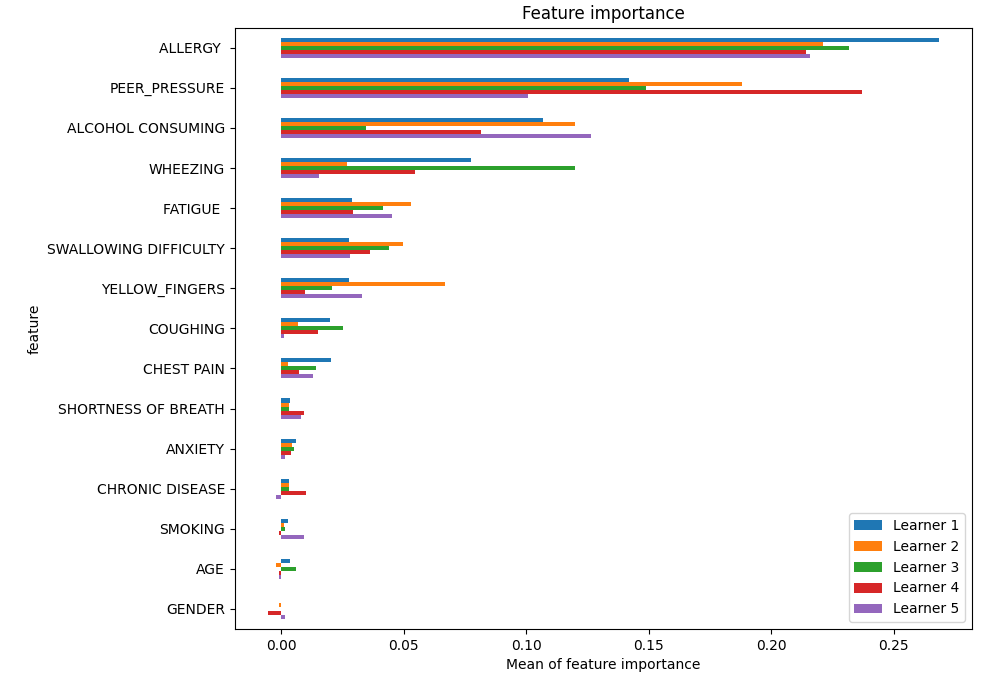
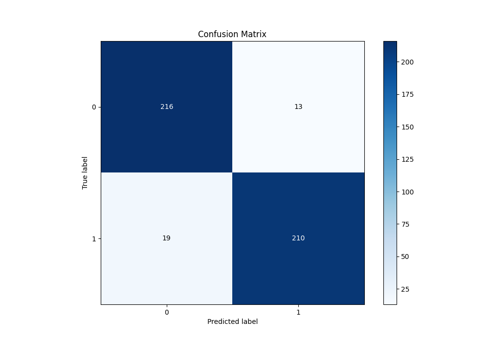
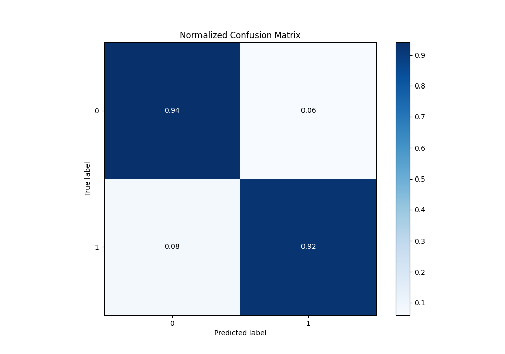
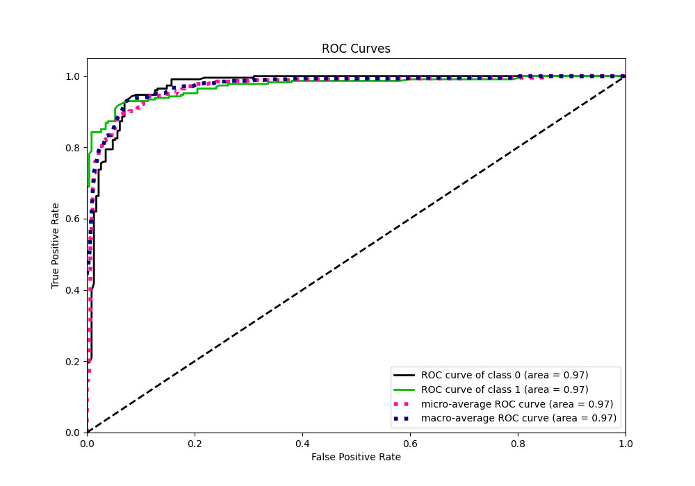
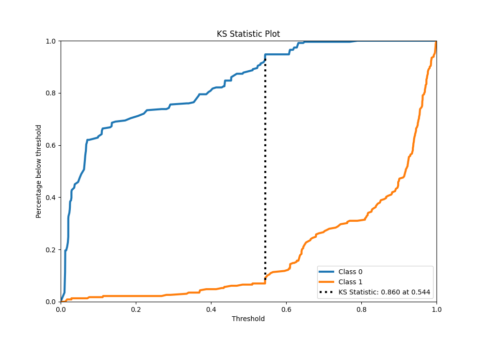
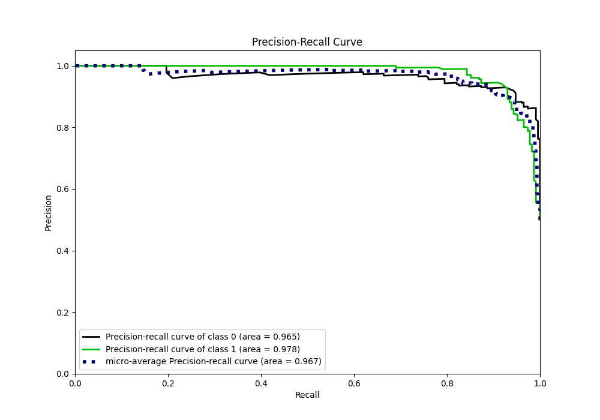
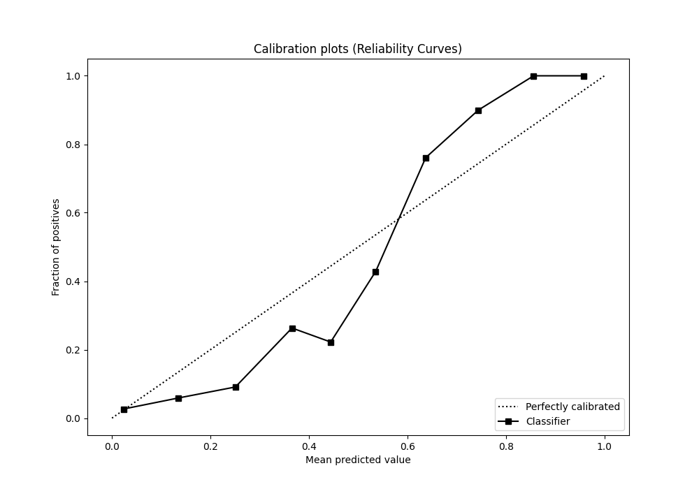
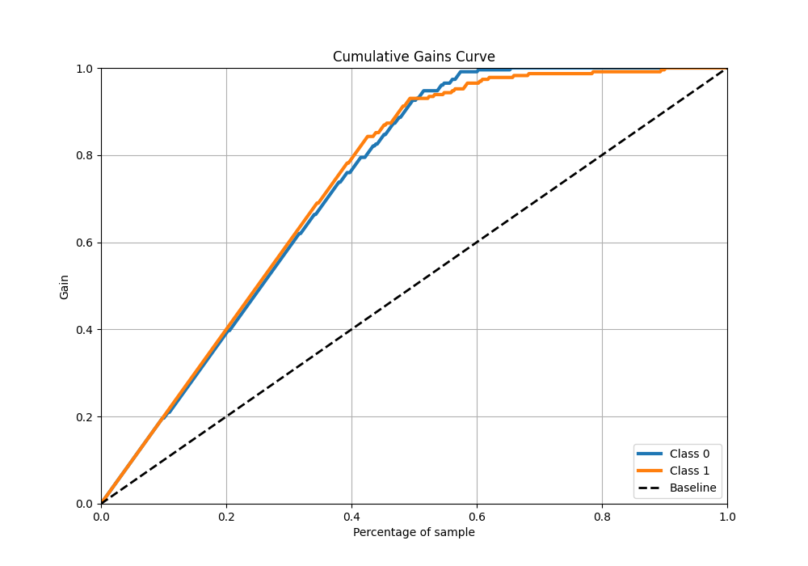
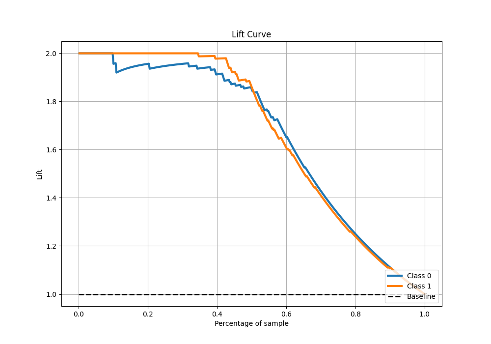

# Summary of 6_Default_RandomForest

[<< Go back](../README.md)

## Random Forest
- **n_jobs**: -1
- **criterion**: gini
- **max_features**: 0.9
- **min_samples_split**: 30
- **max_depth**: 4
- **eval_metric_name**: average_precision
- **explain_level**: 1

## Validation
 - **validation_type**: kfold
 - **k_folds**: 5
 - **shuffle**: True
 - **stratify**: True

## Optimized metric
average_precision

## Training time

35.0 seconds

## Metric details
|           |    score |    threshold |
|:----------|---------:|-------------:|
| logloss   | 0.244857 | nan          |
| auc       | 0.973008 | nan          |
| f1        | 0.929204 |   0.543938   |
| accuracy  | 0.930131 |   0.543938   |
| precision | 1        |   0.809828   |
| recall    | 1        |   0.00924381 |
| mcc       | 0.860557 |   0.543938   |

## Metric details with threshold from accuracy metric
|           |    score |   threshold |
|:----------|---------:|------------:|
| logloss   | 0.244857 |  nan        |
| auc       | 0.973008 |  nan        |
| f1        | 0.929204 |    0.543938 |
| accuracy  | 0.930131 |    0.543938 |
| precision | 0.941704 |    0.543938 |
| recall    | 0.917031 |    0.543938 |
| mcc       | 0.860557 |    0.543938 |

## Confusion matrix (at threshold=0.543938)
|              |   Predicted as 0 |   Predicted as 1 |
|:-------------|-----------------:|-----------------:|
| Labeled as 0 |              216 |               13 |
| Labeled as 1 |               19 |              210 |

## Learning curves

## Permutation-based Importance

## Confusion Matrix

## Normalized Confusion Matrix

## ROC Curve

## Kolmogorov-Smirnov Statistic

## Precision-Recall Curve

## Calibration Curve

## Cumulative Gains Curve

## Lift Curve

[<< Go back](../README.md)
