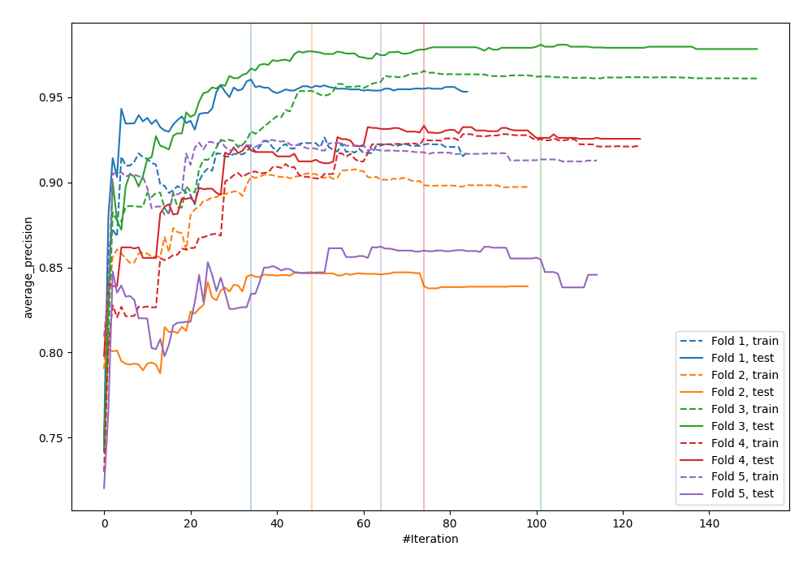
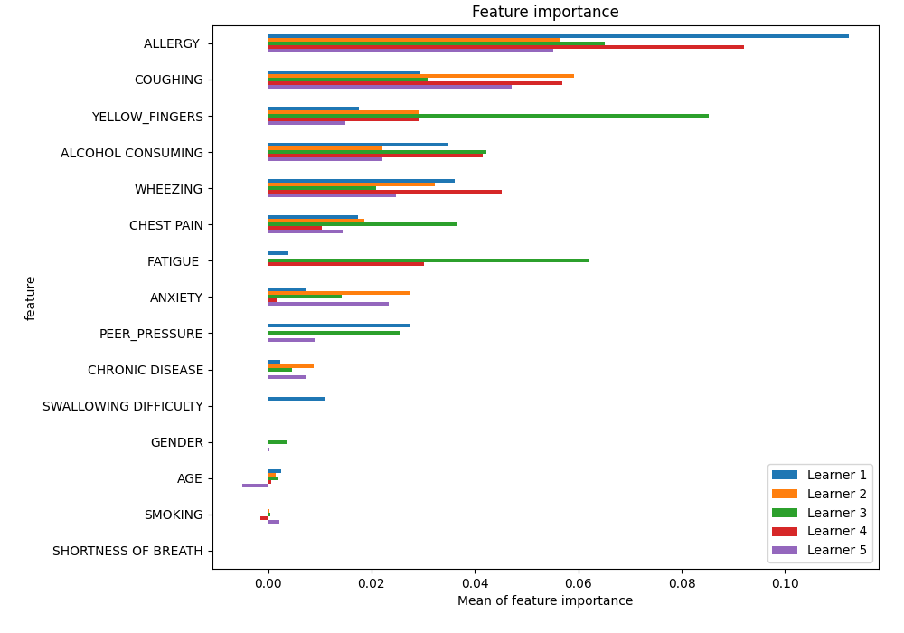
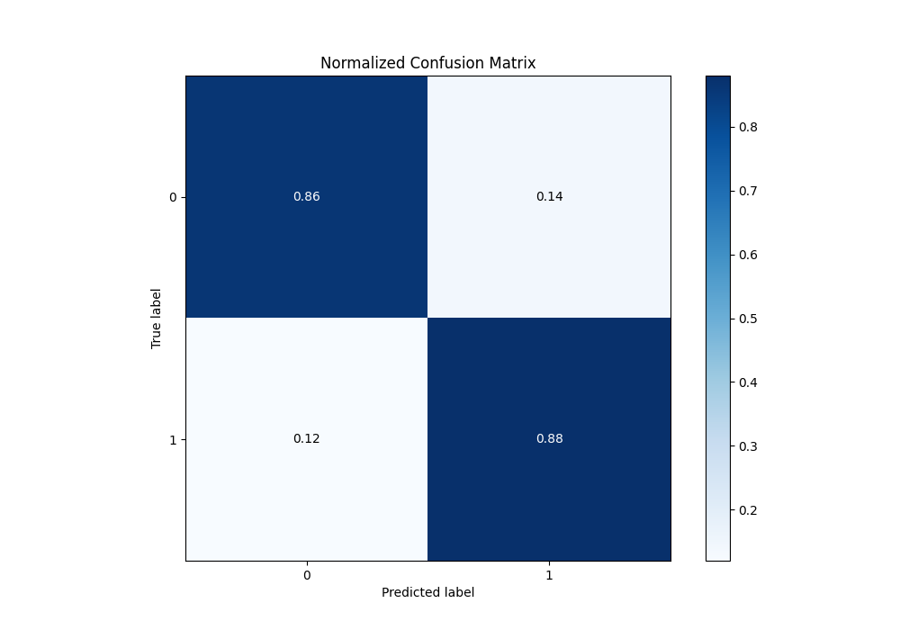
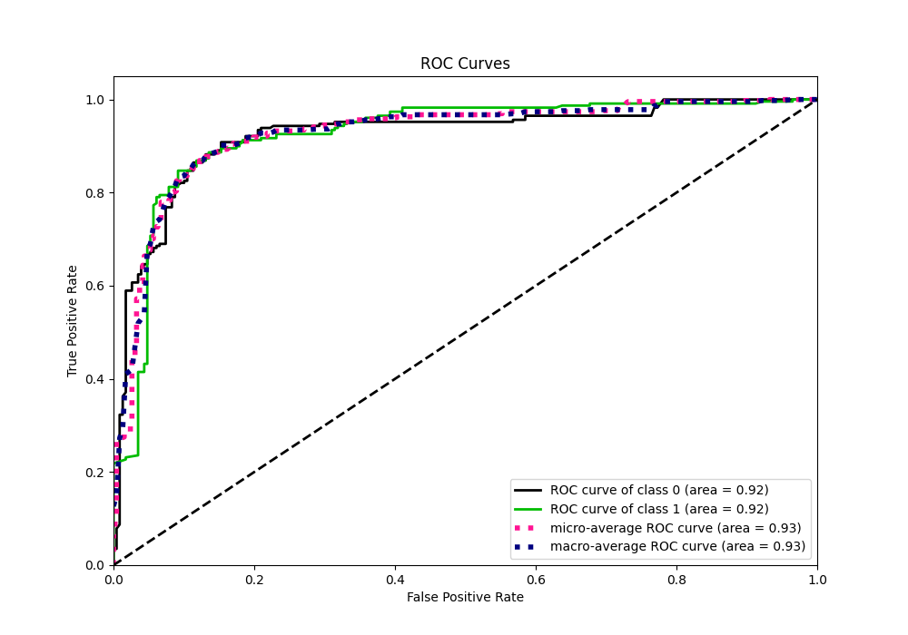
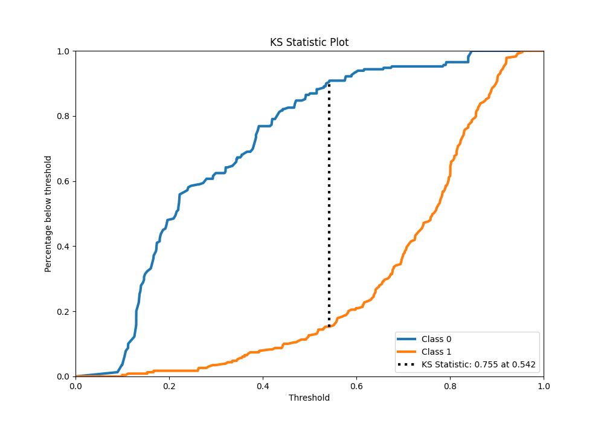
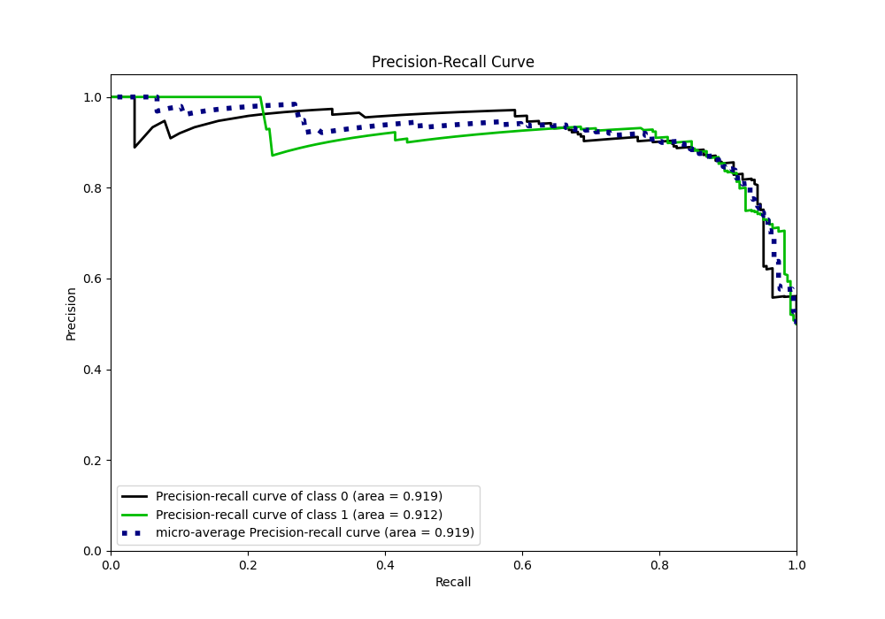
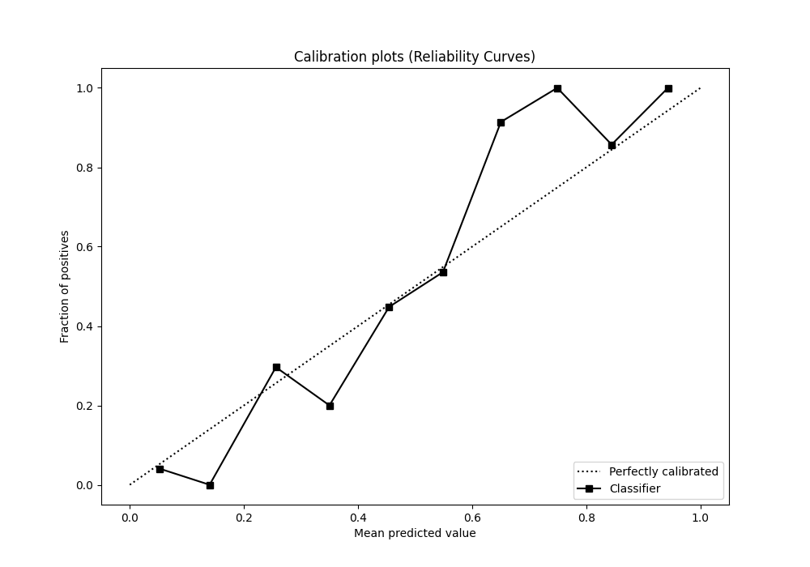
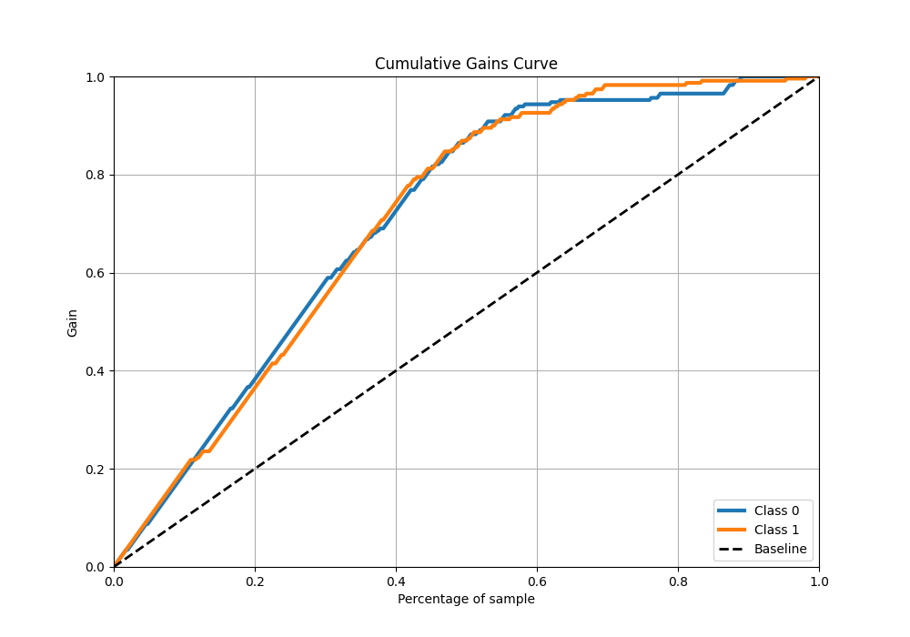
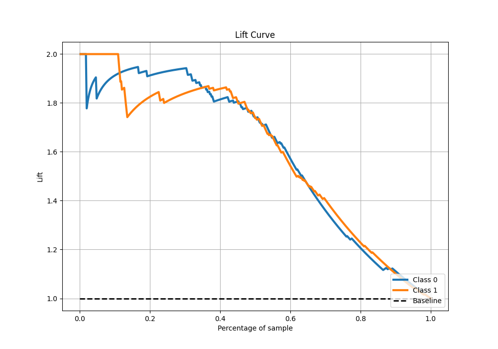

# Summary of 9_Xgboost

[<< Go back](../README.md)

## Extreme Gradient Boosting (Xgboost)
- **n_jobs**: -1
- **objective**: binary:logistic
- **eta**: 0.1
- **max_depth**: 7
- **min_child_weight**: 25
- **subsample**: 0.9
- **colsample_bytree**: 0.6
- **eval_metric**: average_precision
- **explain_level**: 1

## Validation
 - **validation_type**: kfold
 - **k_folds**: 5
 - **shuffle**: True
 - **stratify**: True

## Optimized metric
average_precision

## Training time

34.1 seconds

## Metric details
|           |    score |   threshold |
|:----------|---------:|------------:|
| logloss   | 0.389888 | nan         |
| auc       | 0.923438 | nan         |
| f1        | 0.874459 |   0.496016  |
| accuracy  | 0.873362 |   0.496016  |
| precision | 0.933333 |   0.678531  |
| recall    | 1        |   0.0807524 |
| mcc       | 0.748554 |   0.555026  |

## Metric details with threshold from accuracy metric
|           |    score |   threshold |
|:----------|---------:|------------:|
| logloss   | 0.389888 |  nan        |
| auc       | 0.923438 |  nan        |
| f1        | 0.874459 |    0.496016 |
| accuracy  | 0.873362 |    0.496016 |
| precision | 0.866953 |    0.496016 |
| recall    | 0.882096 |    0.496016 |
| mcc       | 0.746839 |    0.496016 |

## Confusion matrix (at threshold=0.496016)
|              |   Predicted as 0 |   Predicted as 1 |
|:-------------|-----------------:|-----------------:|
| Labeled as 0 |              198 |               31 |
| Labeled as 1 |               27 |              202 |

## Learning curves

## Permutation-based Importance

## Confusion Matrix

## Normalized Confusion Matrix

## ROC Curve

## Kolmogorov-Smirnov Statistic

## Precision-Recall Curve

## Calibration Curve

## Cumulative Gains Curve

## Lift Curve

[<< Go back](../README.md)
