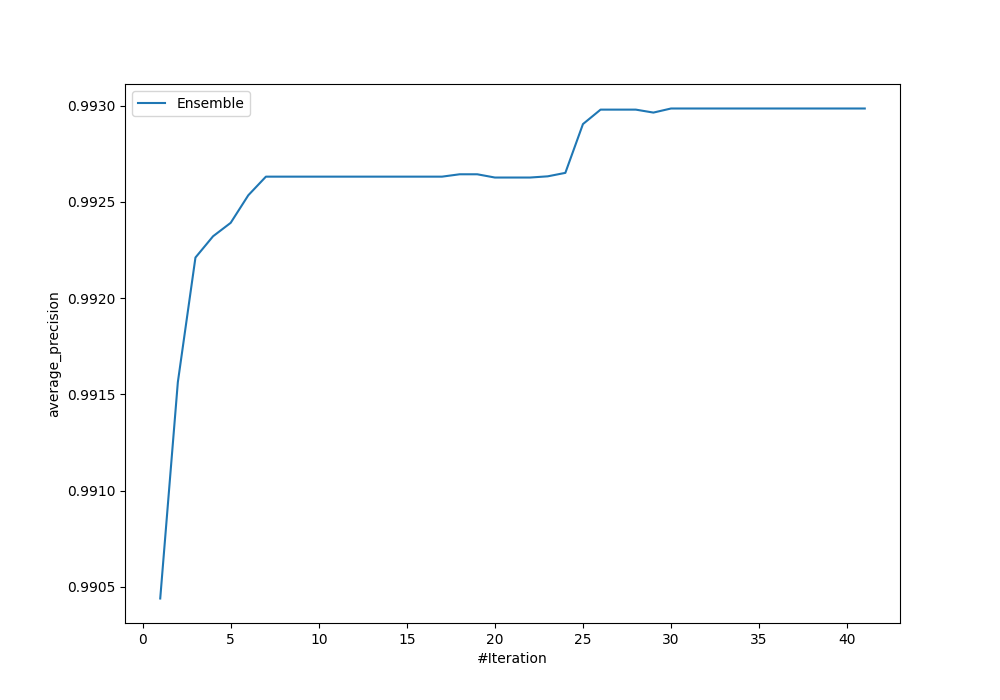
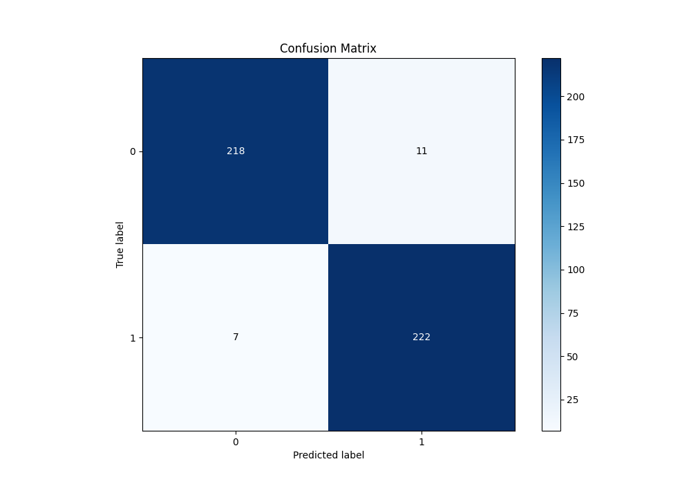
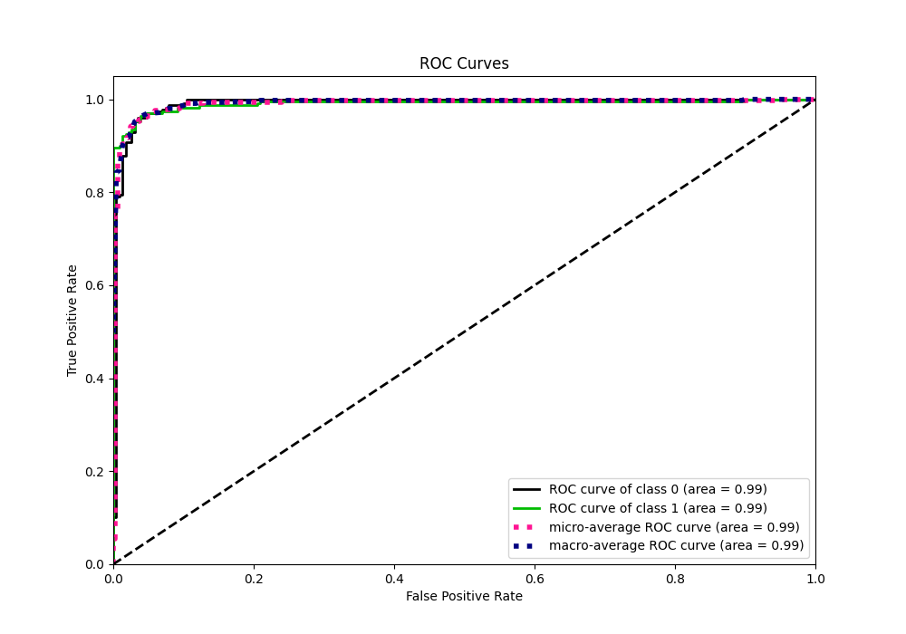
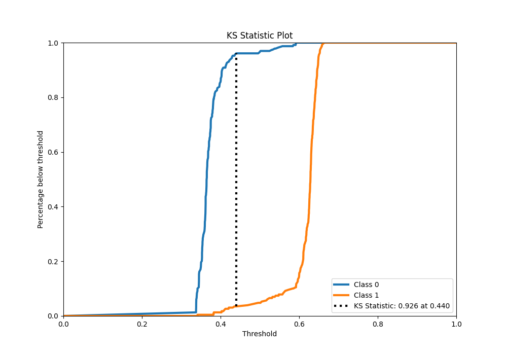
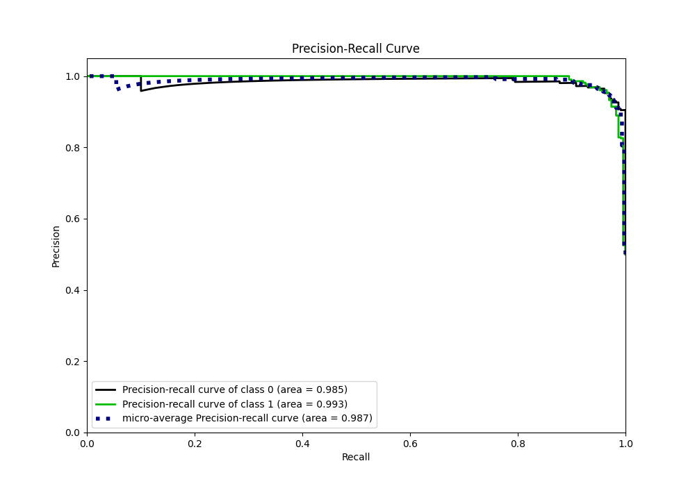
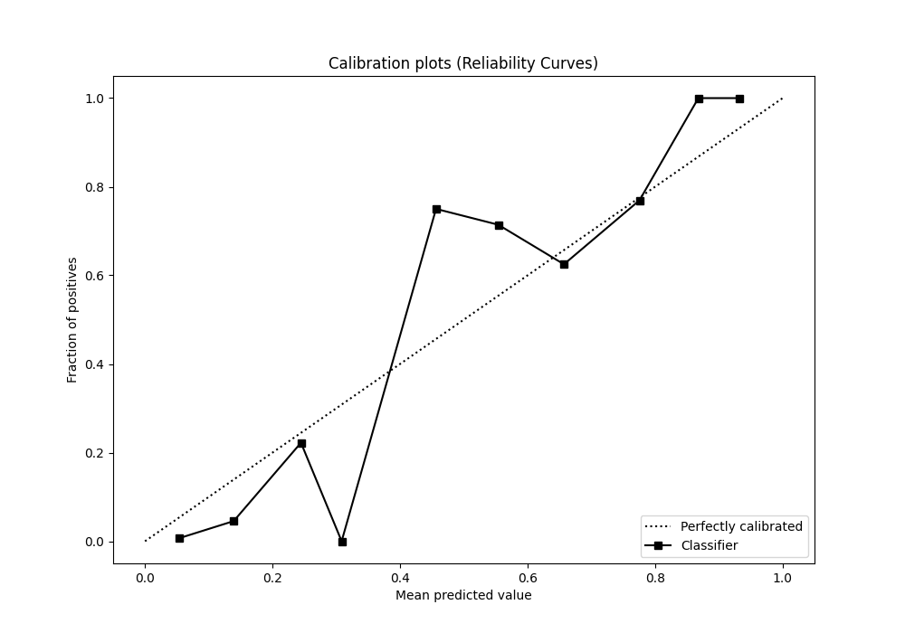
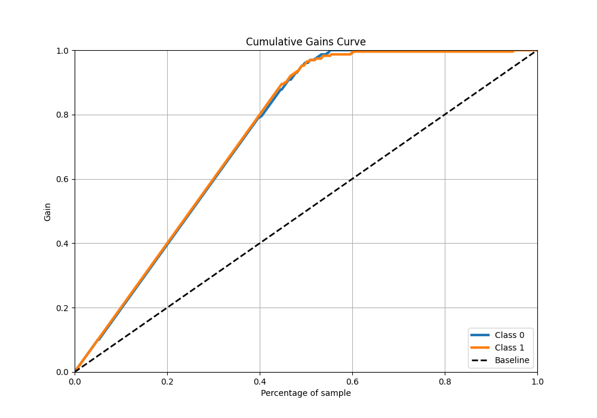
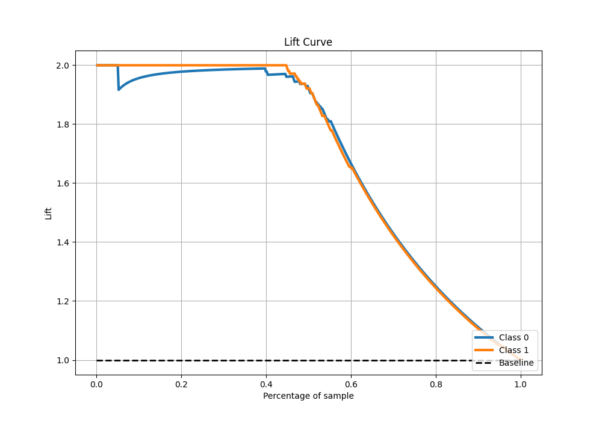

# Summary of Ensemble

[<< Go back](../README.md)

## Ensemble structure
| Model                             |   Weight |
|:----------------------------------|---------:|
| 10_Xgboost                        |       19 |
| 27_CatBoost_GoldenFeatures        |        1 |
| 29_CatBoost                       |        4 |
| 36_CatBoost_GoldenFeatures        |        3 |
| 4_Default_CatBoost_GoldenFeatures |        2 |
| 5_Default_NeuralNetwork           |        1 |

## Metric details
|           |    score |   threshold |
|:----------|---------:|------------:|
| logloss   | 0.481864 |  nan        |
| auc       | 0.990752 |  nan        |
| f1        | 0.961039 |    0.433141 |
| accuracy  | 0.960699 |    0.433141 |
| precision | 1        |    0.592046 |
| recall    | 1        |    0.303875 |
| mcc       | 0.921538 |    0.433141 |

## Metric details with threshold from accuracy metric
|           |    score |   threshold |
|:----------|---------:|------------:|
| logloss   | 0.481864 |  nan        |
| auc       | 0.990752 |  nan        |
| f1        | 0.961039 |    0.433141 |
| accuracy  | 0.960699 |    0.433141 |
| precision | 0.95279  |    0.433141 |
| recall    | 0.969432 |    0.433141 |
| mcc       | 0.921538 |    0.433141 |

## Confusion matrix (at threshold=0.433141)
|              |   Predicted as 0 |   Predicted as 1 |
|:-------------|-----------------:|-----------------:|
| Labeled as 0 |              218 |               11 |
| Labeled as 1 |                7 |              222 |

## Learning curves

## Confusion Matrix

## Normalized Confusion Matrix

## ROC Curve

## Kolmogorov-Smirnov Statistic

## Precision-Recall Curve

## Calibration Curve

## Cumulative Gains Curve

## Lift Curve

[<< Go back](../README.md)
