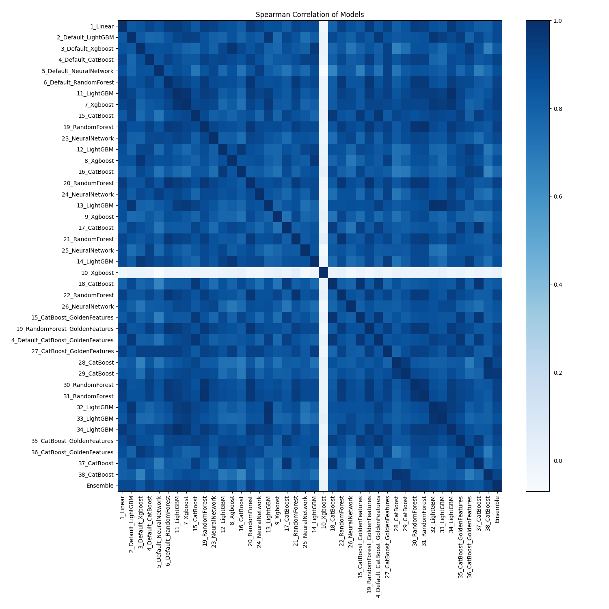

# AutoML Leaderboard

| Best model   | name                                                                             | model_type     | metric_type       |   metric_value |   train_time |   single_prediction_time |
|:-------------|:---------------------------------------------------------------------------------|:---------------|:------------------|---------------:|-------------:|-------------------------:|
|              | [1_Linear](1_Linear/README.md)                                                   | Linear         | average_precision |       0.981151 |        37.12 |                   0.0285 |
|              | [2_Default_LightGBM](2_Default_LightGBM/README.md)                               | LightGBM       | average_precision |       0.984335 |        33.85 |                   0.0133 |
|              | [3_Default_Xgboost](3_Default_Xgboost/README.md)                                 | Xgboost        | average_precision |       0.979549 |        33.35 |                   0.0228 |
|              | [4_Default_CatBoost](4_Default_CatBoost/README.md)                               | CatBoost       | average_precision |       0.987349 |        34.17 |                   0.0333 |
|              | [5_Default_NeuralNetwork](5_Default_NeuralNetwork/README.md)                     | Neural Network | average_precision |       0.971355 |        32.2  |                   0.0405 |
|              | [6_Default_RandomForest](6_Default_RandomForest/README.md)                       | Random Forest  | average_precision |       0.978456 |        35.77 |                   0.1487 |
|              | [11_LightGBM](11_LightGBM/README.md)                                             | LightGBM       | average_precision |       0.984562 |        34.78 |                   0.0148 |
|              | [7_Xgboost](7_Xgboost/README.md)                                                 | Xgboost        | average_precision |       0.981538 |        35.11 |                   0.0137 |
|              | [15_CatBoost](15_CatBoost/README.md)                                             | CatBoost       | average_precision |       0.988065 |        35.58 |                   0.0174 |
|              | [19_RandomForest](19_RandomForest/README.md)                                     | Random Forest  | average_precision |       0.987365 |        38.27 |                   0.1872 |
|              | [23_NeuralNetwork](23_NeuralNetwork/README.md)                                   | Neural Network | average_precision |       0.978522 |        32.79 |                   0.0313 |
|              | [12_LightGBM](12_LightGBM/README.md)                                             | LightGBM       | average_precision |       0.981605 |        34.55 |                   0.0182 |
|              | [8_Xgboost](8_Xgboost/README.md)                                                 | Xgboost        | average_precision |       0.979431 |        33.48 |                   0.0192 |
|              | [16_CatBoost](16_CatBoost/README.md)                                             | CatBoost       | average_precision |       0.981597 |        36.16 |                   0.0246 |
|              | [20_RandomForest](20_RandomForest/README.md)                                     | Random Forest  | average_precision |       0.984126 |        37.24 |                   0.1341 |
|              | [24_NeuralNetwork](24_NeuralNetwork/README.md)                                   | Neural Network | average_precision |       0.976907 |        34.78 |                   0.037  |
|              | [13_LightGBM](13_LightGBM/README.md)                                             | LightGBM       | average_precision |       0.985243 |        35.9  |                   0.0128 |
|              | [9_Xgboost](9_Xgboost/README.md)                                                 | Xgboost        | average_precision |       0.911635 |        34.94 |                   0.0144 |
|              | [17_CatBoost](17_CatBoost/README.md)                                             | CatBoost       | average_precision |       0.980034 |        36.34 |                   0.0179 |
|              | [21_RandomForest](21_RandomForest/README.md)                                     | Random Forest  | average_precision |       0.968446 |        39.55 |                   0.1381 |
|              | [25_NeuralNetwork](25_NeuralNetwork/README.md)                                   | Neural Network | average_precision |       0.969369 |        34.73 |                   0.0367 |
|              | [14_LightGBM](14_LightGBM/README.md)                                             | LightGBM       | average_precision |       0.982671 |        36.43 |                   0.0127 |
|              | [10_Xgboost](10_Xgboost/README.md)                                               | Xgboost        | average_precision |       0.500365 |        33.86 |                   0.0145 |
|              | [18_CatBoost](18_CatBoost/README.md)                                             | CatBoost       | average_precision |       0.985217 |        36.49 |                   0.0169 |
|              | [22_RandomForest](22_RandomForest/README.md)                                     | Random Forest  | average_precision |       0.973307 |        38.21 |                   0.1672 |
|              | [26_NeuralNetwork](26_NeuralNetwork/README.md)                                   | Neural Network | average_precision |       0.97895  |        34.08 |                   0.0343 |
|              | [15_CatBoost_GoldenFeatures](15_CatBoost_GoldenFeatures/README.md)               | CatBoost       | average_precision |       0.987348 |        39.45 |                   0.0404 |
|              | [19_RandomForest_GoldenFeatures](19_RandomForest_GoldenFeatures/README.md)       | Random Forest  | average_precision |       0.981939 |        40.23 |                   0.1546 |
|              | [4_Default_CatBoost_GoldenFeatures](4_Default_CatBoost_GoldenFeatures/README.md) | CatBoost       | average_precision |       0.989526 |        37.73 |                   0.0374 |
|              | [27_CatBoost_GoldenFeatures](27_CatBoost_GoldenFeatures/README.md)               | CatBoost       | average_precision |       0.99044  |        37.09 |                   0.0348 |
|              | [28_CatBoost](28_CatBoost/README.md)                                             | CatBoost       | average_precision |       0.97874  |        37.51 |                   0.013  |
|              | [29_CatBoost](29_CatBoost/README.md)                                             | CatBoost       | average_precision |       0.990262 |        38.18 |                   0.0183 |
|              | [30_RandomForest](30_RandomForest/README.md)                                     | Random Forest  | average_precision |       0.986077 |        40.24 |                   0.1715 |
|              | [31_RandomForest](31_RandomForest/README.md)                                     | Random Forest  | average_precision |       0.985326 |        40.35 |                   0.1417 |
|              | [32_LightGBM](32_LightGBM/README.md)                                             | LightGBM       | average_precision |       0.985875 |        37.62 |                   0.0113 |
|              | [33_LightGBM](33_LightGBM/README.md)                                             | LightGBM       | average_precision |       0.984718 |        37.79 |                   0.0159 |
|              | [34_LightGBM](34_LightGBM/README.md)                                             | LightGBM       | average_precision |       0.9859   |        37.05 |                   0.0113 |
|              | [35_CatBoost_GoldenFeatures](35_CatBoost_GoldenFeatures/README.md)               | CatBoost       | average_precision |       0.989239 |        38.26 |                   0.0364 |
|              | [36_CatBoost_GoldenFeatures](36_CatBoost_GoldenFeatures/README.md)               | CatBoost       | average_precision |       0.986614 |        39.03 |                   0.0388 |
|              | [37_CatBoost](37_CatBoost/README.md)                                             | CatBoost       | average_precision |       0.985173 |        38.25 |                   0.0144 |
|              | [38_CatBoost](38_CatBoost/README.md)                                             | CatBoost       | average_precision |       0.981361 |        39.14 |                   0.0157 |
| **the best** | [Ensemble](Ensemble/README.md)                                                   | Ensemble       | average_precision |       0.992985 |         2.69 |                   0.1873 |

### AutoML Performance

### AutoML Performance Boxplot

### Features Importance

### Spearman Correlation of Models

