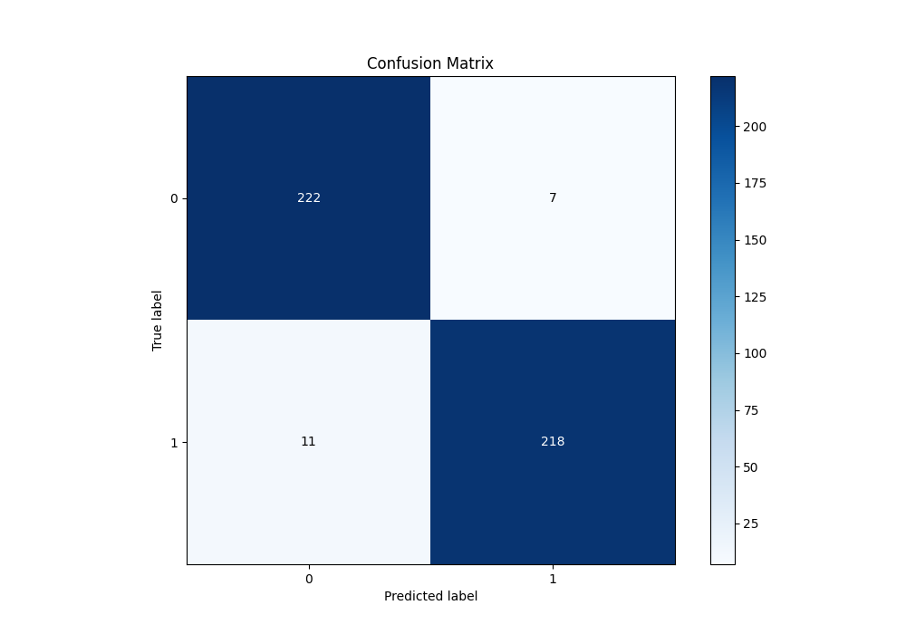
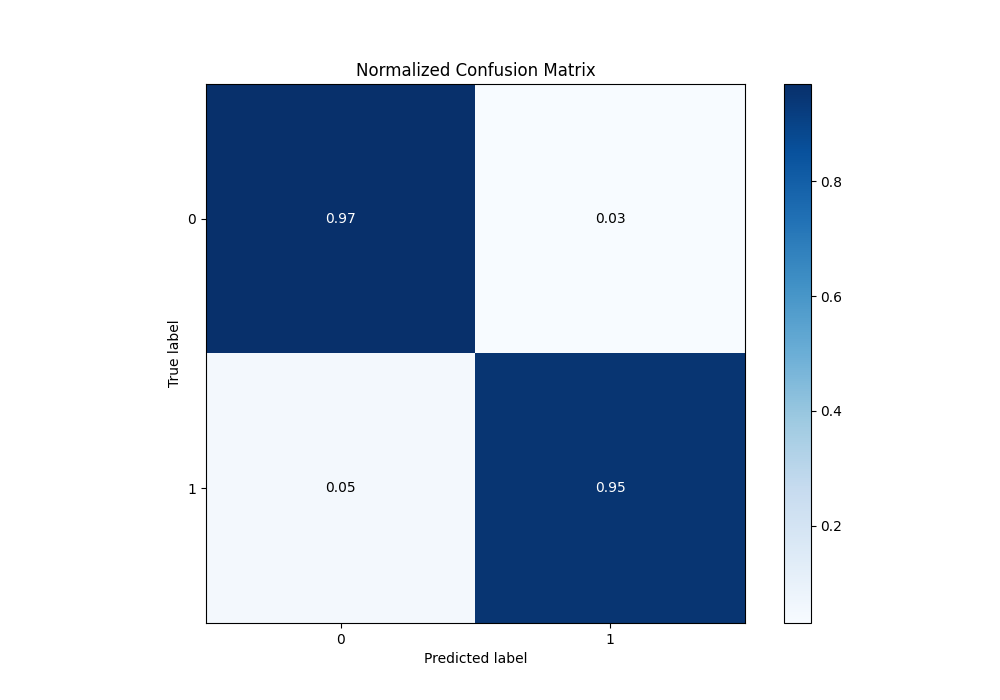

# Summary of 12_LightGBM_RandomFeature

[<< Go back](../README.md)

## LightGBM
- **n_jobs**: -1
- **objective**: binary
- **num_leaves**: 63
- **learning_rate**: 0.2
- **feature_fraction**: 0.5
- **bagging_fraction**: 1.0
- **min_data_in_leaf**: 10
- **metric**: custom
- **custom_eval_metric_name**: f1
- **explain_level**: 1

## Validation
 - **validation_type**: kfold
 - **k_folds**: 5
 - **shuffle**: True
 - **stratify**: True

## Optimized metric
f1

## Training time

18.3 seconds

## Metric details
|           |    score |     threshold |
|:----------|---------:|--------------:|
| logloss   | 0.243977 | nan           |
| auc       | 0.975191 | nan           |
| f1        | 0.960352 |   0.483092    |
| accuracy  | 0.960699 |   0.483092    |
| precision | 0.993464 |   0.762315    |
| recall    | 1        |   0.000145718 |
| mcc       | 0.92196  |   0.522099    |

## Metric details with threshold from accuracy metric
|           |    score |   threshold |
|:----------|---------:|------------:|
| logloss   | 0.243977 |  nan        |
| auc       | 0.975191 |  nan        |
| f1        | 0.960352 |    0.483092 |
| accuracy  | 0.960699 |    0.483092 |
| precision | 0.968889 |    0.483092 |
| recall    | 0.951965 |    0.483092 |
| mcc       | 0.921538 |    0.483092 |

## Confusion matrix (at threshold=0.483092)
|              |   Predicted as 0 |   Predicted as 1 |
|:-------------|-----------------:|-----------------:|
| Labeled as 0 |              222 |                7 |
| Labeled as 1 |               11 |              218 |

## Learning curves

## Permutation-based Importance

## Confusion Matrix

## Normalized Confusion Matrix

## ROC Curve

## Kolmogorov-Smirnov Statistic

## Precision-Recall Curve

## Calibration Curve

## Cumulative Gains Curve

## Lift Curve

[<< Go back](../README.md)
