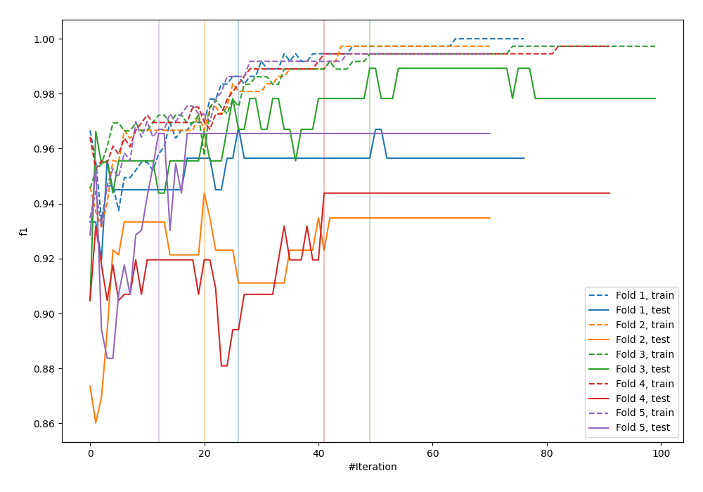
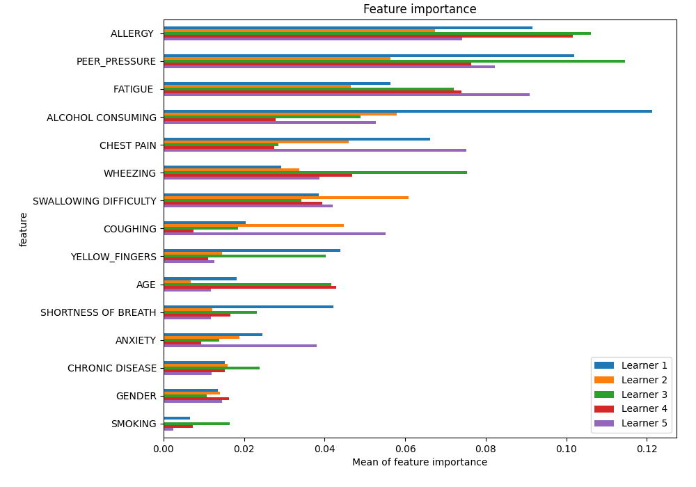
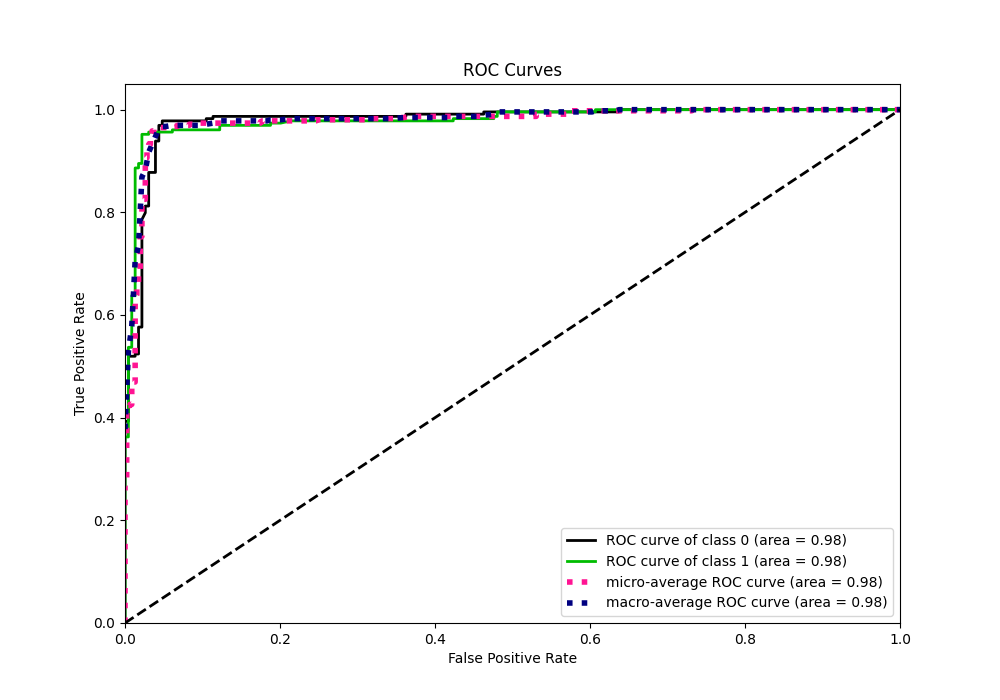
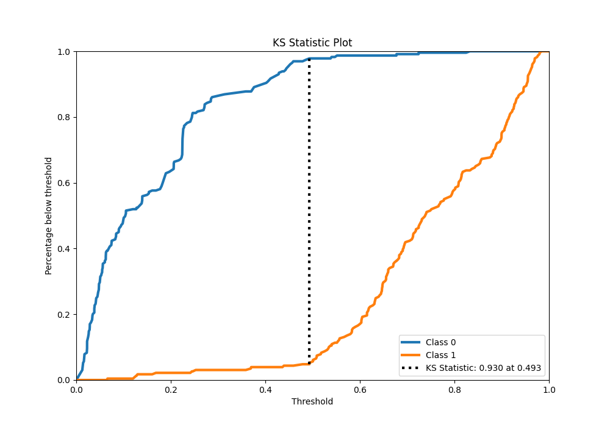
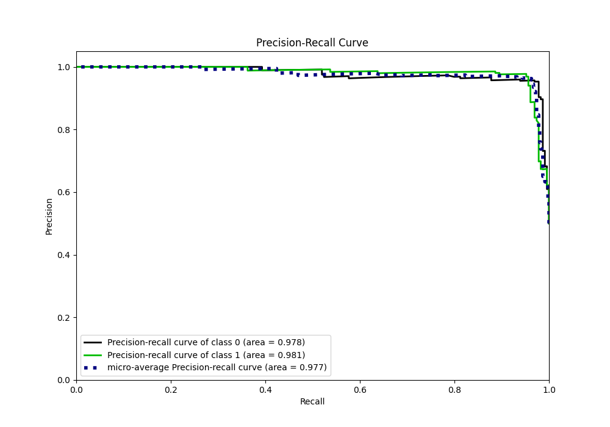
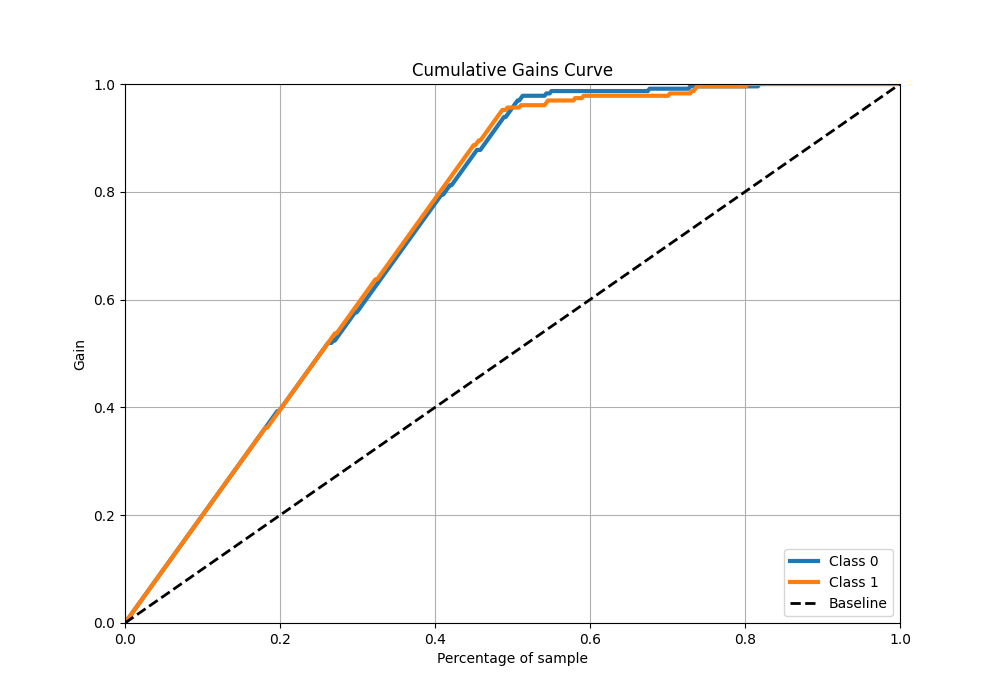
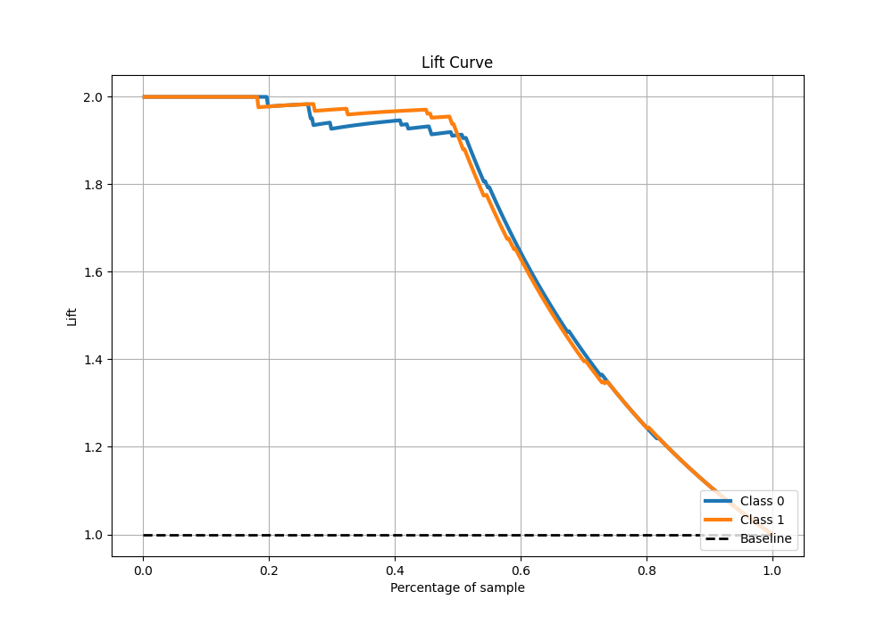

# Summary of 16_CatBoost

[<< Go back](../README.md)

## CatBoost
- **n_jobs**: -1
- **learning_rate**: 0.1
- **depth**: 8
- **rsm**: 1.0
- **loss_function**: Logloss
- **eval_metric**: F1
- **explain_level**: 1

## Validation
 - **validation_type**: kfold
 - **k_folds**: 5
 - **shuffle**: True
 - **stratify**: True

## Optimized metric
f1

## Training time

16.0 seconds

## Metric details
|           |    score |   threshold |
|:----------|---------:|------------:|
| logloss   | 0.270494 | nan         |
| auc       | 0.979739 | nan         |
| f1        | 0.960352 |   0.482133  |
| accuracy  | 0.960699 |   0.482133  |
| precision | 1        |   0.843889  |
| recall    | 1        |   0.0100179 |
| mcc       | 0.92196  |   0.50076   |

## Metric details with threshold from accuracy metric
|           |    score |   threshold |
|:----------|---------:|------------:|
| logloss   | 0.270494 |  nan        |
| auc       | 0.979739 |  nan        |
| f1        | 0.960352 |    0.482133 |
| accuracy  | 0.960699 |    0.482133 |
| precision | 0.968889 |    0.482133 |
| recall    | 0.951965 |    0.482133 |
| mcc       | 0.921538 |    0.482133 |

## Confusion matrix (at threshold=0.482133)
|              |   Predicted as 0 |   Predicted as 1 |
|:-------------|-----------------:|-----------------:|
| Labeled as 0 |              222 |                7 |
| Labeled as 1 |               11 |              218 |

## Learning curves

## Permutation-based Importance

## Confusion Matrix

## Normalized Confusion Matrix

## ROC Curve

## Kolmogorov-Smirnov Statistic

## Precision-Recall Curve

## Calibration Curve

## Cumulative Gains Curve

## Lift Curve

[<< Go back](../README.md)
