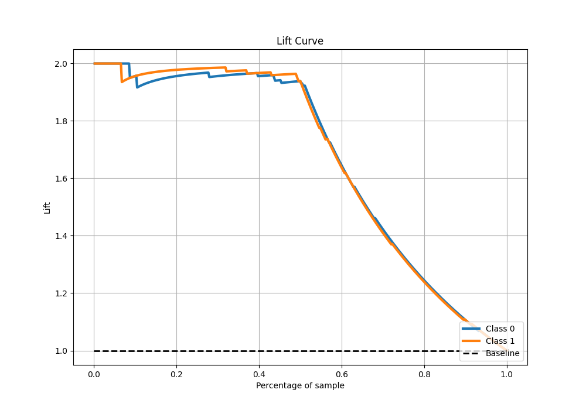

# Summary of 42_CatBoost

[<< Go back](../README.md)

## CatBoost
- **n_jobs**: -1
- **learning_rate**: 0.2
- **depth**: 6
- **rsm**: 0.9
- **loss_function**: Logloss
- **eval_metric**: F1
- **explain_level**: 1

## Validation
 - **validation_type**: kfold
 - **k_folds**: 5
 - **shuffle**: True
 - **stratify**: True

## Optimized metric
f1

## Training time

24.0 seconds

## Metric details
|           |    score |    threshold |
|:----------|---------:|-------------:|
| logloss   | 0.21084  | nan          |
| auc       | 0.98135  | nan          |
| f1        | 0.969163 |   0.48637    |
| accuracy  | 0.969432 |   0.48637    |
| precision | 0.993056 |   0.825665   |
| recall    | 1        |   0.00300853 |
| mcc       | 0.939008 |   0.48637    |

## Metric details with threshold from accuracy metric
|           |    score |   threshold |
|:----------|---------:|------------:|
| logloss   | 0.21084  |   nan       |
| auc       | 0.98135  |   nan       |
| f1        | 0.969163 |     0.48637 |
| accuracy  | 0.969432 |     0.48637 |
| precision | 0.977778 |     0.48637 |
| recall    | 0.960699 |     0.48637 |
| mcc       | 0.939008 |     0.48637 |

## Confusion matrix (at threshold=0.48637)
|              |   Predicted as 0 |   Predicted as 1 |
|:-------------|-----------------:|-----------------:|
| Labeled as 0 |              224 |                5 |
| Labeled as 1 |                9 |              220 |

## Learning curves

## Permutation-based Importance

## Confusion Matrix

## Normalized Confusion Matrix

## ROC Curve

## Kolmogorov-Smirnov Statistic

## Precision-Recall Curve

## Calibration Curve

## Cumulative Gains Curve

## Lift Curve

[<< Go back](../README.md)
