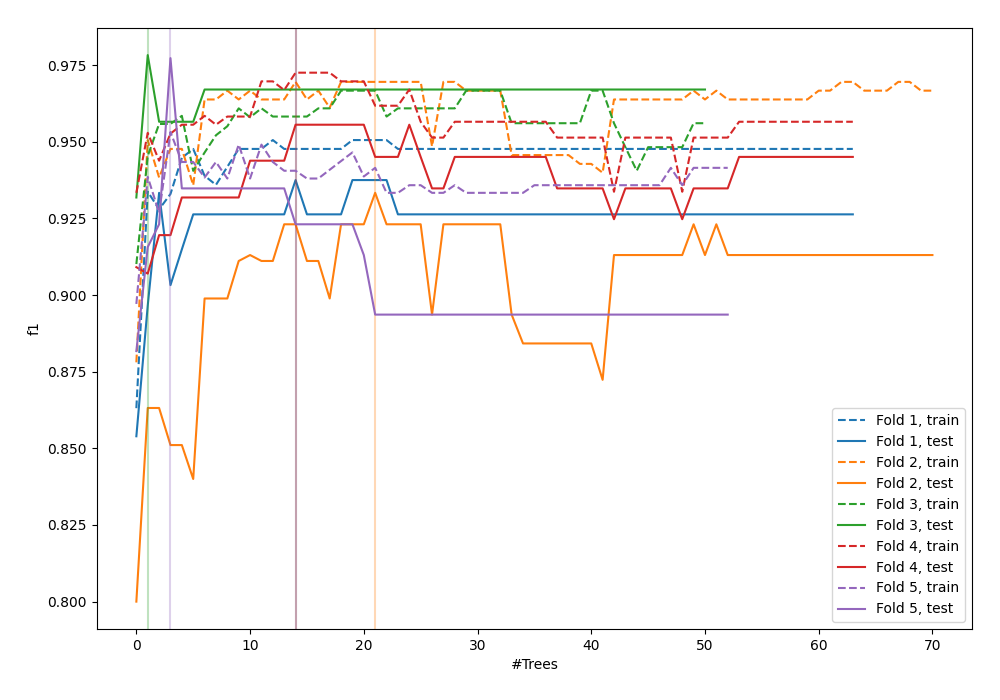
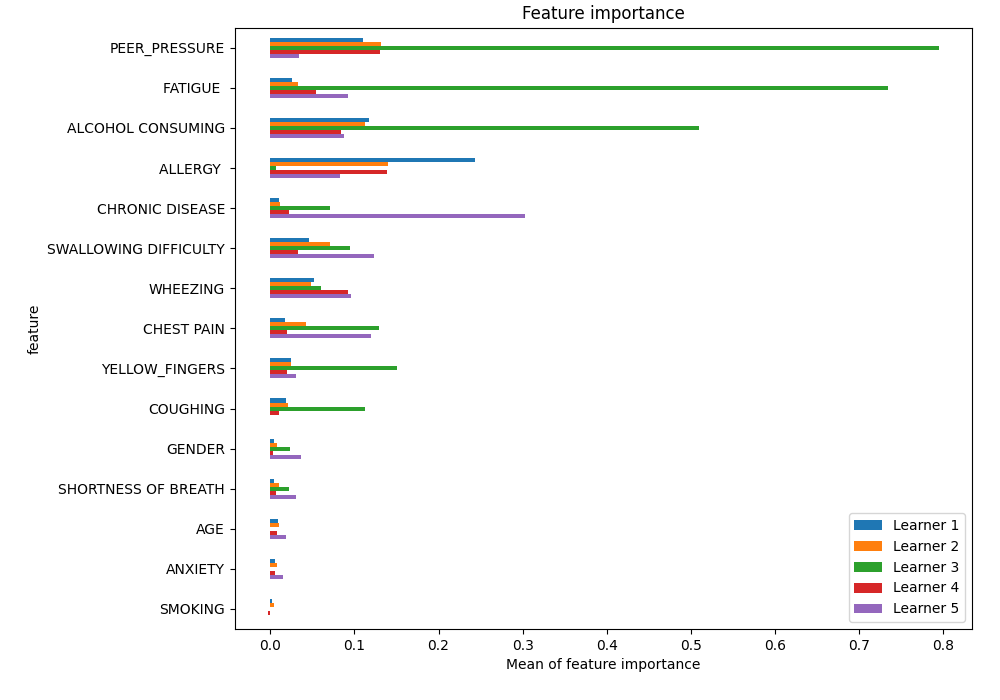
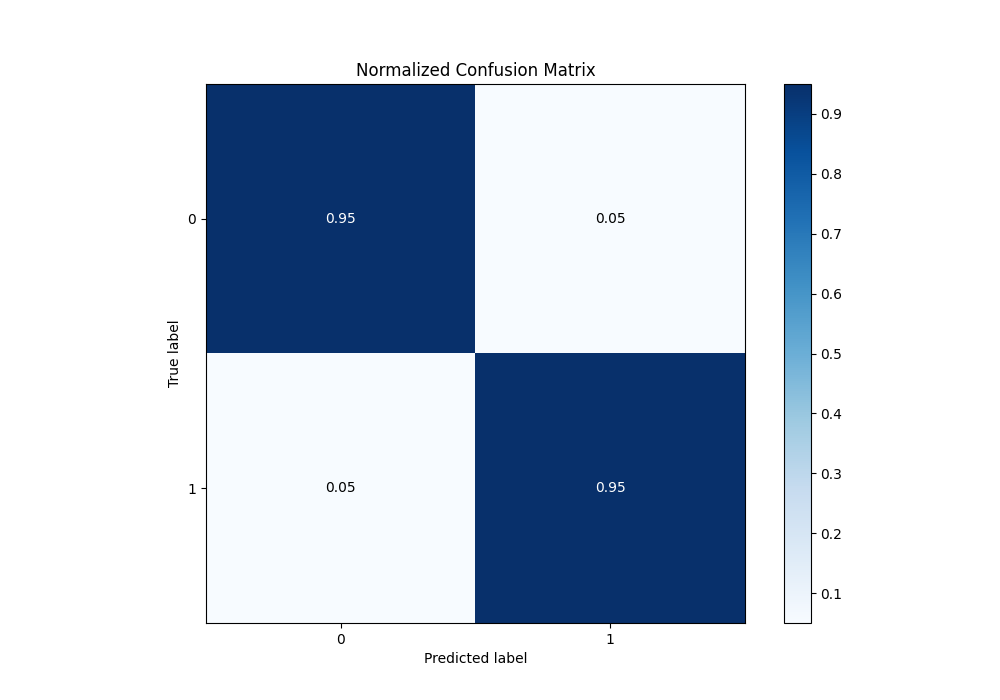
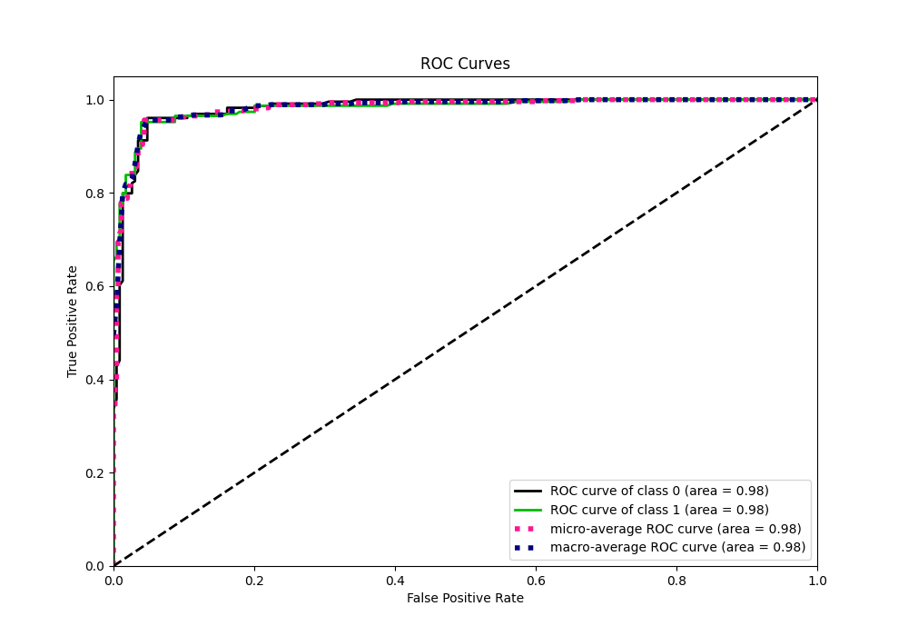
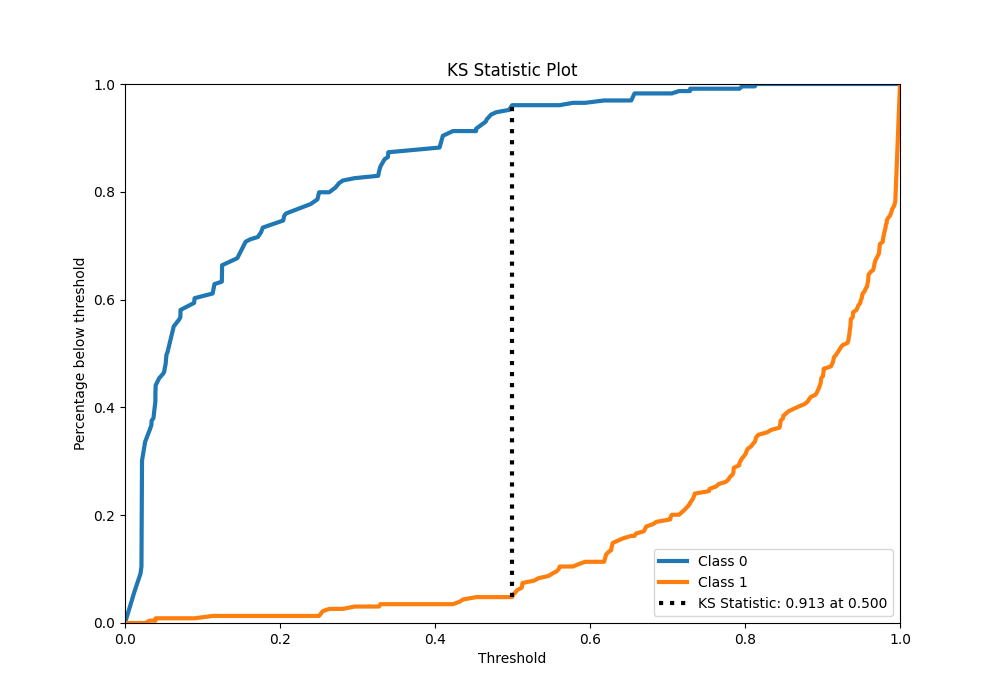
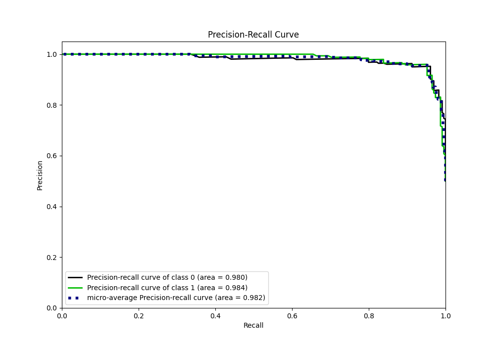
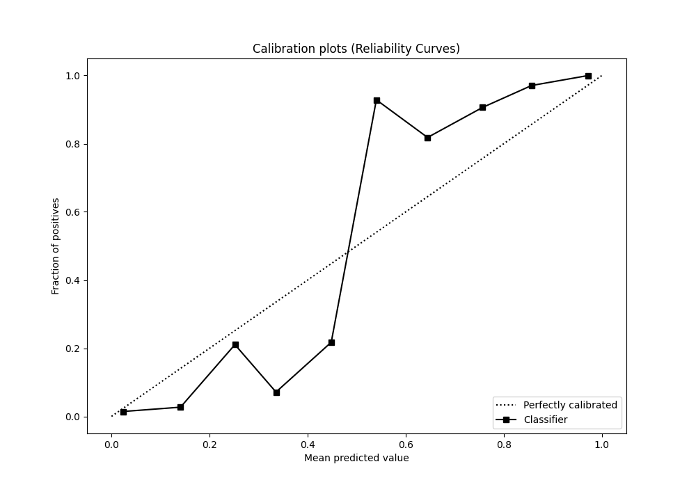
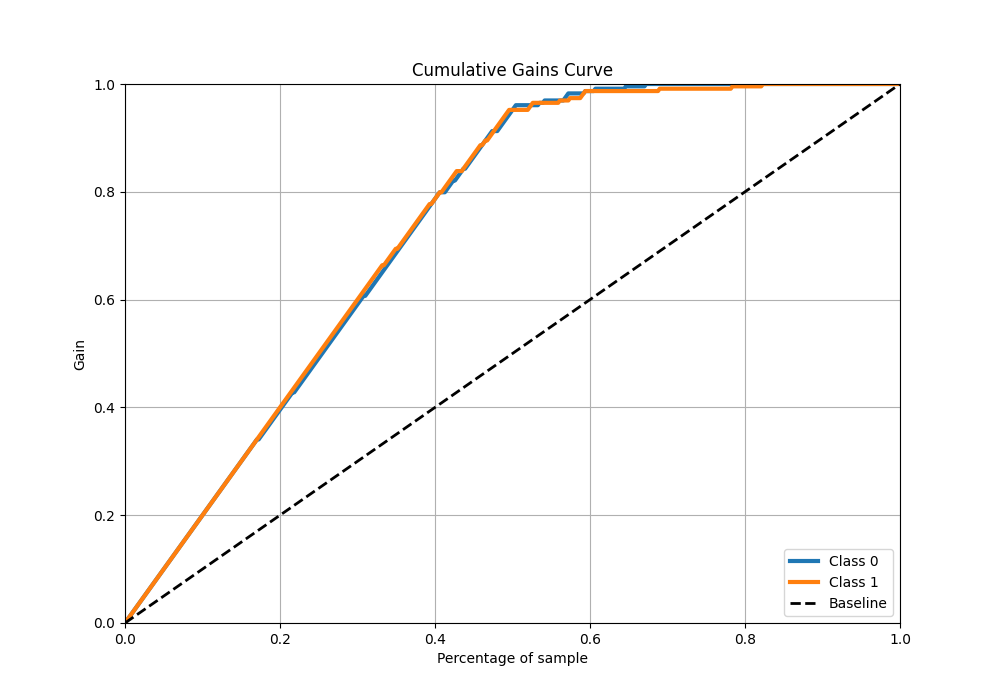
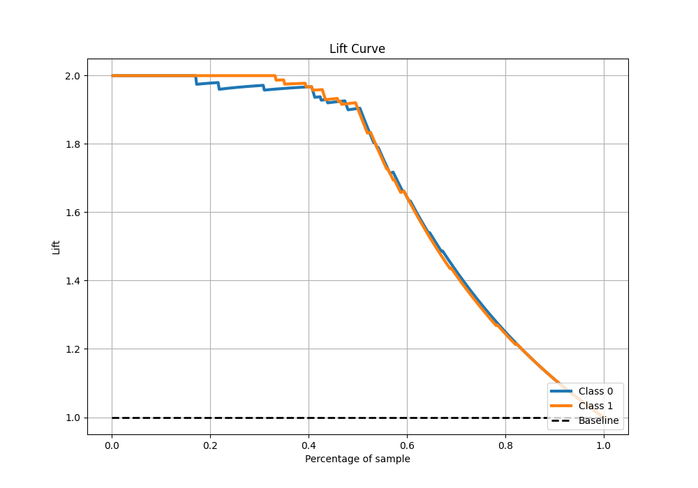

# Summary of 45_RandomForest

[<< Go back](../README.md)

## Random Forest
- **n_jobs**: -1
- **criterion**: entropy
- **max_features**: 0.5
- **min_samples_split**: 20
- **max_depth**: 4
- **eval_metric_name**: f1
- **explain_level**: 1

## Validation
 - **validation_type**: kfold
 - **k_folds**: 5
 - **shuffle**: True
 - **stratify**: True

## Optimized metric
f1

## Training time

24.9 seconds

## Metric details
|           |    score |   threshold |
|:----------|---------:|------------:|
| logloss   | 0.204846 | nan         |
| auc       | 0.981894 | nan         |
| f1        | 0.951965 |   0.497618  |
| accuracy  | 0.951965 |   0.497618  |
| precision | 1        |   0.822999  |
| recall    | 1        |   0.0106853 |
| mcc       | 0.904068 |   0.504971  |

## Metric details with threshold from accuracy metric
|           |    score |   threshold |
|:----------|---------:|------------:|
| logloss   | 0.204846 |  nan        |
| auc       | 0.981894 |  nan        |
| f1        | 0.951965 |    0.497618 |
| accuracy  | 0.951965 |    0.497618 |
| precision | 0.951965 |    0.497618 |
| recall    | 0.951965 |    0.497618 |
| mcc       | 0.90393  |    0.497618 |

## Confusion matrix (at threshold=0.497618)
|              |   Predicted as 0 |   Predicted as 1 |
|:-------------|-----------------:|-----------------:|
| Labeled as 0 |              218 |               11 |
| Labeled as 1 |               11 |              218 |

## Learning curves

## Permutation-based Importance

## Confusion Matrix

## Normalized Confusion Matrix

## ROC Curve

## Kolmogorov-Smirnov Statistic

## Precision-Recall Curve

## Calibration Curve

## Cumulative Gains Curve

## Lift Curve

[<< Go back](../README.md)
