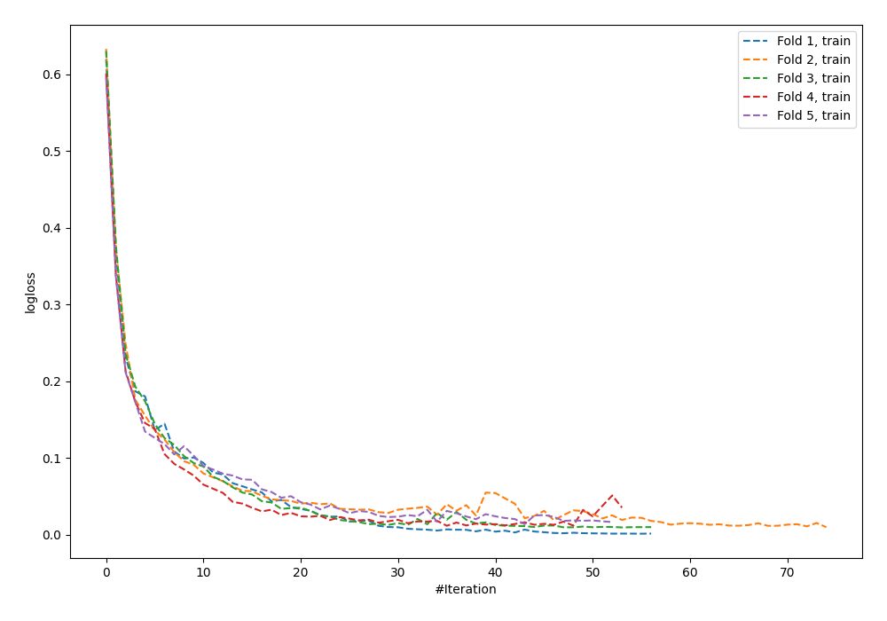
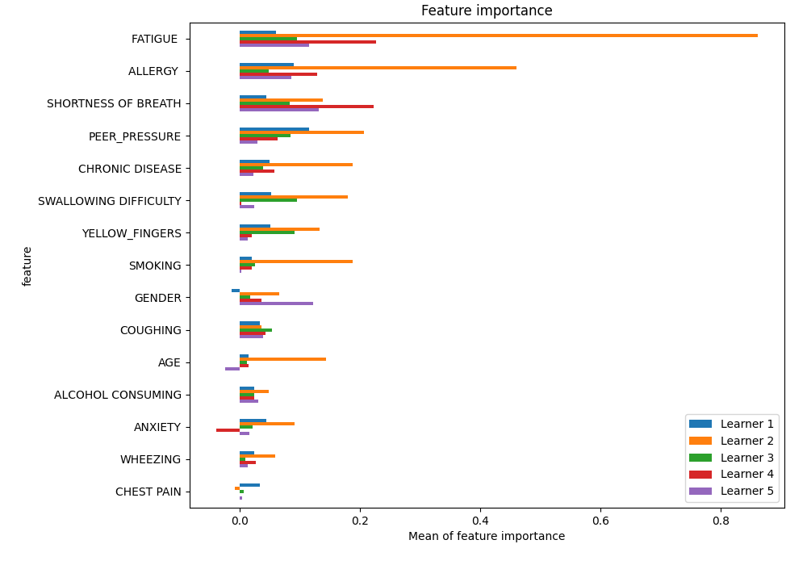
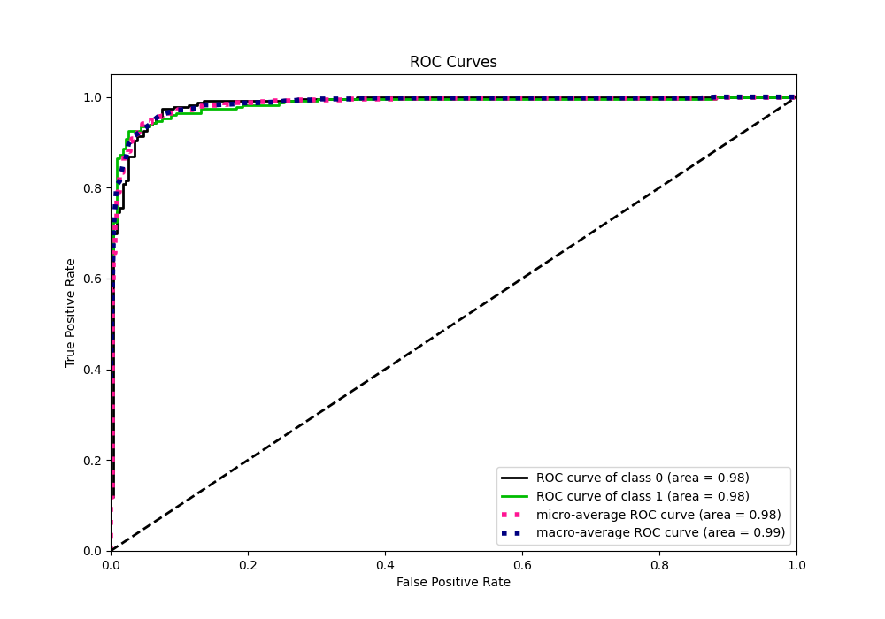
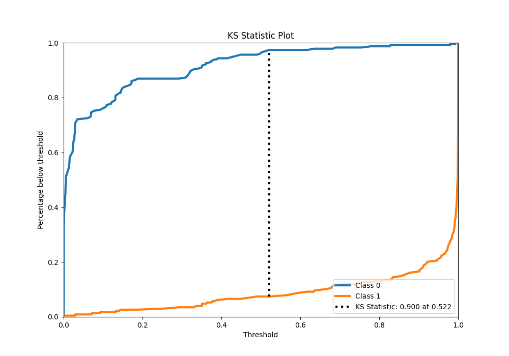
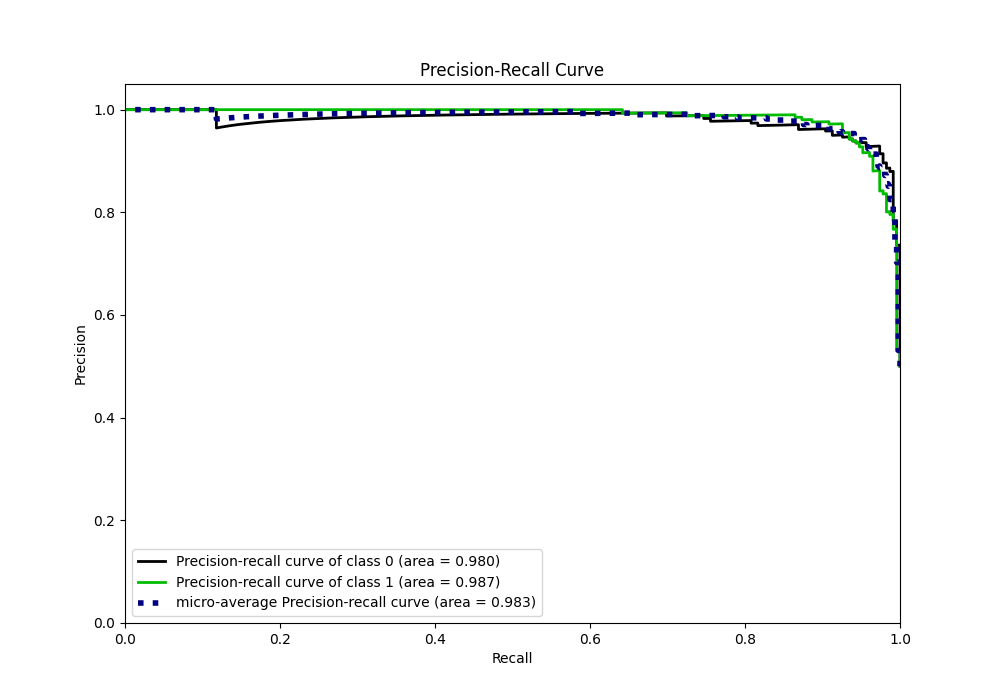
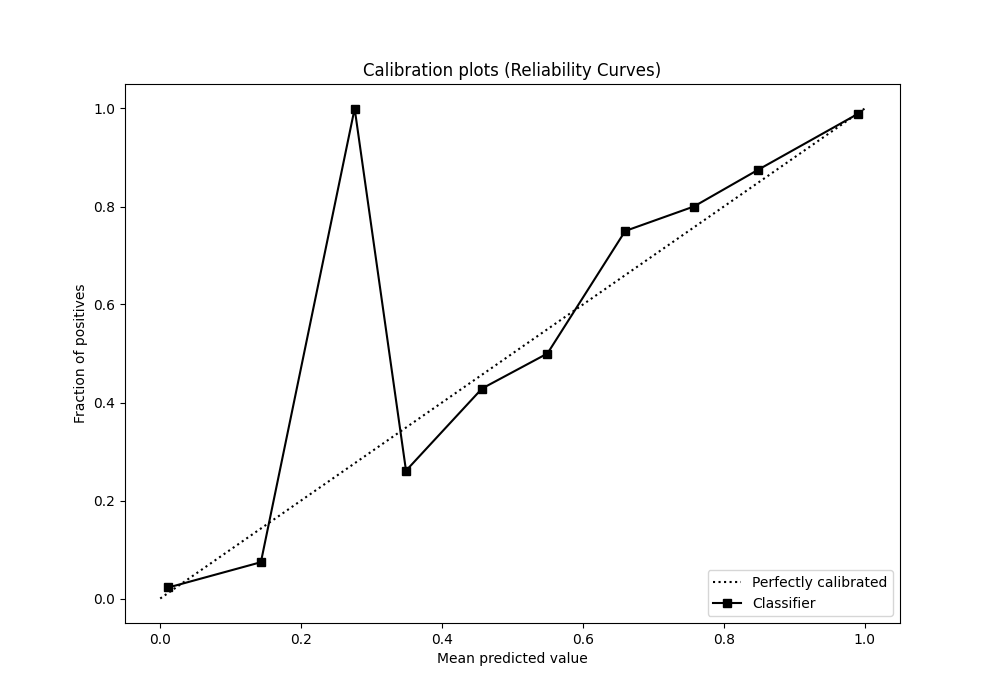
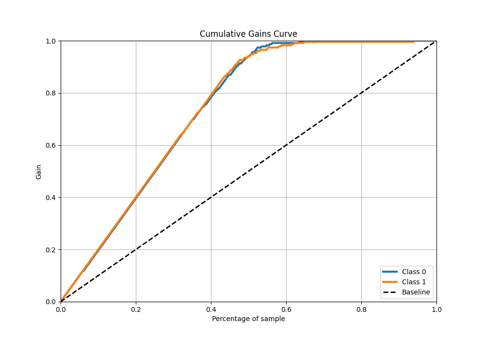
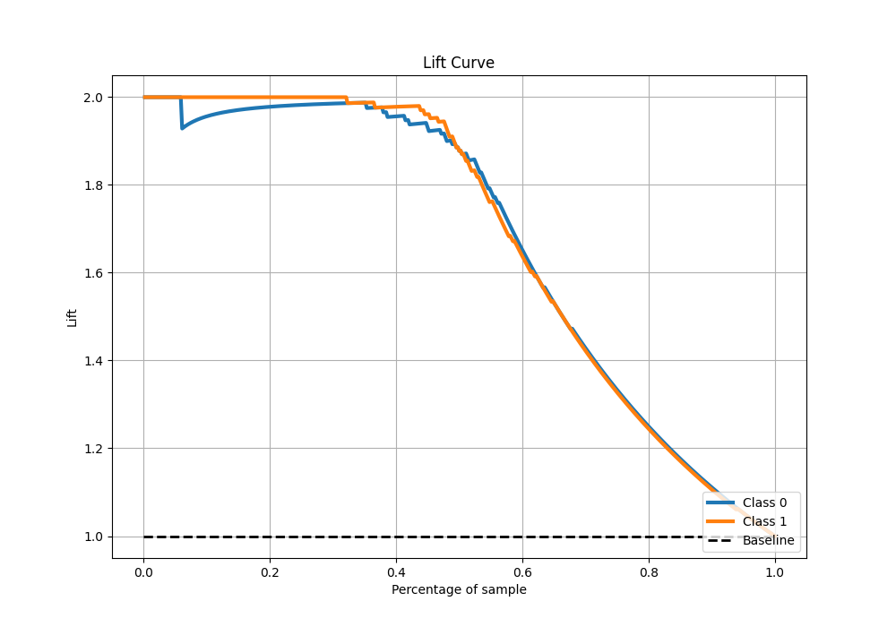

# Summary of 47_NeuralNetwork

[<< Go back](../README.md)

## Neural Network
- **n_jobs**: -1
- **dense_1_size**: 16
- **dense_2_size**: 32
- **learning_rate**: 0.05
- **explain_level**: 1

## Validation
 - **validation_type**: kfold
 - **k_folds**: 5
 - **shuffle**: True
 - **stratify**: True

## Optimized metric
f1

## Training time

20.7 seconds

## Metric details
|           |    score |     threshold |
|:----------|---------:|--------------:|
| logloss   | 0.171276 | nan           |
| auc       | 0.984325 | nan           |
| f1        | 0.946188 |   0.579088    |
| accuracy  | 0.947598 |   0.579088    |
| precision | 1        |   0.993917    |
| recall    | 1        |   1.43029e-10 |
| mcc       | 0.896428 |   0.579088    |

## Metric details with threshold from accuracy metric
|           |    score |   threshold |
|:----------|---------:|------------:|
| logloss   | 0.171276 |  nan        |
| auc       | 0.984325 |  nan        |
| f1        | 0.946188 |    0.579088 |
| accuracy  | 0.947598 |    0.579088 |
| precision | 0.97235  |    0.579088 |
| recall    | 0.921397 |    0.579088 |
| mcc       | 0.896428 |    0.579088 |

## Confusion matrix (at threshold=0.579088)
|              |   Predicted as 0 |   Predicted as 1 |
|:-------------|-----------------:|-----------------:|
| Labeled as 0 |              223 |                6 |
| Labeled as 1 |               18 |              211 |

## Learning curves

## Permutation-based Importance

## Confusion Matrix

## Normalized Confusion Matrix

## ROC Curve

## Kolmogorov-Smirnov Statistic

## Precision-Recall Curve

## Calibration Curve

## Cumulative Gains Curve

## Lift Curve

[<< Go back](../README.md)
