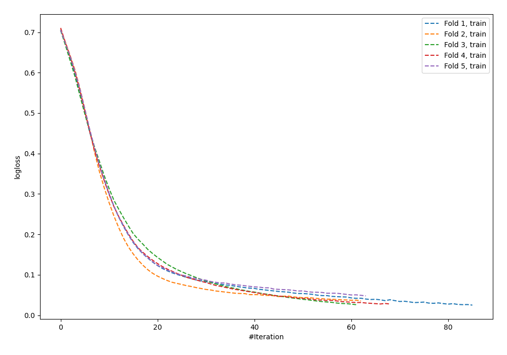
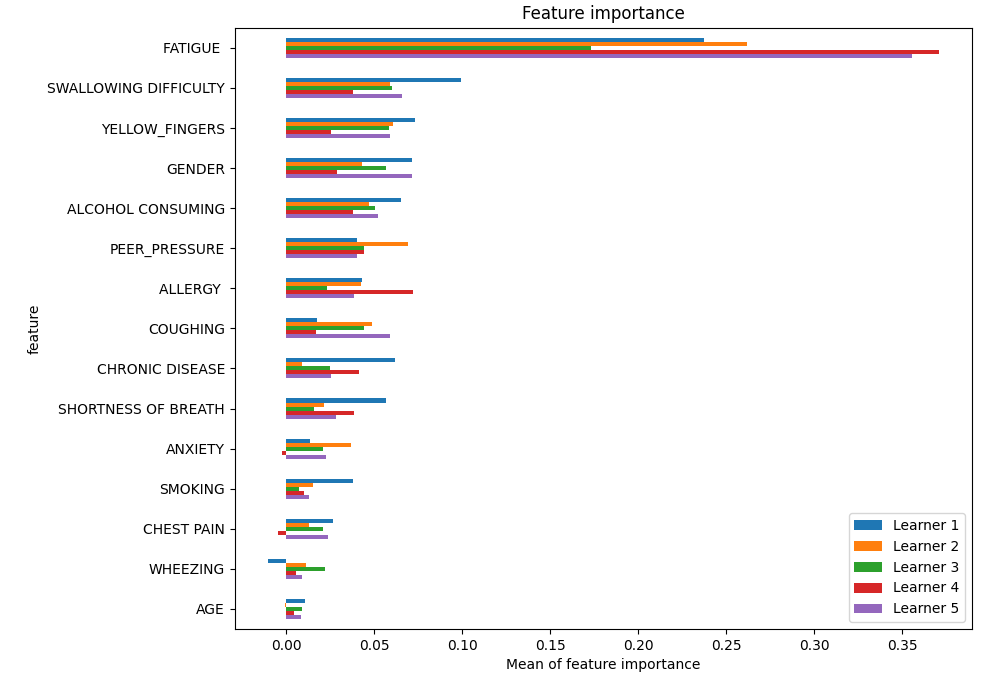
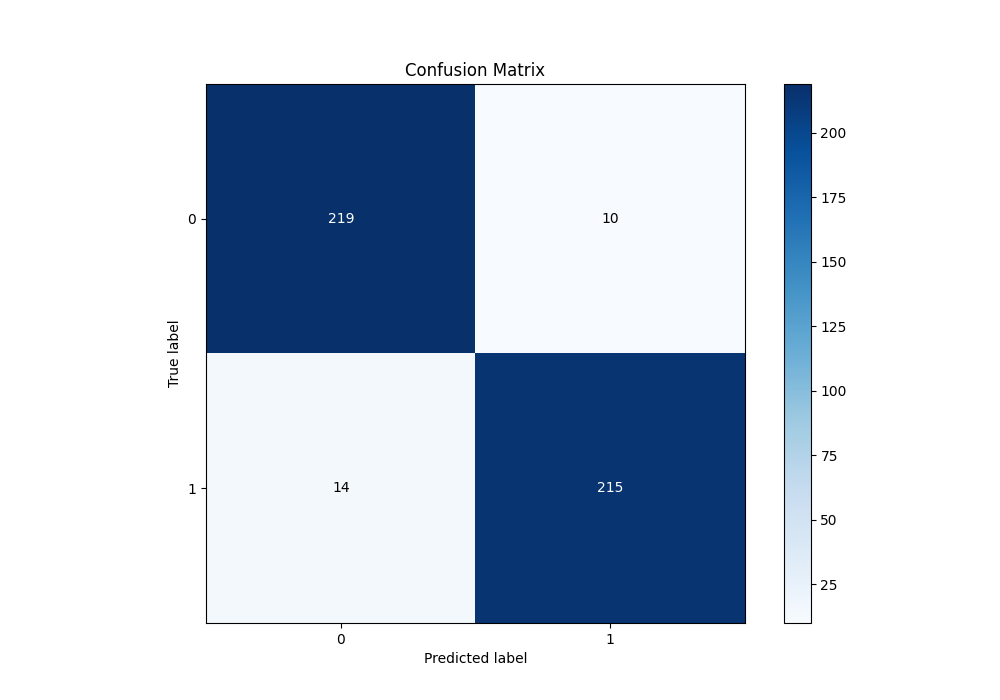
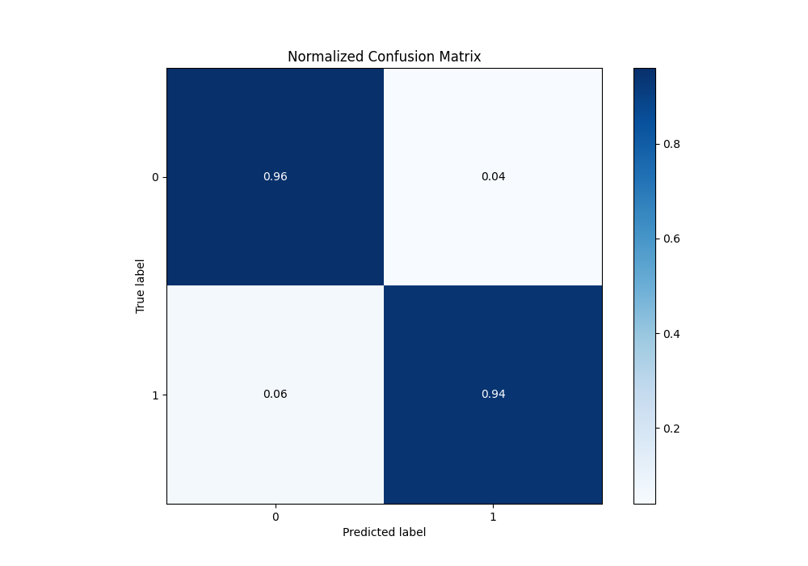
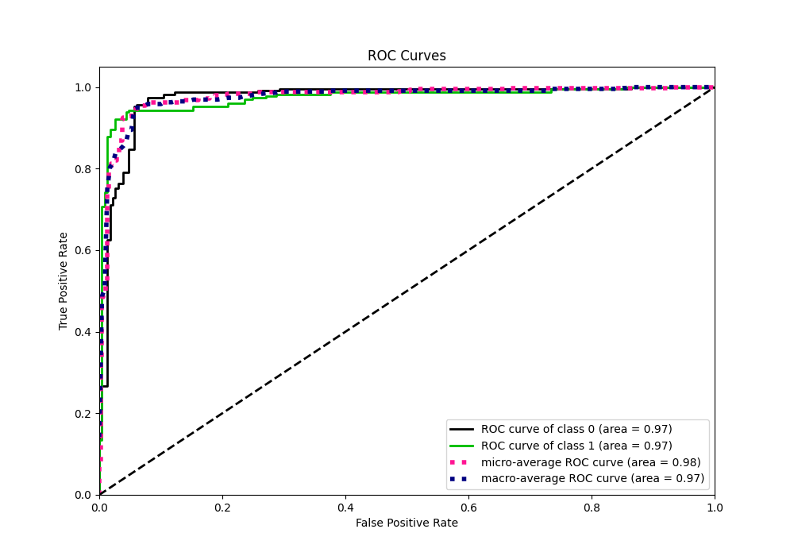
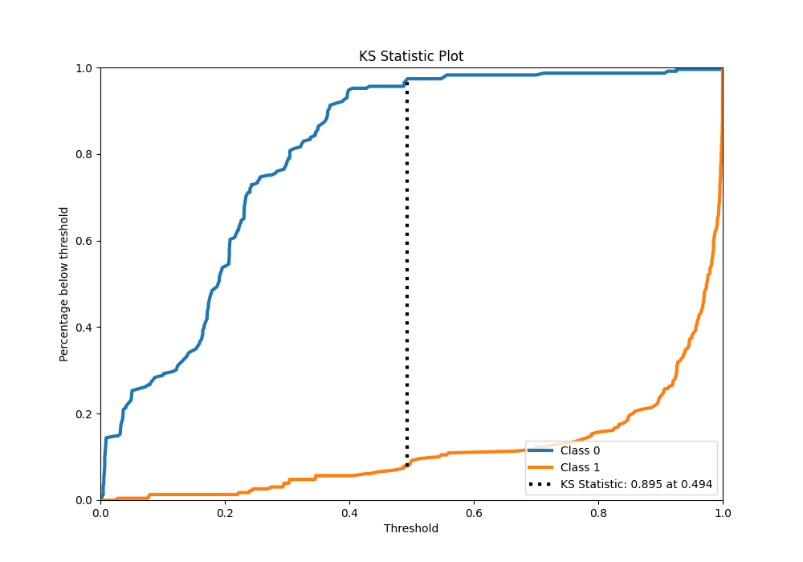
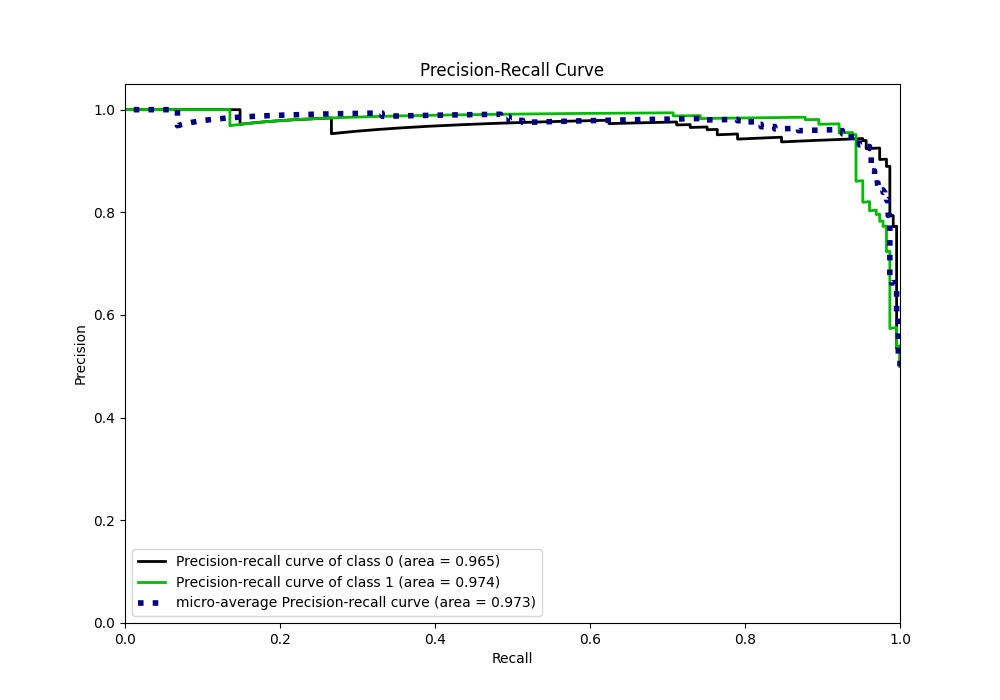
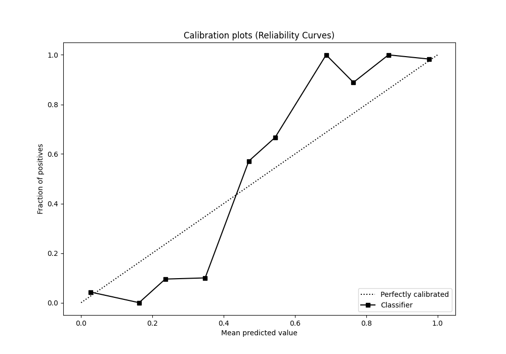
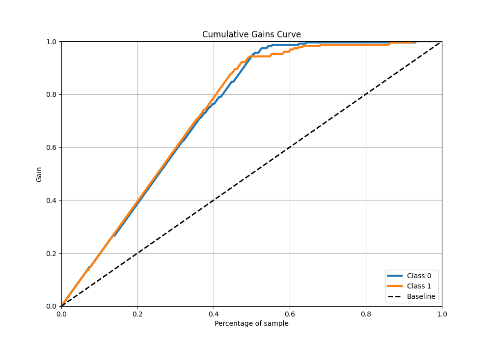
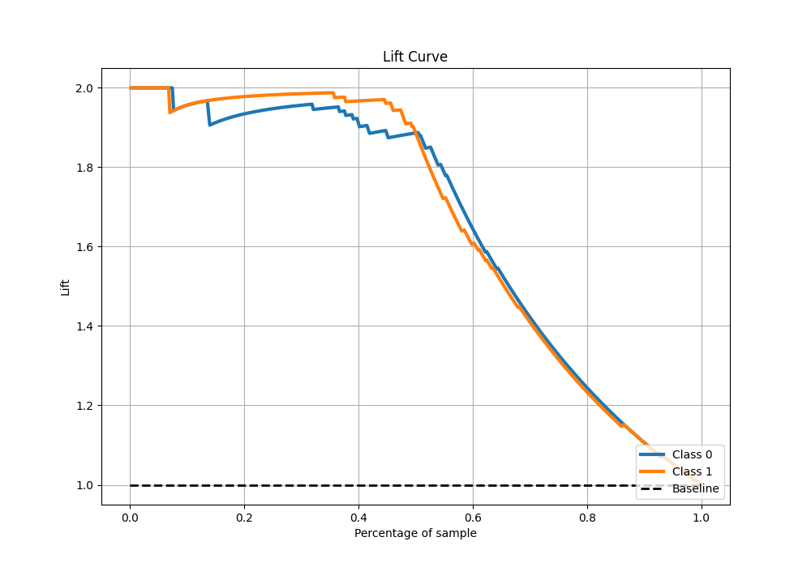

# Summary of 49_NeuralNetwork

[<< Go back](../README.md)

## Neural Network
- **n_jobs**: -1
- **dense_1_size**: 16
- **dense_2_size**: 4
- **learning_rate**: 0.01
- **explain_level**: 1

## Validation
 - **validation_type**: kfold
 - **k_folds**: 5
 - **shuffle**: True
 - **stratify**: True

## Optimized metric
f1

## Training time

19.3 seconds

## Metric details
|           |    score |    threshold |
|:----------|---------:|-------------:|
| logloss   | 0.223506 | nan          |
| auc       | 0.972941 | nan          |
| f1        | 0.947137 |   0.439385   |
| accuracy  | 0.947598 |   0.439385   |
| precision | 0.993789 |   0.926364   |
| recall    | 1        |   0.00408889 |
| mcc       | 0.896428 |   0.495458   |

## Metric details with threshold from accuracy metric
|           |    score |   threshold |
|:----------|---------:|------------:|
| logloss   | 0.223506 |  nan        |
| auc       | 0.972941 |  nan        |
| f1        | 0.947137 |    0.439385 |
| accuracy  | 0.947598 |    0.439385 |
| precision | 0.955556 |    0.439385 |
| recall    | 0.938865 |    0.439385 |
| mcc       | 0.895333 |    0.439385 |

## Confusion matrix (at threshold=0.439385)
|              |   Predicted as 0 |   Predicted as 1 |
|:-------------|-----------------:|-----------------:|
| Labeled as 0 |              219 |               10 |
| Labeled as 1 |               14 |              215 |

## Learning curves

## Permutation-based Importance

## Confusion Matrix

## Normalized Confusion Matrix

## ROC Curve

## Kolmogorov-Smirnov Statistic

## Precision-Recall Curve

## Calibration Curve

## Cumulative Gains Curve

## Lift Curve

[<< Go back](../README.md)
