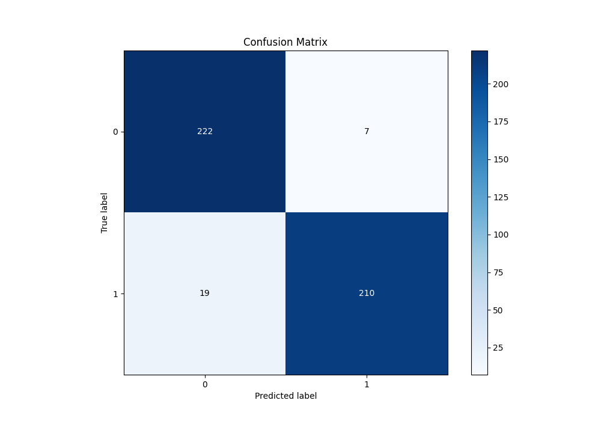

# Summary of 50_NeuralNetwork

[<< Go back](../README.md)

## Neural Network
- **n_jobs**: -1
- **dense_1_size**: 64
- **dense_2_size**: 4
- **learning_rate**: 0.01
- **explain_level**: 1

## Validation
 - **validation_type**: kfold
 - **k_folds**: 5
 - **shuffle**: True
 - **stratify**: True

## Optimized metric
f1

## Training time

23.8 seconds

## Metric details
|           |    score |    threshold |
|:----------|---------:|-------------:|
| logloss   | 0.180569 | nan          |
| auc       | 0.976688 | nan          |
| f1        | 0.941704 |   0.523118   |
| accuracy  | 0.943231 |   0.523118   |
| precision | 1        |   0.977751   |
| recall    | 1        |   0.00153578 |
| mcc       | 0.888635 |   0.673509   |

## Metric details with threshold from accuracy metric
|           |    score |   threshold |
|:----------|---------:|------------:|
| logloss   | 0.180569 |  nan        |
| auc       | 0.976688 |  nan        |
| f1        | 0.941704 |    0.523118 |
| accuracy  | 0.943231 |    0.523118 |
| precision | 0.967742 |    0.523118 |
| recall    | 0.917031 |    0.523118 |
| mcc       | 0.887682 |    0.523118 |

## Confusion matrix (at threshold=0.523118)
|              |   Predicted as 0 |   Predicted as 1 |
|:-------------|-----------------:|-----------------:|
| Labeled as 0 |              222 |                7 |
| Labeled as 1 |               19 |              210 |

## Learning curves

## Permutation-based Importance

## Confusion Matrix

## Normalized Confusion Matrix

## ROC Curve

## Kolmogorov-Smirnov Statistic

## Precision-Recall Curve

## Calibration Curve

## Cumulative Gains Curve

## Lift Curve

[<< Go back](../README.md)
