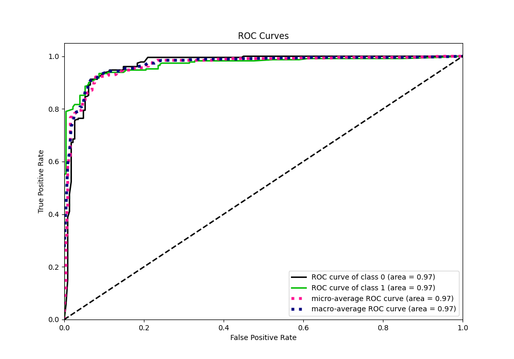

# Summary of 6_Default_RandomForest

[<< Go back](../README.md)

## Random Forest
- **n_jobs**: -1
- **criterion**: gini
- **max_features**: 0.9
- **min_samples_split**: 30
- **max_depth**: 4
- **eval_metric_name**: f1
- **explain_level**: 1

## Validation
 - **validation_type**: kfold
 - **k_folds**: 5
 - **shuffle**: True
 - **stratify**: True

## Optimized metric
f1

## Training time

18.7 seconds

## Metric details
|           |    score |   threshold |
|:----------|---------:|------------:|
| logloss   | 0.250242 | nan         |
| auc       | 0.968021 | nan         |
| f1        | 0.922078 |   0.524125  |
| accuracy  | 0.921397 |   0.524125  |
| precision | 1        |   0.881013  |
| recall    | 1        |   0.0074135 |
| mcc       | 0.842923 |   0.524125  |

## Metric details with threshold from accuracy metric
|           |    score |   threshold |
|:----------|---------:|------------:|
| logloss   | 0.250242 |  nan        |
| auc       | 0.968021 |  nan        |
| f1        | 0.922078 |    0.524125 |
| accuracy  | 0.921397 |    0.524125 |
| precision | 0.914163 |    0.524125 |
| recall    | 0.930131 |    0.524125 |
| mcc       | 0.842923 |    0.524125 |

## Confusion matrix (at threshold=0.524125)
|              |   Predicted as 0 |   Predicted as 1 |
|:-------------|-----------------:|-----------------:|
| Labeled as 0 |              209 |               20 |
| Labeled as 1 |               16 |              213 |

## Learning curves

## Permutation-based Importance

## Confusion Matrix

## Normalized Confusion Matrix

## ROC Curve

## Kolmogorov-Smirnov Statistic

## Precision-Recall Curve

## Calibration Curve

## Cumulative Gains Curve

## Lift Curve

[<< Go back](../README.md)
