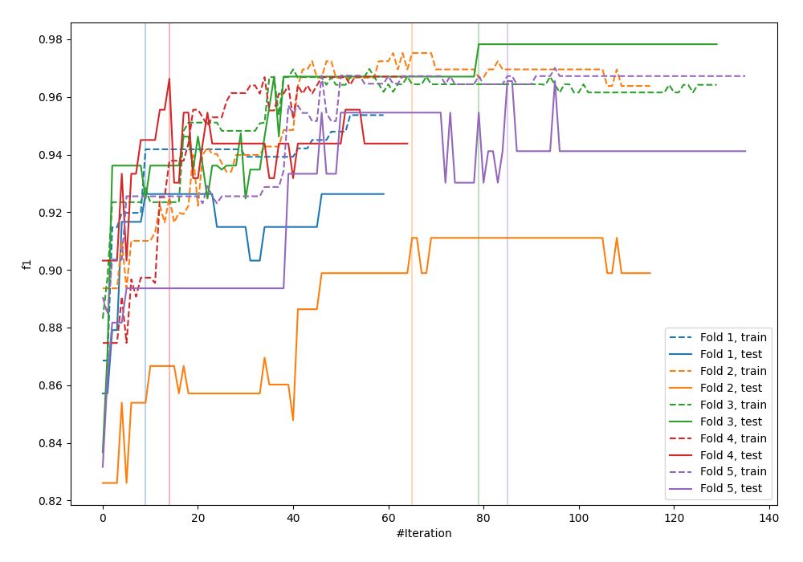
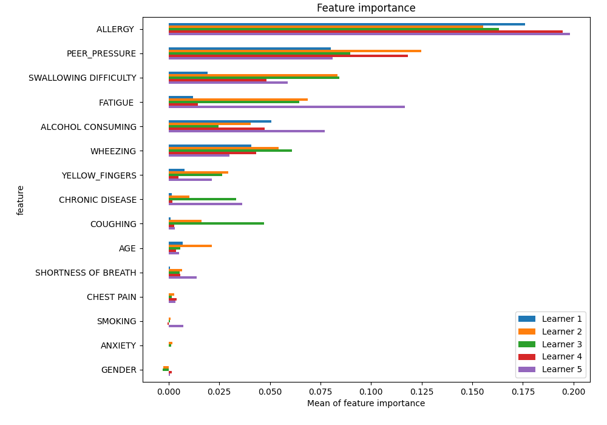
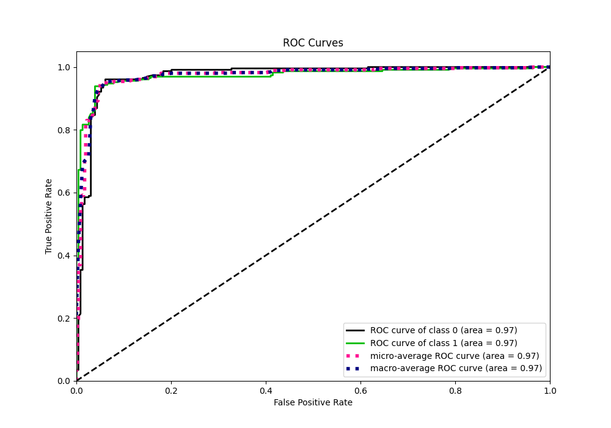
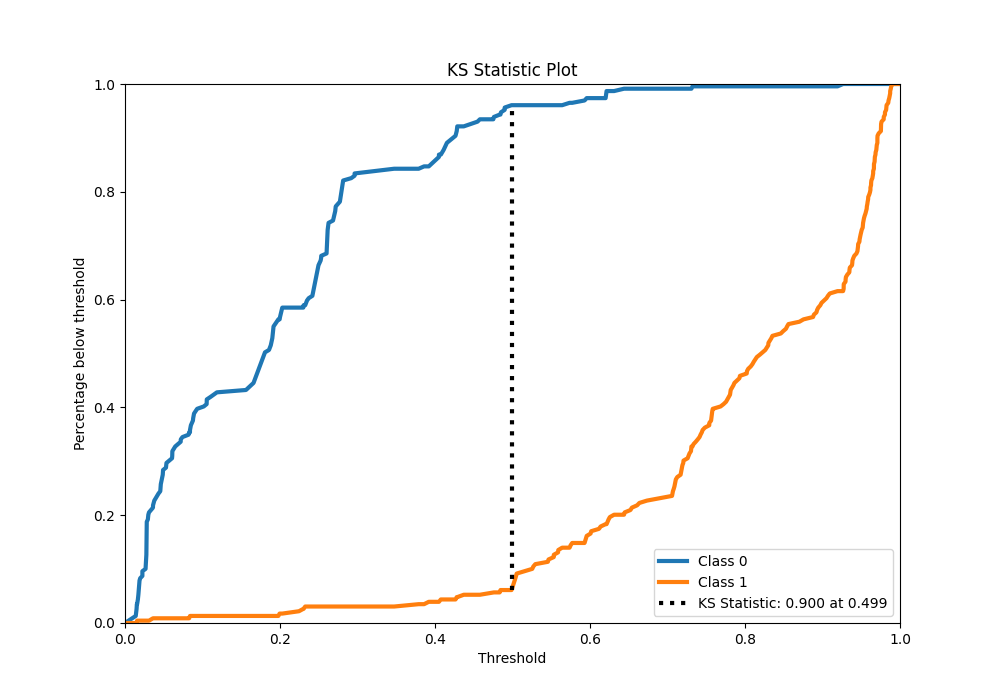
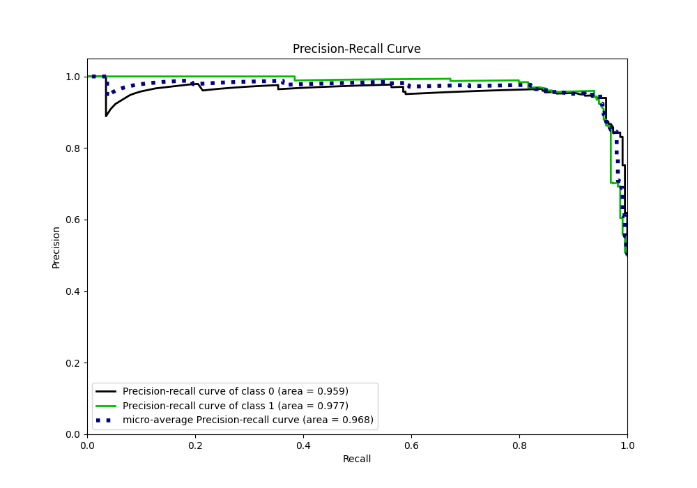
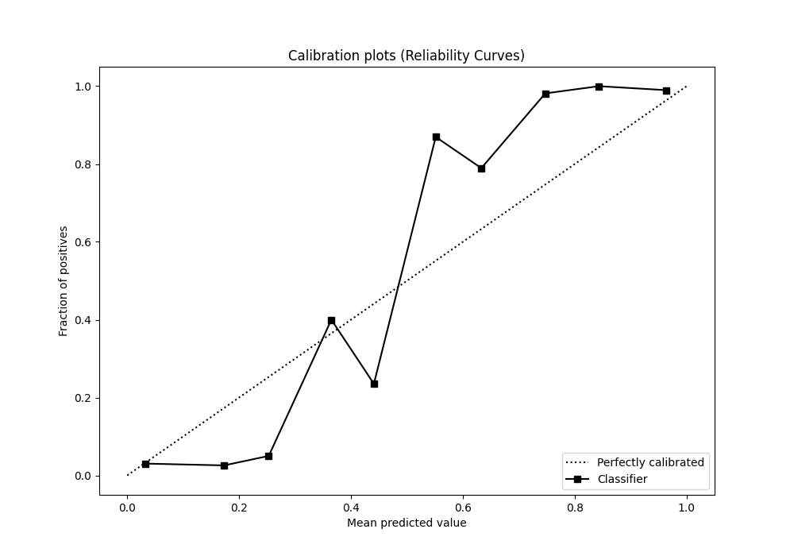
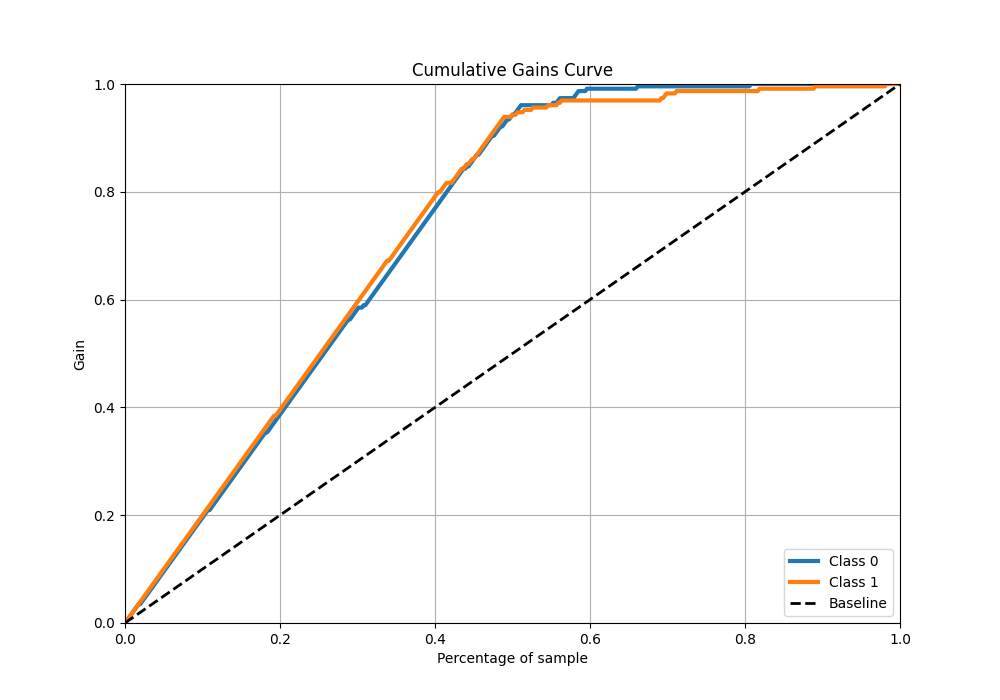
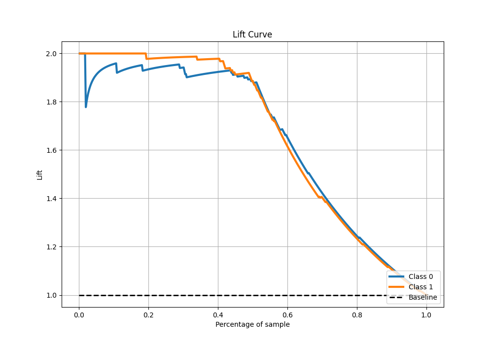

# Summary of 7_Xgboost

[<< Go back](../README.md)

## Extreme Gradient Boosting (Xgboost)
- **n_jobs**: -1
- **objective**: binary:logistic
- **eta**: 0.075
- **max_depth**: 8
- **min_child_weight**: 5
- **subsample**: 1.0
- **colsample_bytree**: 1.0
- **eval_metric**: f1
- **explain_level**: 1

## Validation
 - **validation_type**: kfold
 - **k_folds**: 5
 - **shuffle**: True
 - **stratify**: True

## Optimized metric
f1

## Training time

15.4 seconds

## Metric details
|           |    score |   threshold |
|:----------|---------:|------------:|
| logloss   | 0.2715   | nan         |
| auc       | 0.972054 | nan         |
| f1        | 0.947137 |   0.494361  |
| accuracy  | 0.947598 |   0.494361  |
| precision | 1        |   0.928547  |
| recall    | 1        |   0.0124766 |
| mcc       | 0.895333 |   0.494361  |

## Metric details with threshold from accuracy metric
|           |    score |   threshold |
|:----------|---------:|------------:|
| logloss   | 0.2715   |  nan        |
| auc       | 0.972054 |  nan        |
| f1        | 0.947137 |    0.494361 |
| accuracy  | 0.947598 |    0.494361 |
| precision | 0.955556 |    0.494361 |
| recall    | 0.938865 |    0.494361 |
| mcc       | 0.895333 |    0.494361 |

## Confusion matrix (at threshold=0.494361)
|              |   Predicted as 0 |   Predicted as 1 |
|:-------------|-----------------:|-----------------:|
| Labeled as 0 |              219 |               10 |
| Labeled as 1 |               14 |              215 |

## Learning curves

## Permutation-based Importance

## Confusion Matrix

## Normalized Confusion Matrix

## ROC Curve

## Kolmogorov-Smirnov Statistic

## Precision-Recall Curve

## Calibration Curve

## Cumulative Gains Curve

## Lift Curve

[<< Go back](../README.md)
