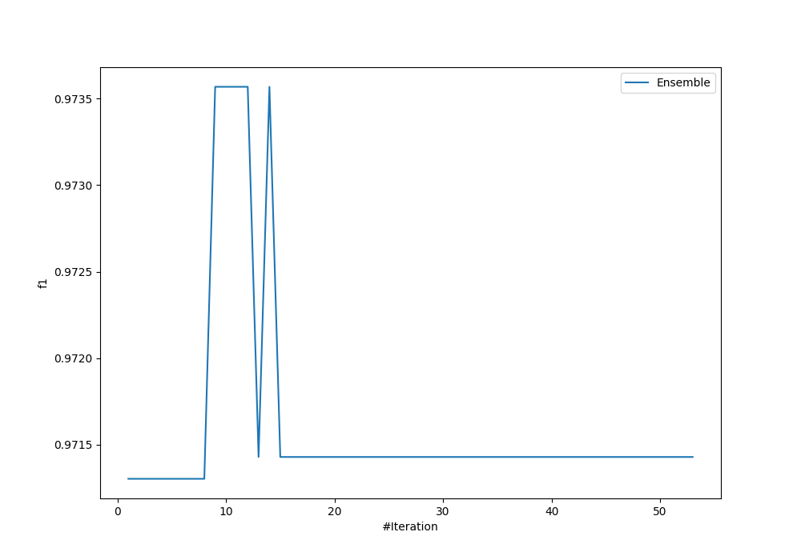
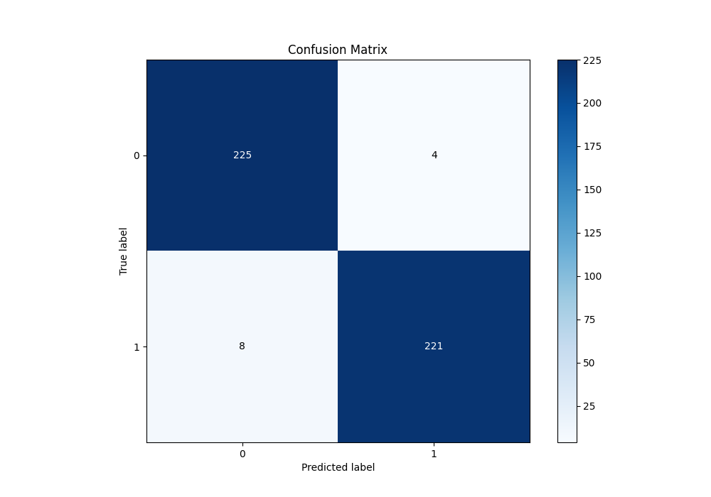
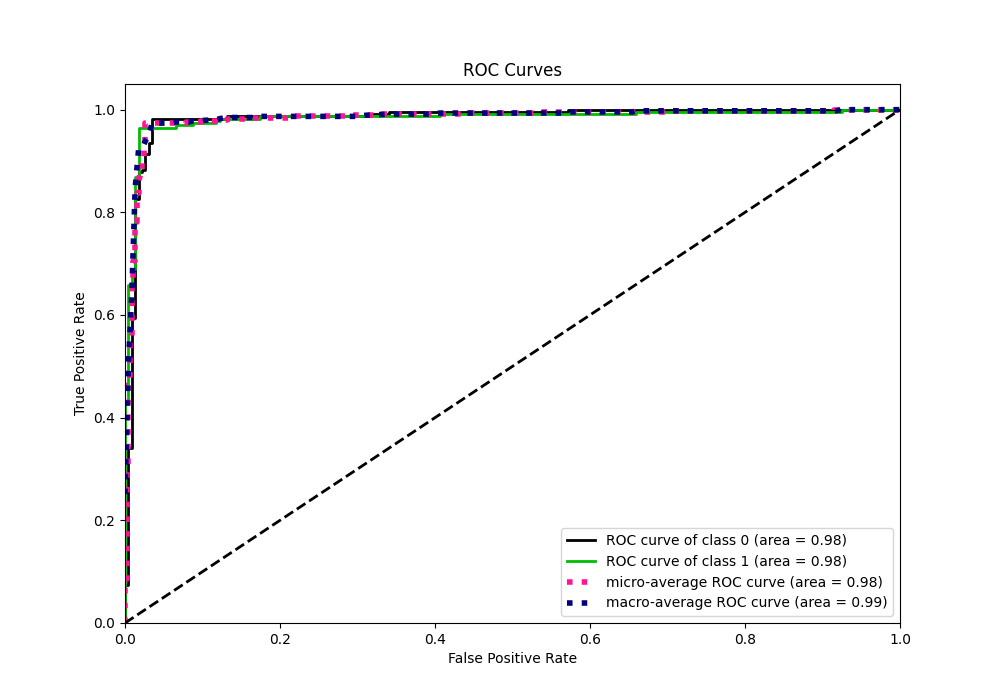
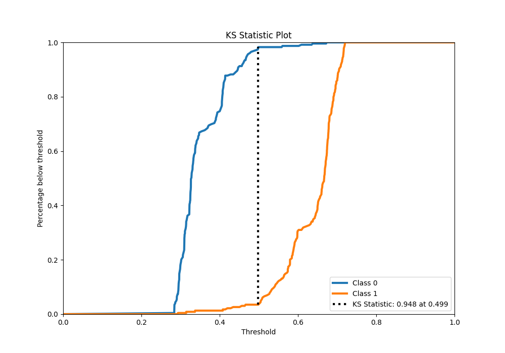
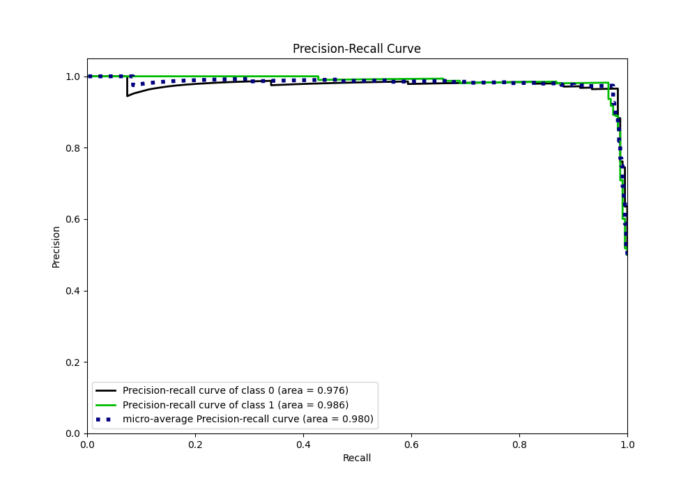
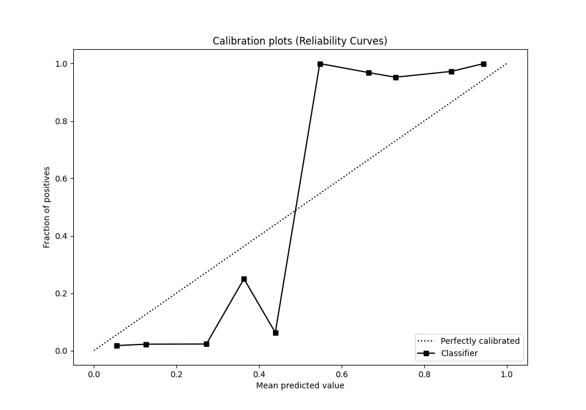
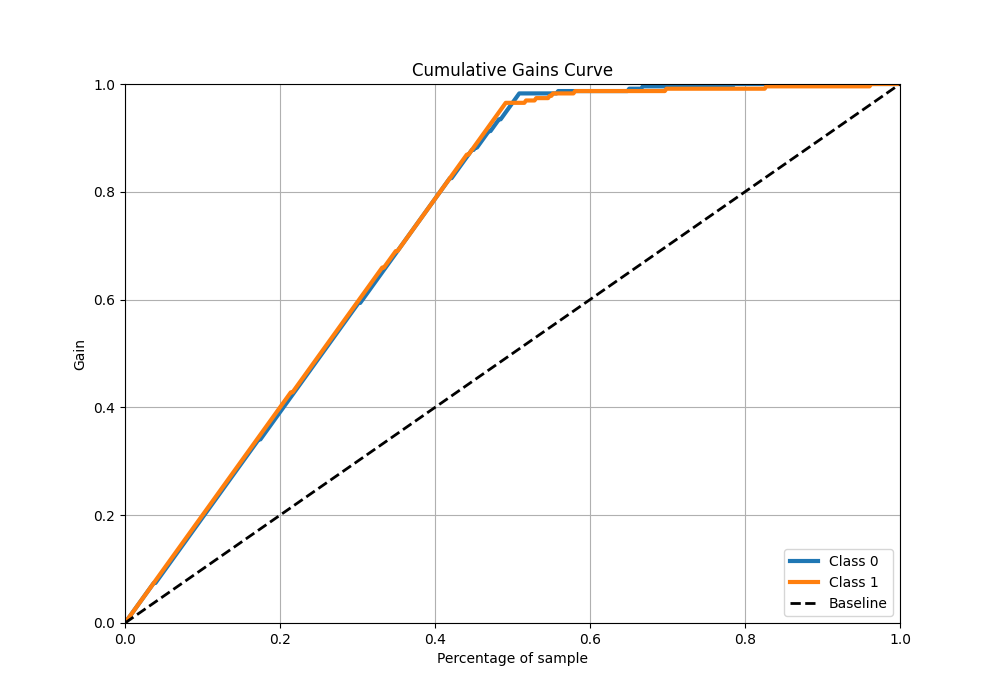
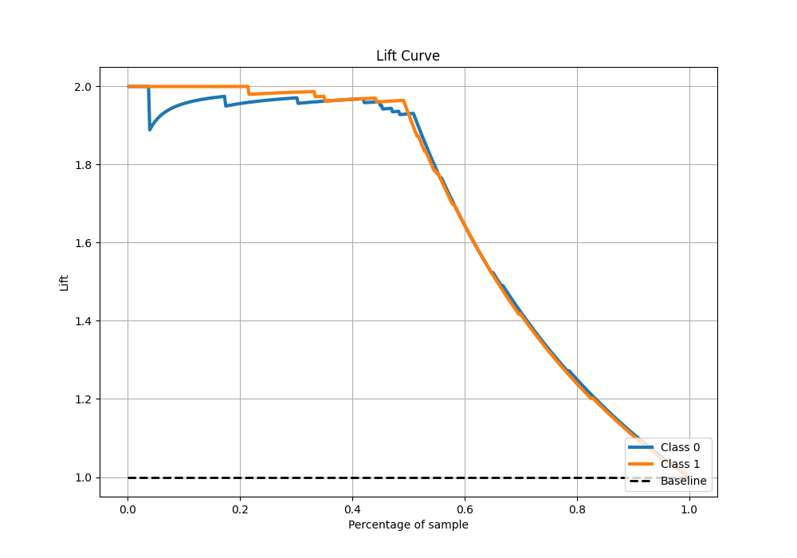

# Summary of Ensemble

[<< Go back](../README.md)

## Ensemble structure
| Model       |   Weight |
|:------------|---------:|
| 10_Xgboost  |        5 |
| 13_LightGBM |        1 |
| 41_CatBoost |        1 |
| 42_CatBoost |        2 |

## Metric details
|           |    score |   threshold |
|:----------|---------:|------------:|
| logloss   | 0.450385 |  nan        |
| auc       | 0.983524 |  nan        |
| f1        | 0.973568 |    0.501504 |
| accuracy  | 0.973799 |    0.501504 |
| precision | 1        |    0.672646 |
| recall    | 1        |    0.255591 |
| mcc       | 0.947743 |    0.501504 |

## Metric details with threshold from accuracy metric
|           |    score |   threshold |
|:----------|---------:|------------:|
| logloss   | 0.450385 |  nan        |
| auc       | 0.983524 |  nan        |
| f1        | 0.973568 |    0.501504 |
| accuracy  | 0.973799 |    0.501504 |
| precision | 0.982222 |    0.501504 |
| recall    | 0.965066 |    0.501504 |
| mcc       | 0.947743 |    0.501504 |

## Confusion matrix (at threshold=0.501504)
|              |   Predicted as 0 |   Predicted as 1 |
|:-------------|-----------------:|-----------------:|
| Labeled as 0 |              225 |                4 |
| Labeled as 1 |                8 |              221 |

## Learning curves

## Confusion Matrix

## Normalized Confusion Matrix

## ROC Curve

## Kolmogorov-Smirnov Statistic

## Precision-Recall Curve

## Calibration Curve

## Cumulative Gains Curve

## Lift Curve

[<< Go back](../README.md)
