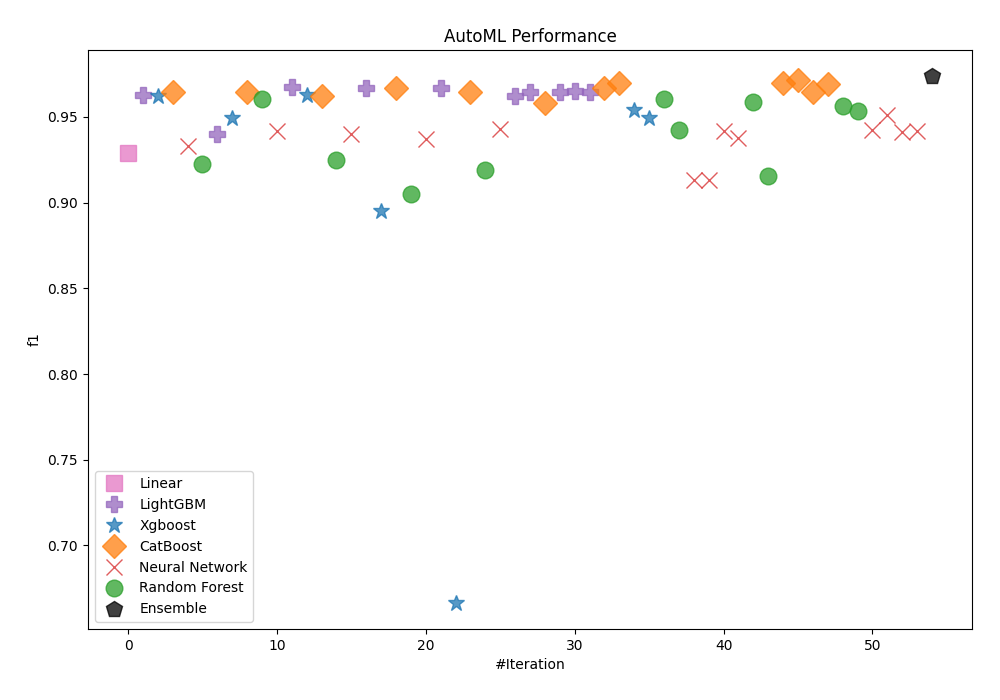
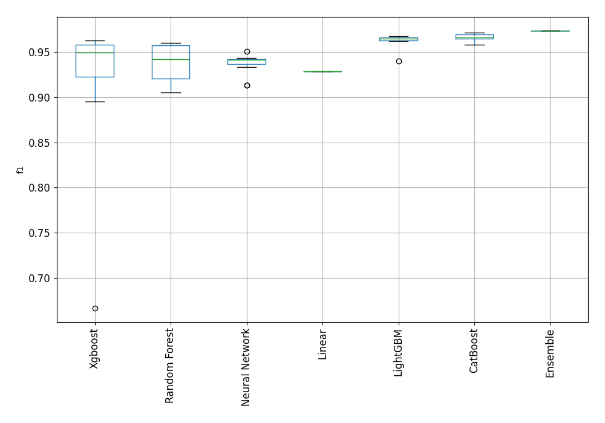
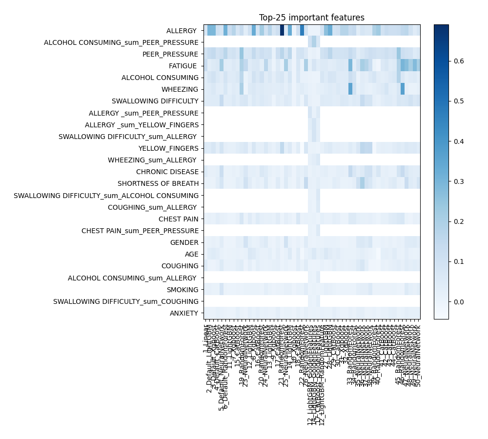
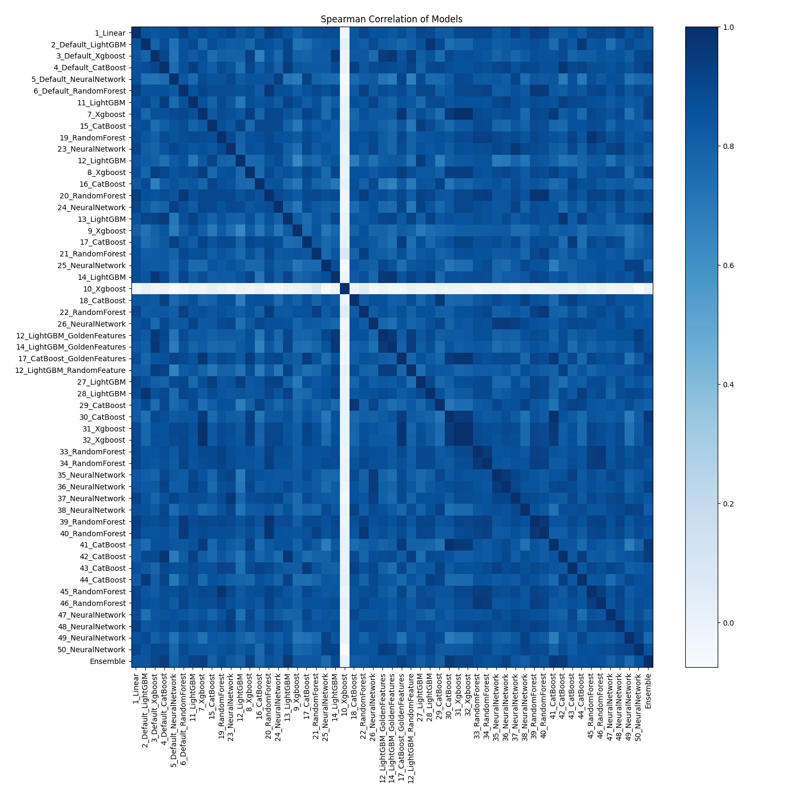

# AutoML Leaderboard

| Best model   | name                                                               | model_type     | metric_type   |   metric_value |   train_time |   single_prediction_time |
|:-------------|:-------------------------------------------------------------------|:---------------|:--------------|---------------:|-------------:|-------------------------:|
|              | [1_Linear](1_Linear/README.md)                                     | Linear         | f1            |       0.928889 |        15.97 |                   0.0281 |
|              | [2_Default_LightGBM](2_Default_LightGBM/README.md)                 | LightGBM       | f1            |       0.962472 |        15.92 |                   0.0132 |
|              | [3_Default_Xgboost](3_Default_Xgboost/README.md)                   | Xgboost        | f1            |       0.962306 |        16.69 |                   0.0187 |
|              | [4_Default_CatBoost](4_Default_CatBoost/README.md)                 | CatBoost       | f1            |       0.964758 |        22.71 |                   0.0245 |
|              | [5_Default_NeuralNetwork](5_Default_NeuralNetwork/README.md)       | Neural Network | f1            |       0.933036 |        25.43 |                   0.0276 |
|              | [6_Default_RandomForest](6_Default_RandomForest/README.md)         | Random Forest  | f1            |       0.922414 |        19.4  |                   0.1371 |
|              | [11_LightGBM](11_LightGBM/README.md)                               | LightGBM       | f1            |       0.940171 |        15.79 |                   0.0113 |
|              | [7_Xgboost](7_Xgboost/README.md)                                   | Xgboost        | f1            |       0.949227 |        16.08 |                   0.0142 |
|              | [15_CatBoost](15_CatBoost/README.md)                               | CatBoost       | f1            |       0.964444 |        14.99 |                   0.0196 |
|              | [19_RandomForest](19_RandomForest/README.md)                       | Random Forest  | f1            |       0.960177 |        18.01 |                   0.1148 |
|              | [23_NeuralNetwork](23_NeuralNetwork/README.md)                     | Neural Network | f1            |       0.941964 |        15.17 |                   0.0328 |
|              | [12_LightGBM](12_LightGBM/README.md)                               | LightGBM       | f1            |       0.967177 |        16.23 |                   0.0114 |
|              | [8_Xgboost](8_Xgboost/README.md)                                   | Xgboost        | f1            |       0.962637 |        17.13 |                   0.0187 |
|              | [16_CatBoost](16_CatBoost/README.md)                               | CatBoost       | f1            |       0.962306 |        16.62 |                   0.0145 |
|              | [20_RandomForest](20_RandomForest/README.md)                       | Random Forest  | f1            |       0.925054 |        19.16 |                   0.1358 |
|              | [24_NeuralNetwork](24_NeuralNetwork/README.md)                     | Neural Network | f1            |       0.940133 |        15.97 |                   0.03   |
|              | [13_LightGBM](13_LightGBM/README.md)                               | LightGBM       | f1            |       0.966741 |        18.61 |                   0.0121 |
|              | [9_Xgboost](9_Xgboost/README.md)                                   | Xgboost        | f1            |       0.895323 |        17.22 |                   0.0154 |
|              | [17_CatBoost](17_CatBoost/README.md)                               | CatBoost       | f1            |       0.966887 |        16.82 |                   0.0138 |
|              | [21_RandomForest](21_RandomForest/README.md)                       | Random Forest  | f1            |       0.904959 |        19.49 |                   0.1574 |
|              | [25_NeuralNetwork](25_NeuralNetwork/README.md)                     | Neural Network | f1            |       0.936819 |        17.51 |                   0.0298 |
|              | [14_LightGBM](14_LightGBM/README.md)                               | LightGBM       | f1            |       0.966887 |        19.25 |                   0.0126 |
|              | [10_Xgboost](10_Xgboost/README.md)                                 | Xgboost        | f1            |       0.666667 |        17.26 |                   0.0156 |
|              | [18_CatBoost](18_CatBoost/README.md)                               | CatBoost       | f1            |       0.964758 |        17.67 |                   0.0137 |
|              | [22_RandomForest](22_RandomForest/README.md)                       | Random Forest  | f1            |       0.918919 |        19.75 |                   0.1178 |
|              | [26_NeuralNetwork](26_NeuralNetwork/README.md)                     | Neural Network | f1            |       0.942982 |        17.24 |                   0.0277 |
|              | [12_LightGBM_GoldenFeatures](12_LightGBM_GoldenFeatures/README.md) | LightGBM       | f1            |       0.962306 |        18.34 |                   0.0284 |
|              | [14_LightGBM_GoldenFeatures](14_LightGBM_GoldenFeatures/README.md) | LightGBM       | f1            |       0.964602 |        19.7  |                   0.0278 |
|              | [17_CatBoost_GoldenFeatures](17_CatBoost_GoldenFeatures/README.md) | CatBoost       | f1            |       0.958242 |        18.21 |                   0.0346 |
|              | [12_LightGBM_RandomFeature](12_LightGBM_RandomFeature/README.md)   | LightGBM       | f1            |       0.964602 |        19.03 |                   0.014  |
|              | [27_LightGBM](27_LightGBM/README.md)                               | LightGBM       | f1            |       0.965066 |        19.07 |                   0.0123 |
|              | [28_LightGBM](28_LightGBM/README.md)                               | LightGBM       | f1            |       0.964602 |        19.5  |                   0.0119 |
|              | [29_CatBoost](29_CatBoost/README.md)                               | CatBoost       | f1            |       0.966741 |        18.16 |                   0.0156 |
|              | [30_CatBoost](30_CatBoost/README.md)                               | CatBoost       | f1            |       0.969565 |        18.75 |                   0.0146 |
|              | [31_Xgboost](31_Xgboost/README.md)                                 | Xgboost        | f1            |       0.953846 |        19.22 |                   0.0131 |
|              | [32_Xgboost](32_Xgboost/README.md)                                 | Xgboost        | f1            |       0.949227 |        19.15 |                   0.0151 |
|              | [33_RandomForest](33_RandomForest/README.md)                       | Random Forest  | f1            |       0.960177 |        20.82 |                   0.145  |
|              | [34_RandomForest](34_RandomForest/README.md)                       | Random Forest  | f1            |       0.942184 |        29.97 |                   0.1295 |
|              | [35_NeuralNetwork](35_NeuralNetwork/README.md)                     | Neural Network | f1            |       0.913319 |        23.52 |                   0.0502 |
|              | [36_NeuralNetwork](36_NeuralNetwork/README.md)                     | Neural Network | f1            |       0.913319 |        19.15 |                   0.0301 |
|              | [37_NeuralNetwork](37_NeuralNetwork/README.md)                     | Neural Network | f1            |       0.941964 |        19.5  |                   0.0409 |
|              | [38_NeuralNetwork](38_NeuralNetwork/README.md)                     | Neural Network | f1            |       0.9375   |        20.61 |                   0.0284 |
|              | [39_RandomForest](39_RandomForest/README.md)                       | Random Forest  | f1            |       0.958425 |        24.68 |                   0.124  |
|              | [40_RandomForest](40_RandomForest/README.md)                       | Random Forest  | f1            |       0.915464 |        25.32 |                   0.2265 |
|              | [41_CatBoost](41_CatBoost/README.md)                               | CatBoost       | f1            |       0.969565 |        25.52 |                   0.0169 |
|              | [42_CatBoost](42_CatBoost/README.md)                               | CatBoost       | f1            |       0.971302 |        25.03 |                   0.0504 |
|              | [43_CatBoost](43_CatBoost/README.md)                               | CatBoost       | f1            |       0.964602 |        24.46 |                   0.0228 |
|              | [44_CatBoost](44_CatBoost/README.md)                               | CatBoost       | f1            |       0.969027 |        26.49 |                   0.0231 |
|              | [45_RandomForest](45_RandomForest/README.md)                       | Random Forest  | f1            |       0.95614  |        25.63 |                   0.2178 |
|              | [46_RandomForest](46_RandomForest/README.md)                       | Random Forest  | f1            |       0.953437 |        28.85 |                   0.1242 |
|              | [47_NeuralNetwork](47_NeuralNetwork/README.md)                     | Neural Network | f1            |       0.942222 |        21.51 |                   0.0517 |
|              | [48_NeuralNetwork](48_NeuralNetwork/README.md)                     | Neural Network | f1            |       0.950893 |        23.37 |                   0.0302 |
|              | [49_NeuralNetwork](49_NeuralNetwork/README.md)                     | Neural Network | f1            |       0.941441 |        20.24 |                   0.0388 |
|              | [50_NeuralNetwork](50_NeuralNetwork/README.md)                     | Neural Network | f1            |       0.941964 |        25.1  |                   0.0379 |
| **the best** | [Ensemble](Ensemble/README.md)                                     | Ensemble       | f1            |       0.973568 |         7.54 |                   0.1539 |

### AutoML Performance

### AutoML Performance Boxplot

### Features Importance

### Spearman Correlation of Models

