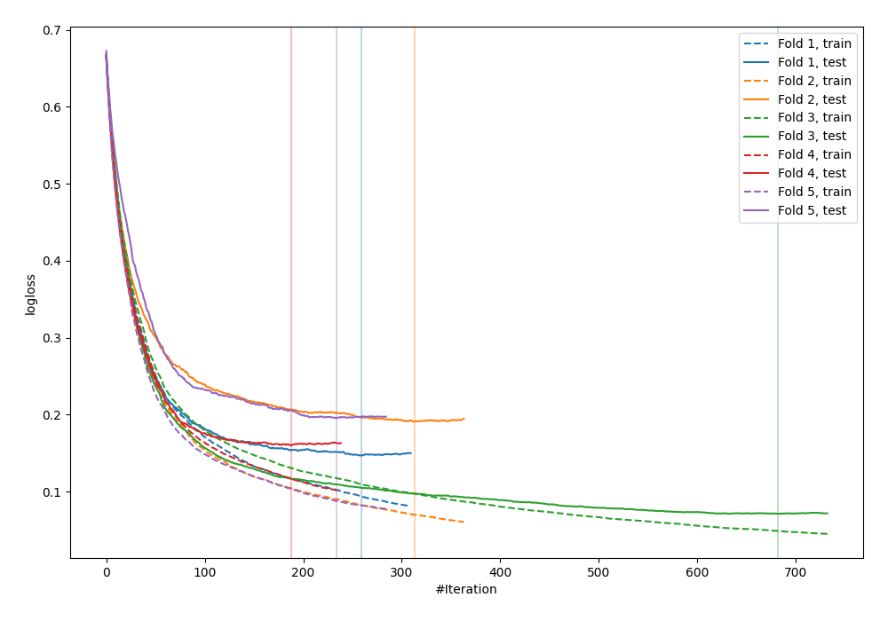
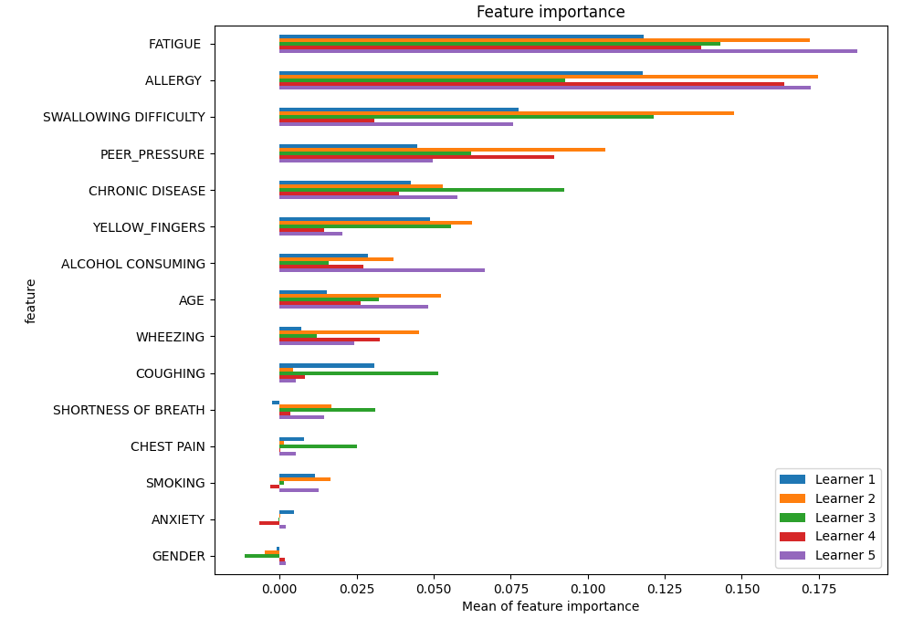
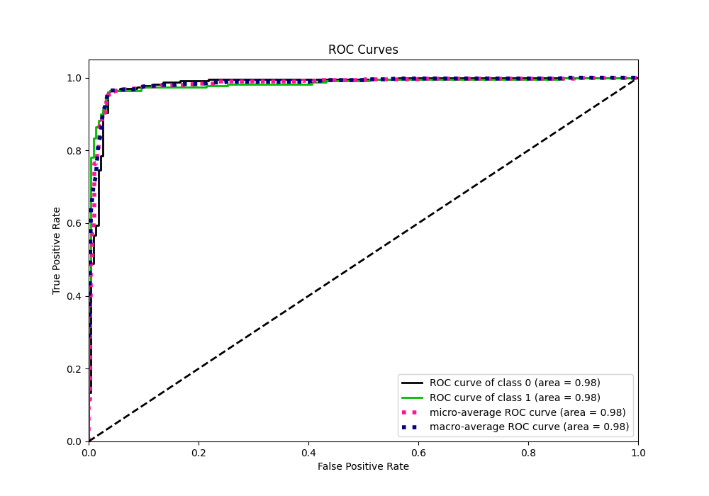
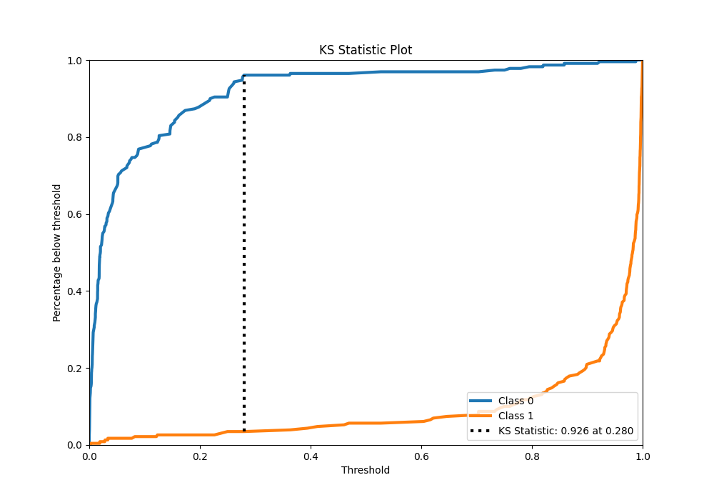
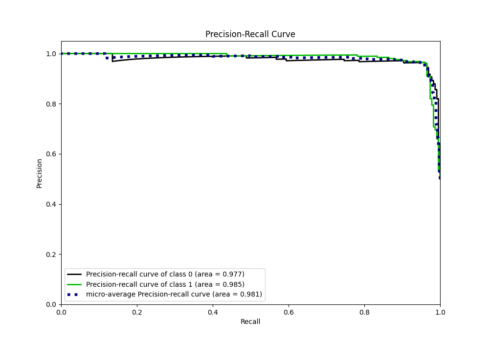
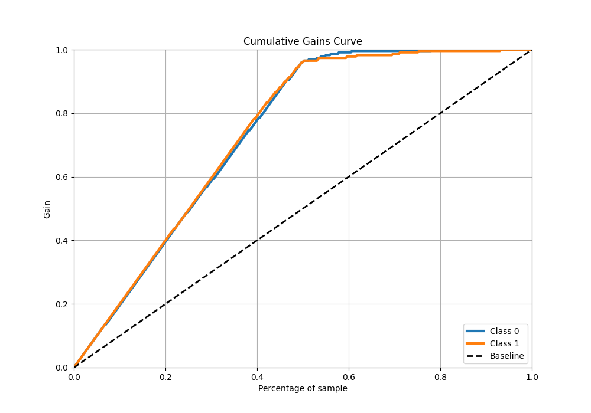
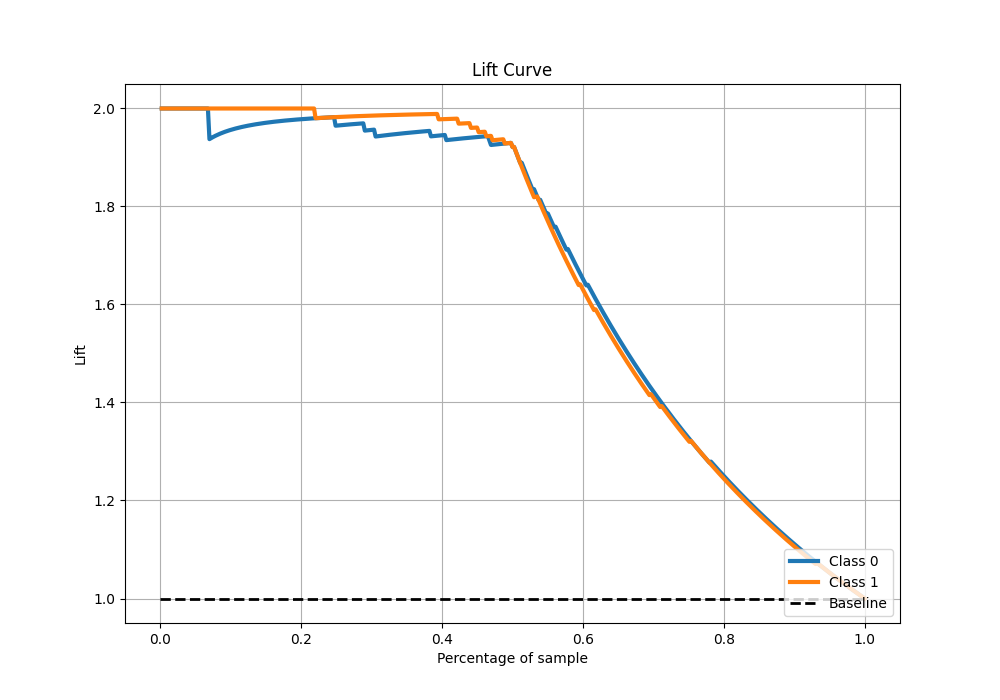

# Summary of 11_LightGBM

[<< Go back](../README.md)

## LightGBM
- **n_jobs**: -1
- **objective**: binary
- **num_leaves**: 15
- **learning_rate**: 0.05
- **feature_fraction**: 0.8
- **bagging_fraction**: 0.5
- **min_data_in_leaf**: 50
- **metric**: binary_logloss
- **custom_eval_metric_name**: None
- **explain_level**: 1

## Validation
 - **validation_type**: kfold
 - **k_folds**: 5
 - **shuffle**: True
 - **stratify**: True

## Optimized metric
logloss

## Training time

5.1 seconds

## Metric details
|           |    score |     threshold |
|:----------|---------:|--------------:|
| logloss   | 0.152876 | nan           |
| auc       | 0.982342 | nan           |
| f1        | 0.960699 |   0.362657    |
| accuracy  | 0.960699 |   0.362657    |
| precision | 1        |   0.988195    |
| recall    | 1        |   1.07721e-05 |
| mcc       | 0.921397 |   0.362657    |

## Metric details with threshold from accuracy metric
|           |    score |   threshold |
|:----------|---------:|------------:|
| logloss   | 0.152876 |  nan        |
| auc       | 0.982342 |  nan        |
| f1        | 0.960699 |    0.362657 |
| accuracy  | 0.960699 |    0.362657 |
| precision | 0.960699 |    0.362657 |
| recall    | 0.960699 |    0.362657 |
| mcc       | 0.921397 |    0.362657 |

## Confusion matrix (at threshold=0.362657)
|              |   Predicted as 0 |   Predicted as 1 |
|:-------------|-----------------:|-----------------:|
| Labeled as 0 |              220 |                9 |
| Labeled as 1 |                9 |              220 |

## Learning curves

## Permutation-based Importance

## Confusion Matrix

## Normalized Confusion Matrix

## ROC Curve

## Kolmogorov-Smirnov Statistic

## Precision-Recall Curve

## Calibration Curve

## Cumulative Gains Curve

## Lift Curve

[<< Go back](../README.md)
