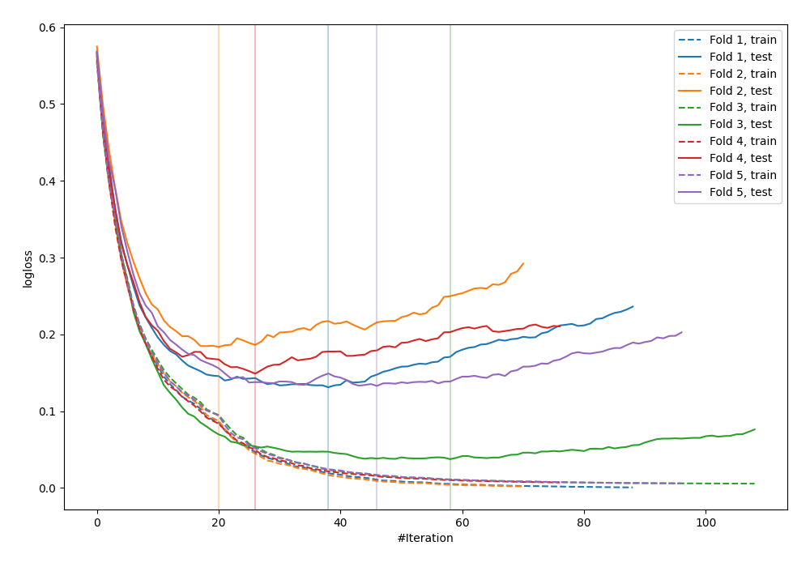
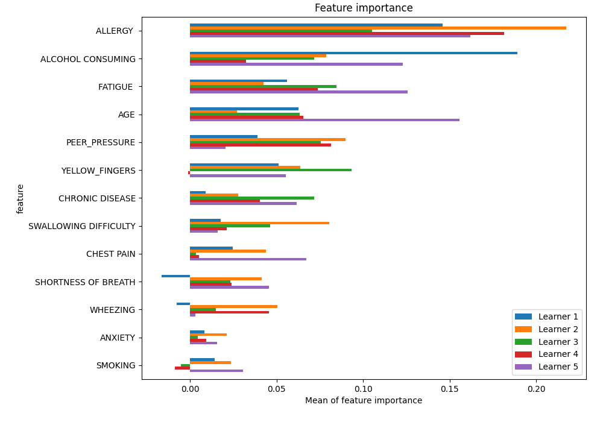
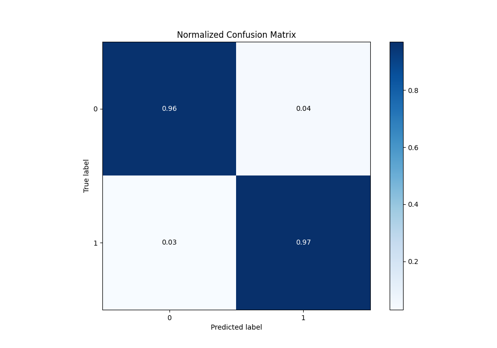
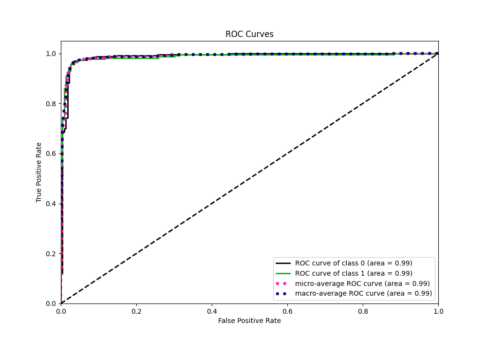
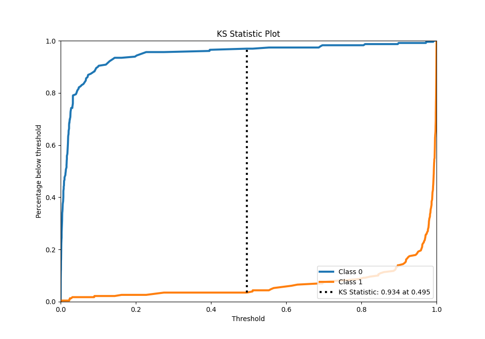
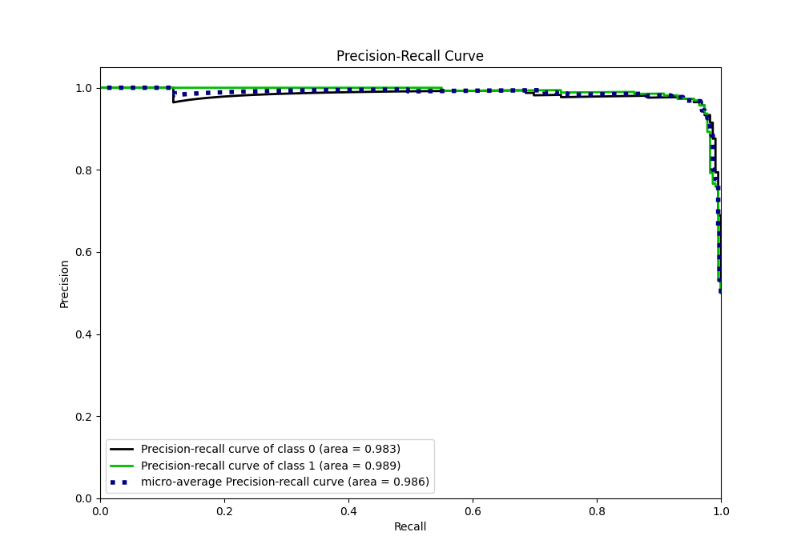
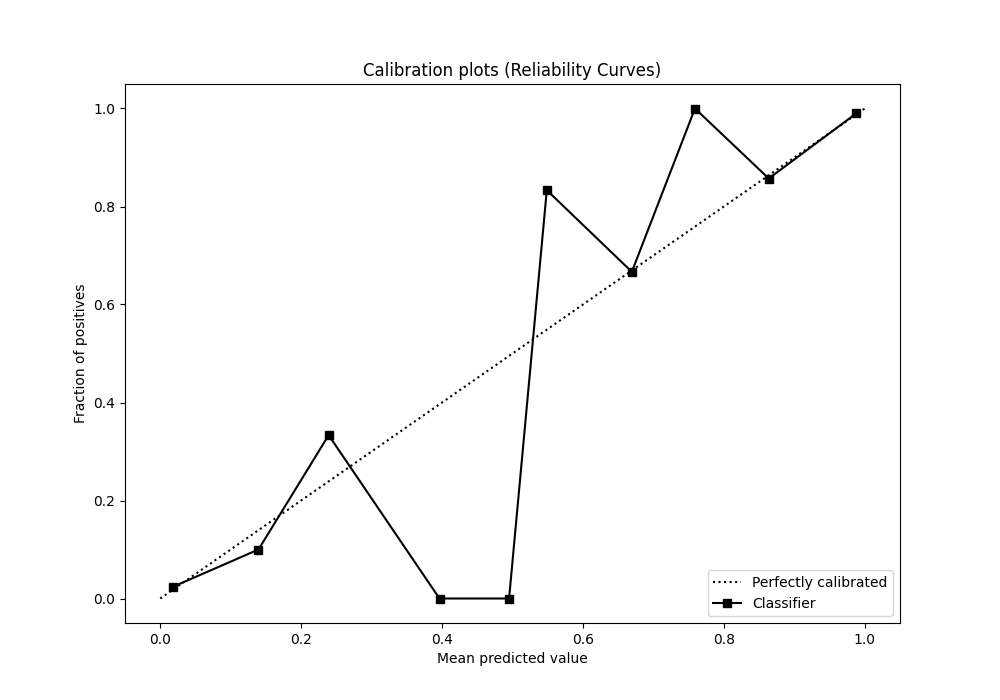
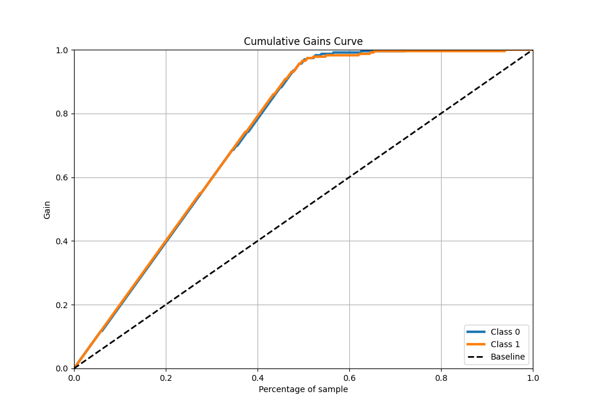
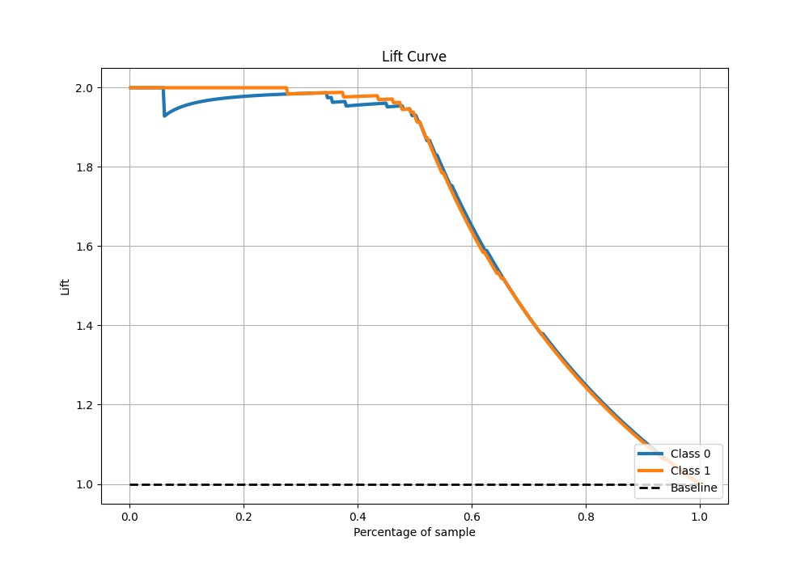

# Summary of 12_LightGBM_SelectedFeatures

[<< Go back](../README.md)

## LightGBM
- **n_jobs**: -1
- **objective**: binary
- **num_leaves**: 63
- **learning_rate**: 0.2
- **feature_fraction**: 0.5
- **bagging_fraction**: 1.0
- **min_data_in_leaf**: 10
- **metric**: binary_logloss
- **custom_eval_metric_name**: None
- **explain_level**: 1

## Validation
 - **validation_type**: kfold
 - **k_folds**: 5
 - **shuffle**: True
 - **stratify**: True

## Optimized metric
logloss

## Training time

8.1 seconds

## Metric details
|           |    score |     threshold |
|:----------|---------:|--------------:|
| logloss   | 0.126824 | nan           |
| auc       | 0.987319 | nan           |
| f1        | 0.965368 |   0.251195    |
| accuracy  | 0.965066 |   0.251195    |
| precision | 1        |   0.991555    |
| recall    | 1        |   4.46679e-05 |
| mcc       | 0.930273 |   0.251195    |

## Metric details with threshold from accuracy metric
|           |    score |   threshold |
|:----------|---------:|------------:|
| logloss   | 0.126824 |  nan        |
| auc       | 0.987319 |  nan        |
| f1        | 0.965368 |    0.251195 |
| accuracy  | 0.965066 |    0.251195 |
| precision | 0.957082 |    0.251195 |
| recall    | 0.973799 |    0.251195 |
| mcc       | 0.930273 |    0.251195 |

## Confusion matrix (at threshold=0.251195)
|              |   Predicted as 0 |   Predicted as 1 |
|:-------------|-----------------:|-----------------:|
| Labeled as 0 |              219 |               10 |
| Labeled as 1 |                6 |              223 |

## Learning curves

## Permutation-based Importance

## Confusion Matrix

## Normalized Confusion Matrix

## ROC Curve

## Kolmogorov-Smirnov Statistic

## Precision-Recall Curve

## Calibration Curve

## Cumulative Gains Curve

## Lift Curve

[<< Go back](../README.md)
