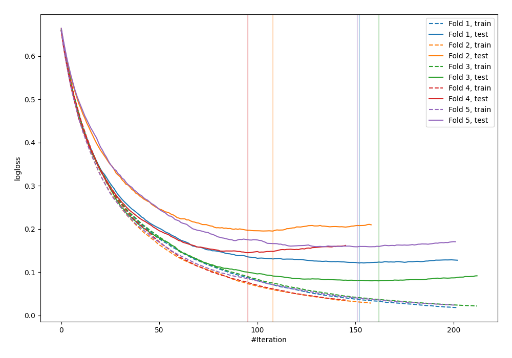
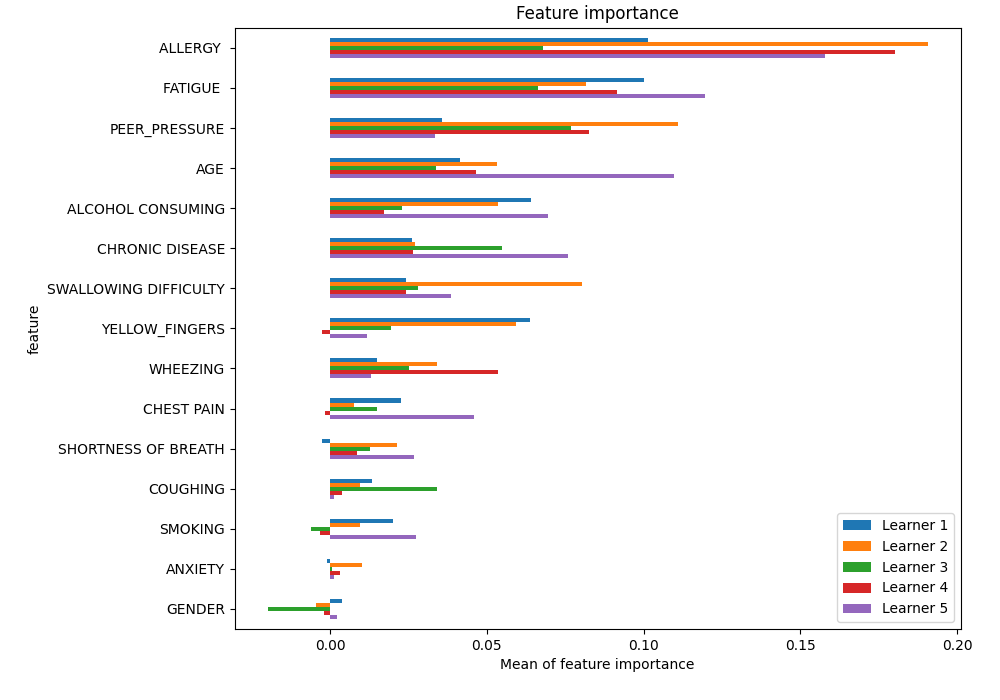
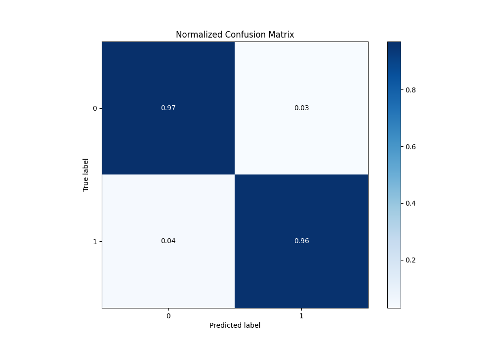
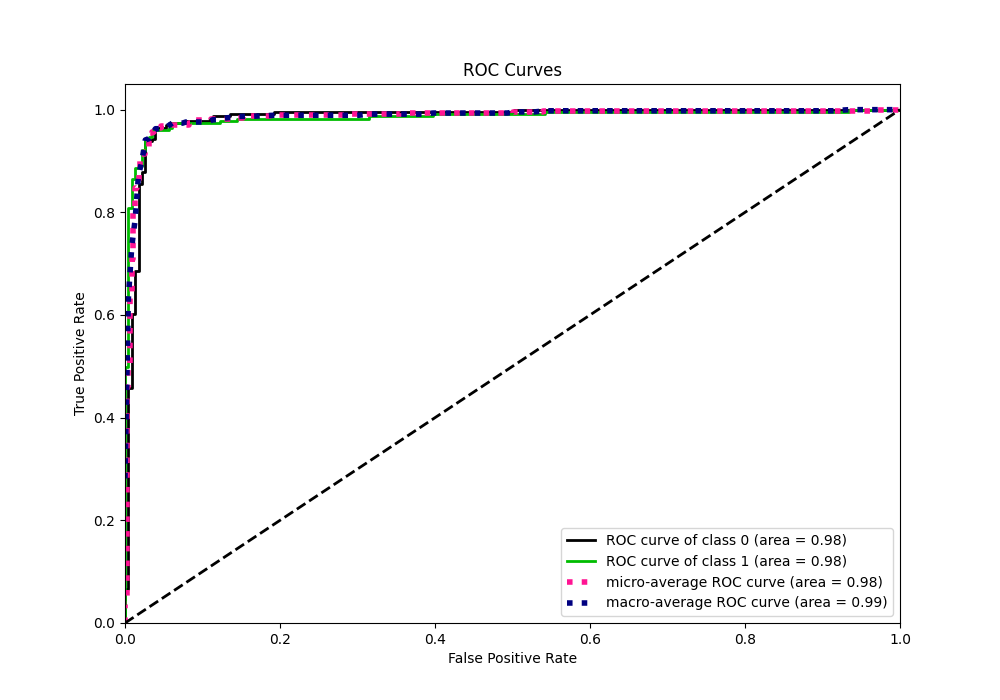
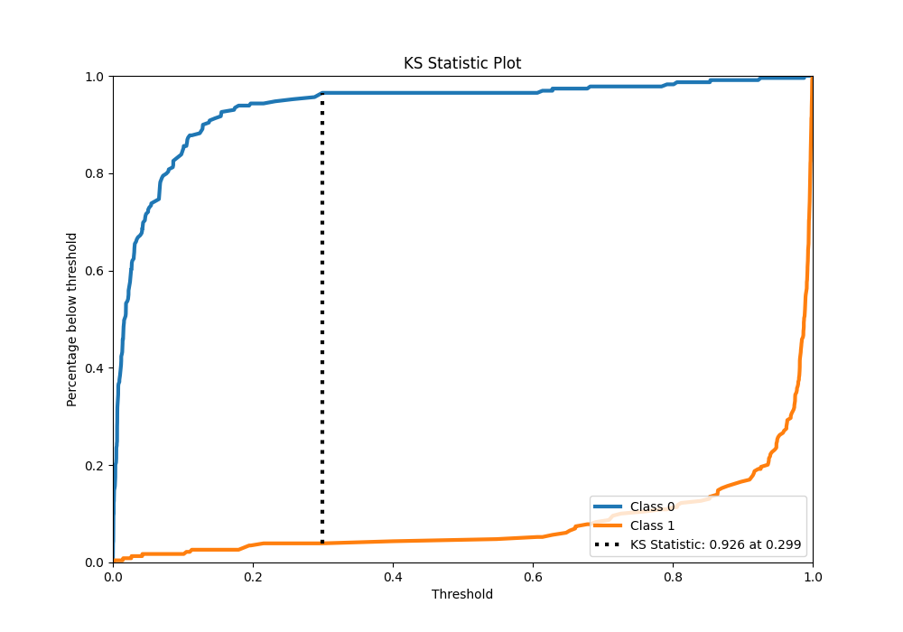
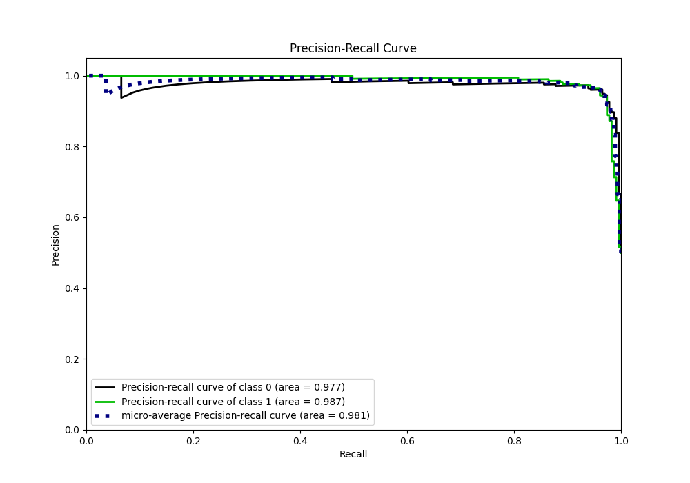
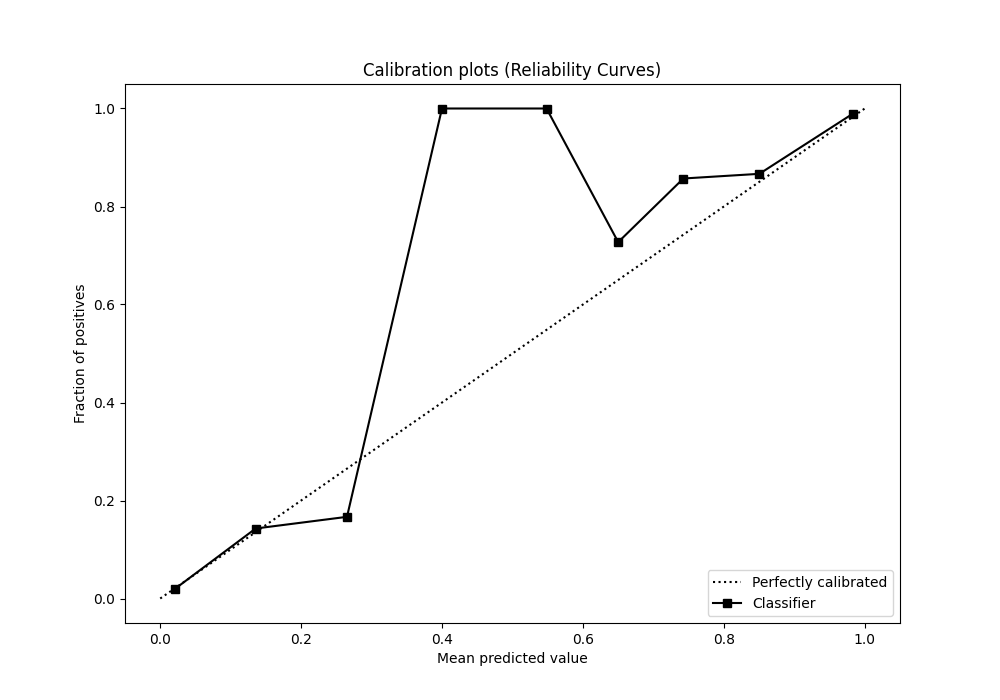
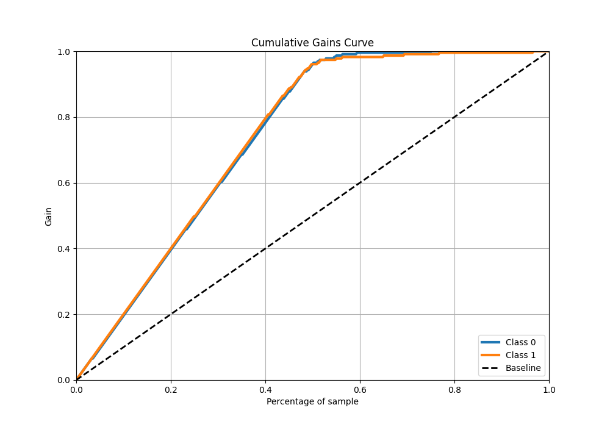
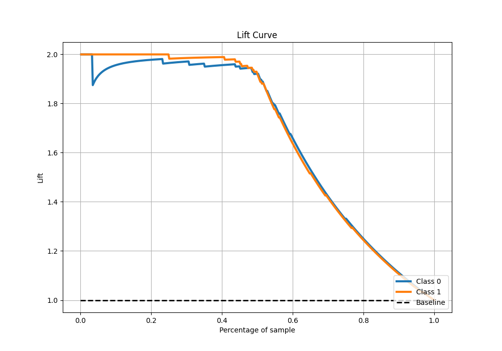

# Summary of 13_LightGBM

[<< Go back](../README.md)

## LightGBM
- **n_jobs**: -1
- **objective**: binary
- **num_leaves**: 63
- **learning_rate**: 0.05
- **feature_fraction**: 0.9
- **bagging_fraction**: 1.0
- **min_data_in_leaf**: 20
- **metric**: binary_logloss
- **custom_eval_metric_name**: None
- **explain_level**: 1

## Validation
 - **validation_type**: kfold
 - **k_folds**: 5
 - **shuffle**: True
 - **stratify**: True

## Optimized metric
logloss

## Training time

6.1 seconds

## Metric details
|           |    score |     threshold |
|:----------|---------:|--------------:|
| logloss   | 0.140203 | nan           |
| auc       | 0.984459 | nan           |
| f1        | 0.962801 |   0.299151    |
| accuracy  | 0.962882 |   0.299151    |
| precision | 1        |   0.988524    |
| recall    | 1        |   0.000103851 |
| mcc       | 0.925773 |   0.299151    |

## Metric details with threshold from accuracy metric
|           |    score |   threshold |
|:----------|---------:|------------:|
| logloss   | 0.140203 |  nan        |
| auc       | 0.984459 |  nan        |
| f1        | 0.962801 |    0.299151 |
| accuracy  | 0.962882 |    0.299151 |
| precision | 0.964912 |    0.299151 |
| recall    | 0.960699 |    0.299151 |
| mcc       | 0.925773 |    0.299151 |

## Confusion matrix (at threshold=0.299151)
|              |   Predicted as 0 |   Predicted as 1 |
|:-------------|-----------------:|-----------------:|
| Labeled as 0 |              221 |                8 |
| Labeled as 1 |                9 |              220 |

## Learning curves

## Permutation-based Importance

## Confusion Matrix

## Normalized Confusion Matrix

## ROC Curve

## Kolmogorov-Smirnov Statistic

## Precision-Recall Curve

## Calibration Curve

## Cumulative Gains Curve

## Lift Curve

[<< Go back](../README.md)
