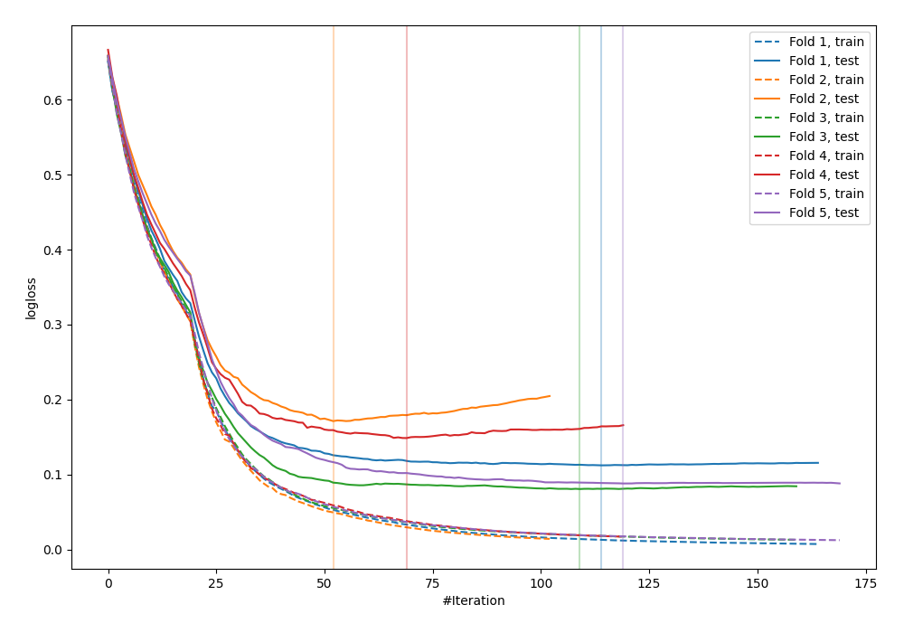
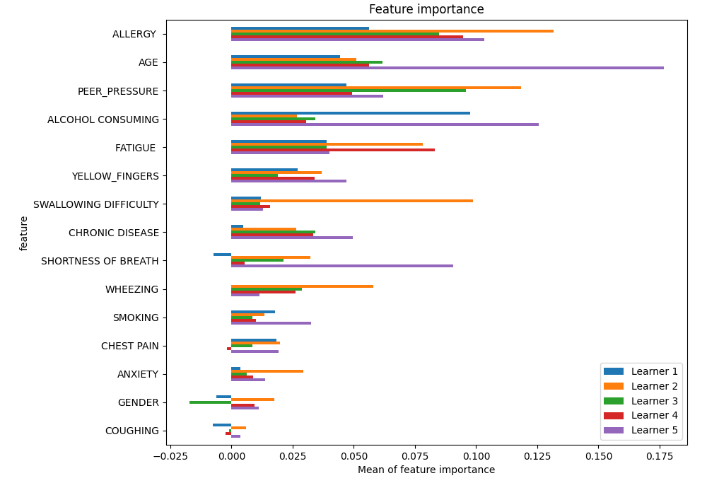
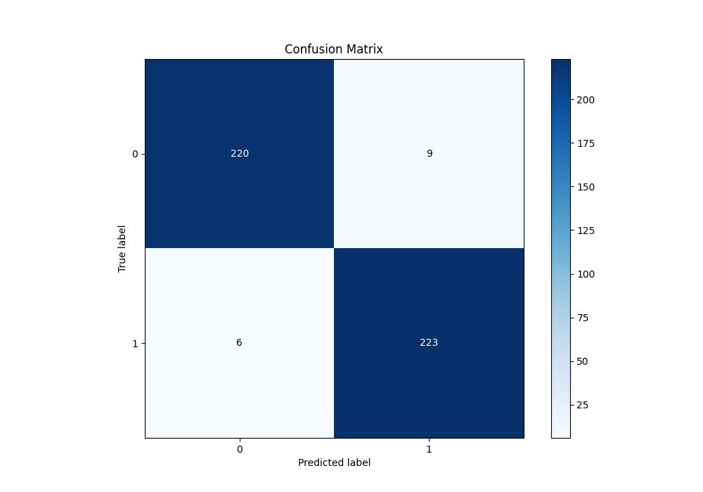
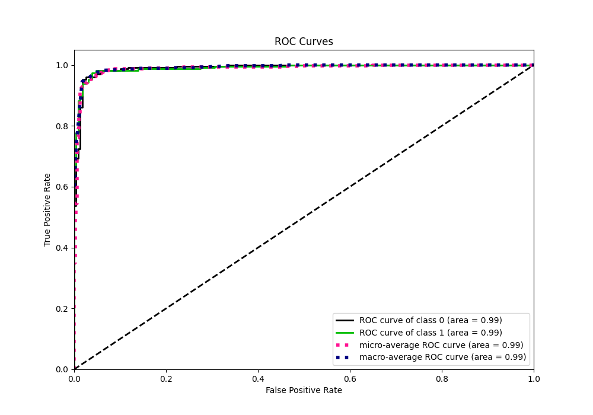
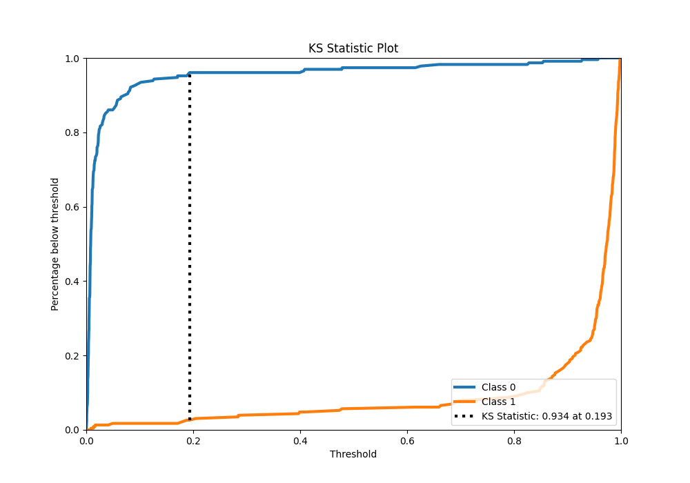
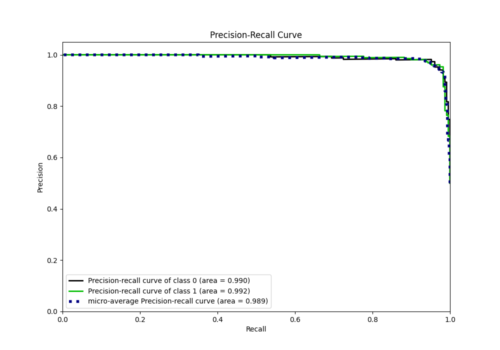
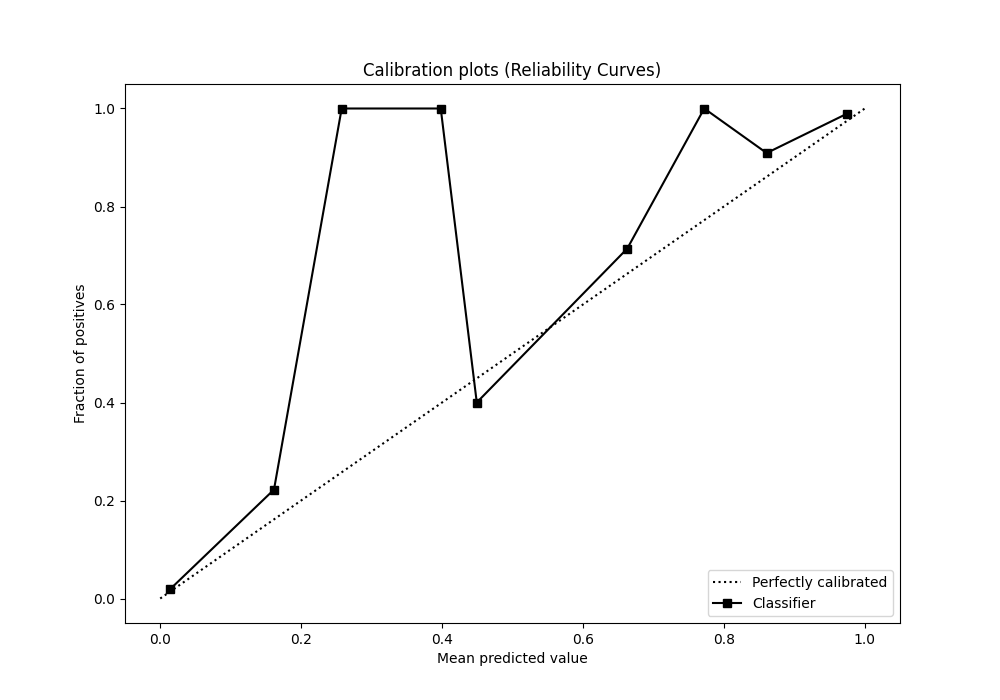
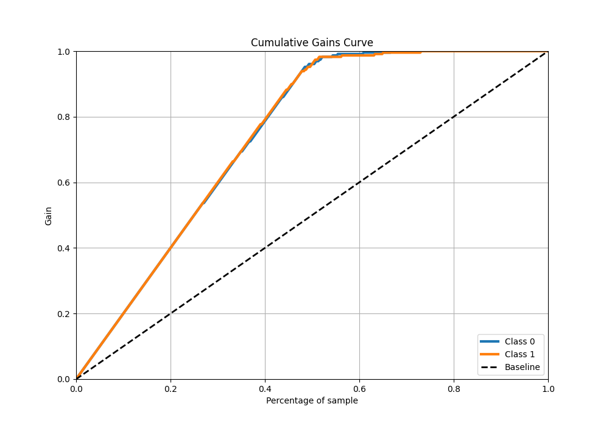
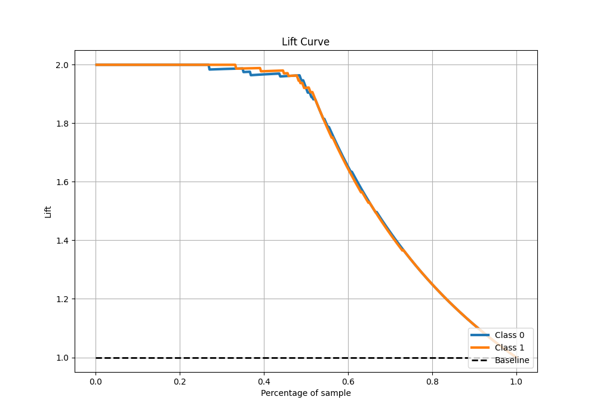

# Summary of 17_CatBoost

[<< Go back](../README.md)

## CatBoost
- **n_jobs**: -1
- **learning_rate**: 0.1
- **depth**: 7
- **rsm**: 1.0
- **loss_function**: Logloss
- **eval_metric**: Logloss
- **explain_level**: 1

## Validation
 - **validation_type**: kfold
 - **k_folds**: 5
 - **shuffle**: True
 - **stratify**: True

## Optimized metric
logloss

## Training time

6.5 seconds

## Metric details
|           |    score |    threshold |
|:----------|---------:|-------------:|
| logloss   | 0.120144 | nan          |
| auc       | 0.990847 | nan          |
| f1        | 0.967462 |   0.193248   |
| accuracy  | 0.967249 |   0.193248   |
| precision | 1        |   0.960676   |
| recall    | 1        |   0.00073441 |
| mcc       | 0.934578 |   0.193248   |

## Metric details with threshold from accuracy metric
|           |    score |   threshold |
|:----------|---------:|------------:|
| logloss   | 0.120144 |  nan        |
| auc       | 0.990847 |  nan        |
| f1        | 0.967462 |    0.193248 |
| accuracy  | 0.967249 |    0.193248 |
| precision | 0.961207 |    0.193248 |
| recall    | 0.973799 |    0.193248 |
| mcc       | 0.934578 |    0.193248 |

## Confusion matrix (at threshold=0.193248)
|              |   Predicted as 0 |   Predicted as 1 |
|:-------------|-----------------:|-----------------:|
| Labeled as 0 |              220 |                9 |
| Labeled as 1 |                6 |              223 |

## Learning curves

## Permutation-based Importance

## Confusion Matrix

## Normalized Confusion Matrix

## ROC Curve

## Kolmogorov-Smirnov Statistic

## Precision-Recall Curve

## Calibration Curve

## Cumulative Gains Curve

## Lift Curve

[<< Go back](../README.md)
