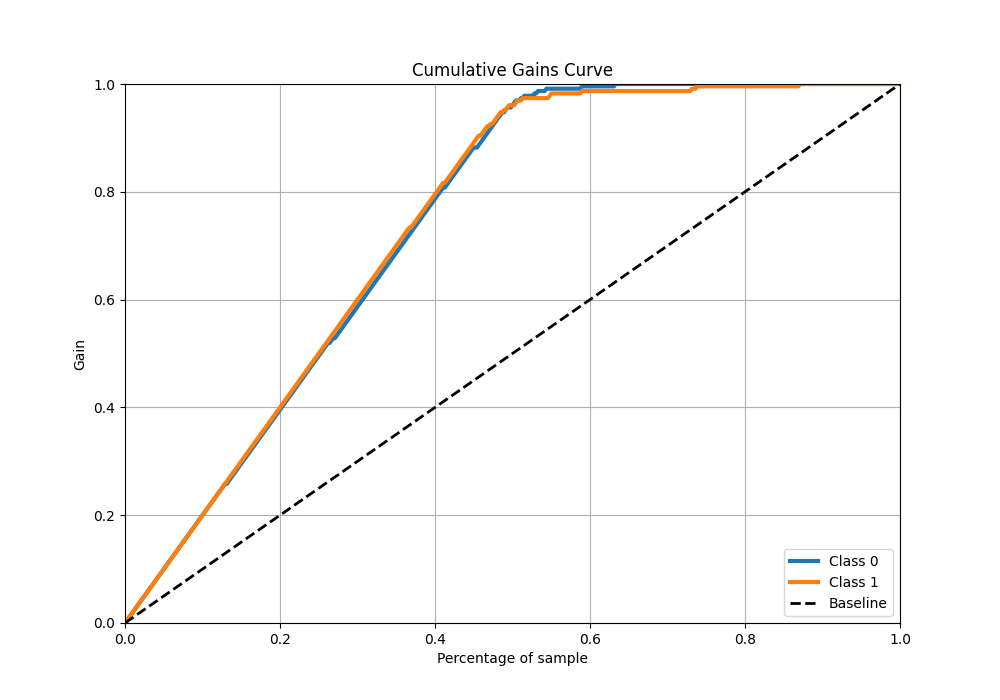

# Summary of 17_CatBoost_GoldenFeatures

[<< Go back](../README.md)

## CatBoost
- **n_jobs**: -1
- **learning_rate**: 0.1
- **depth**: 7
- **rsm**: 1.0
- **loss_function**: Logloss
- **eval_metric**: Logloss
- **explain_level**: 1

## Validation
 - **validation_type**: kfold
 - **k_folds**: 5
 - **shuffle**: True
 - **stratify**: True

## Optimized metric
logloss

## Training time

7.9 seconds

## Metric details
|           |    score |     threshold |
|:----------|---------:|--------------:|
| logloss   | 0.123813 | nan           |
| auc       | 0.987834 | nan           |
| f1        | 0.963124 |   0.248975    |
| accuracy  | 0.962882 |   0.248975    |
| precision | 1        |   0.972835    |
| recall    | 1        |   0.000309712 |
| mcc       | 0.925844 |   0.248975    |

## Metric details with threshold from accuracy metric
|           |    score |   threshold |
|:----------|---------:|------------:|
| logloss   | 0.123813 |  nan        |
| auc       | 0.987834 |  nan        |
| f1        | 0.963124 |    0.248975 |
| accuracy  | 0.962882 |    0.248975 |
| precision | 0.956897 |    0.248975 |
| recall    | 0.969432 |    0.248975 |
| mcc       | 0.925844 |    0.248975 |

## Confusion matrix (at threshold=0.248975)
|              |   Predicted as 0 |   Predicted as 1 |
|:-------------|-----------------:|-----------------:|
| Labeled as 0 |              219 |               10 |
| Labeled as 1 |                7 |              222 |

## Learning curves

## Permutation-based Importance

## Confusion Matrix

## Normalized Confusion Matrix

## ROC Curve

## Kolmogorov-Smirnov Statistic

## Precision-Recall Curve

## Calibration Curve

## Cumulative Gains Curve

## Lift Curve

[<< Go back](../README.md)
