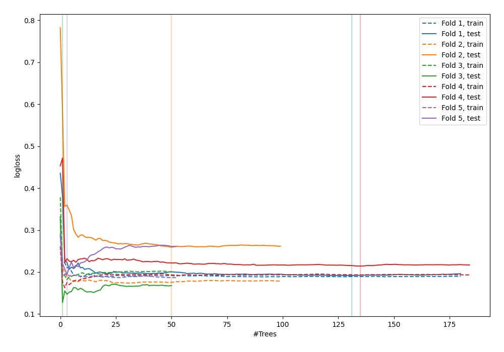
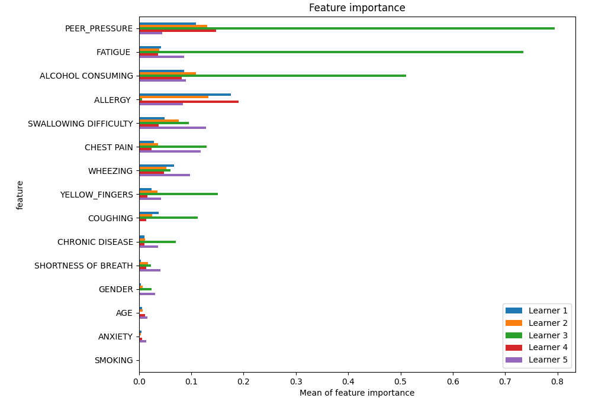
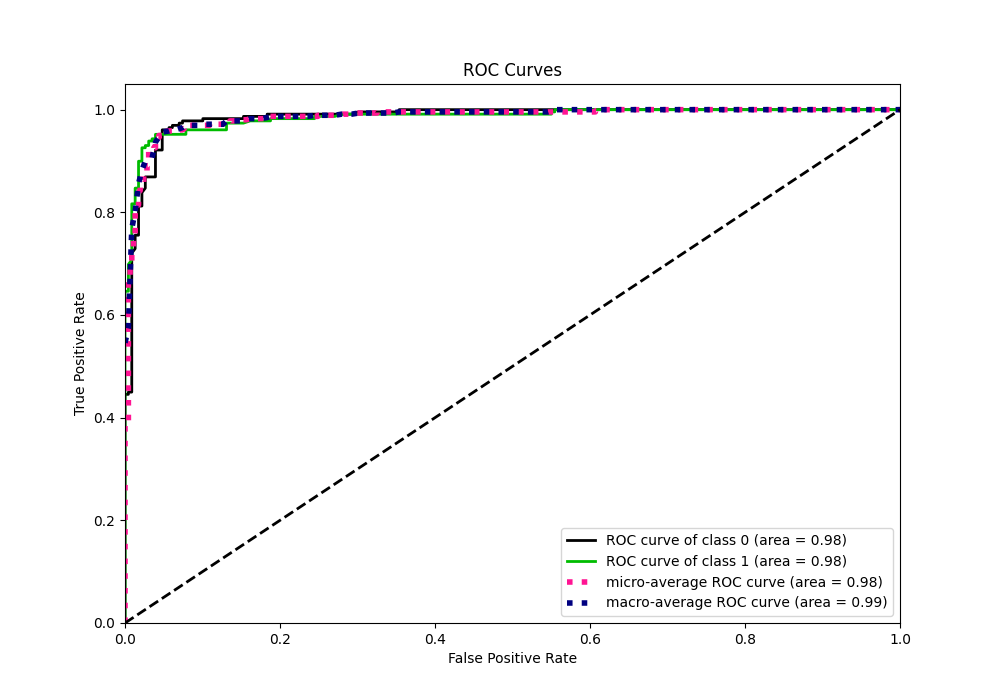
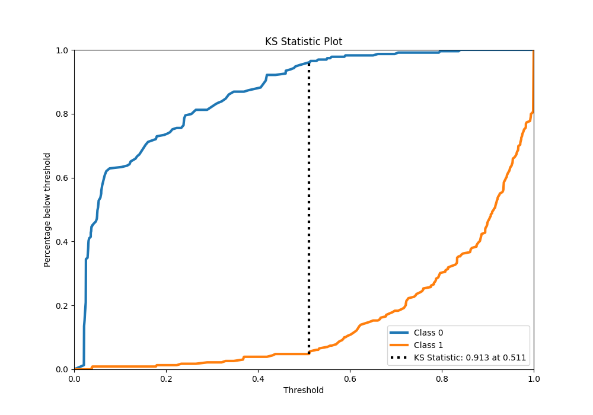
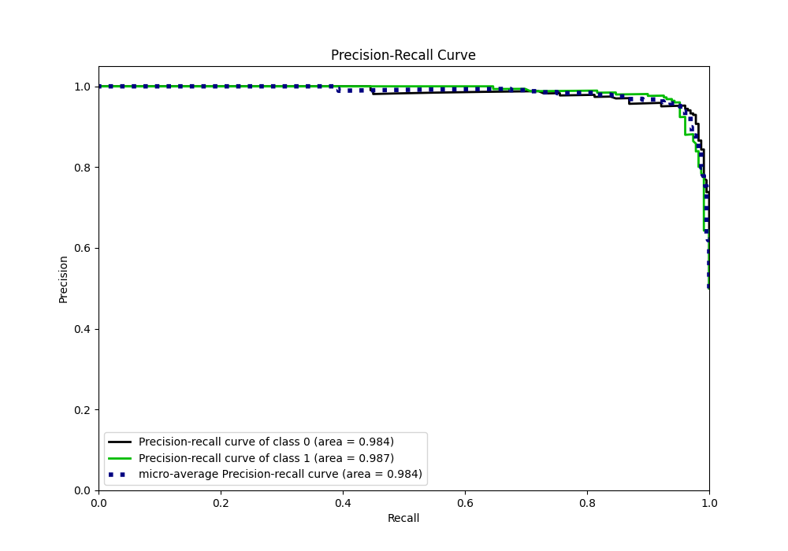
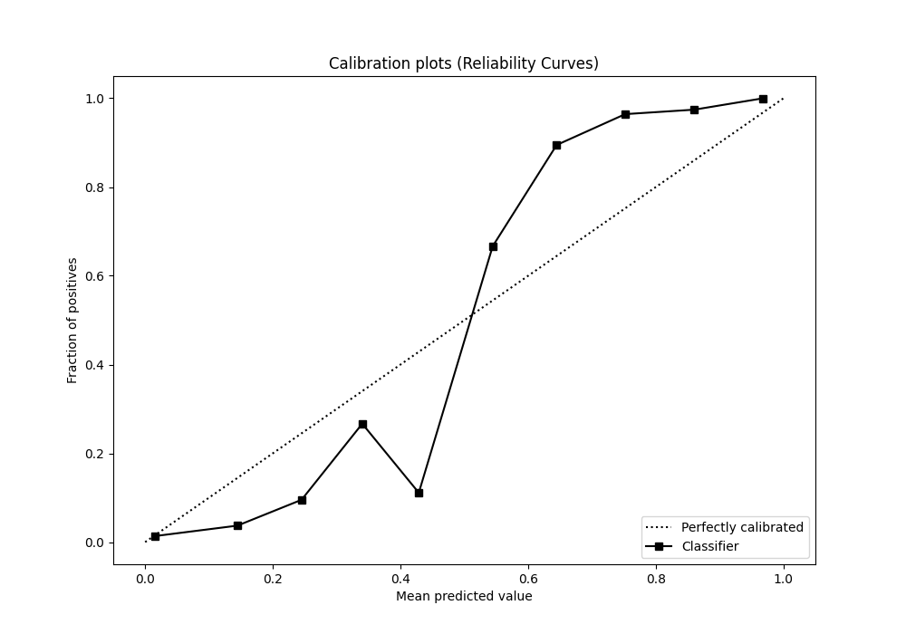
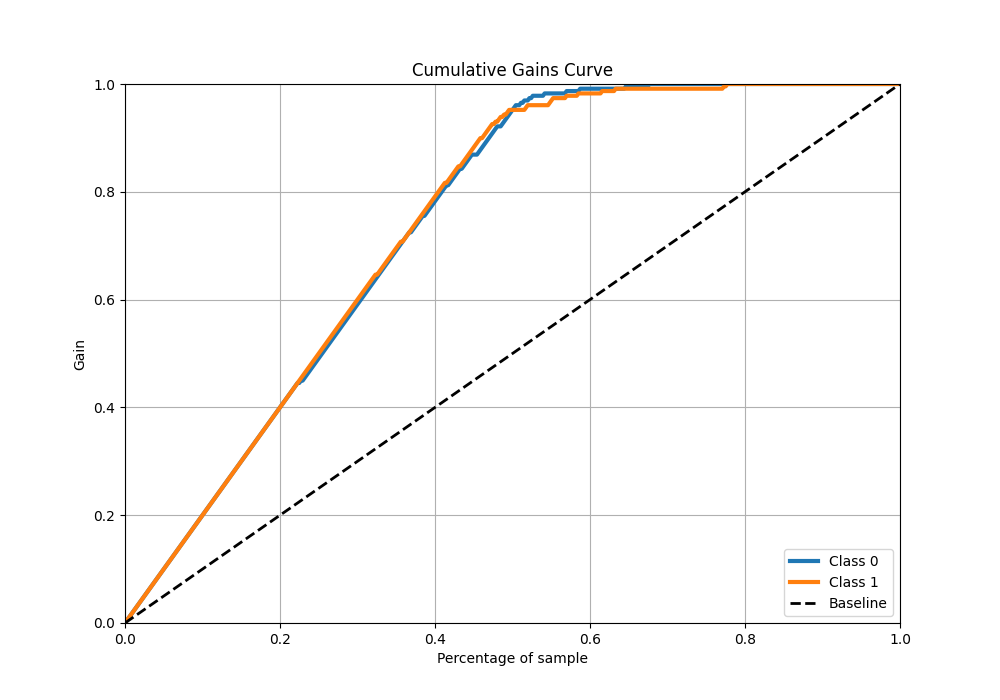
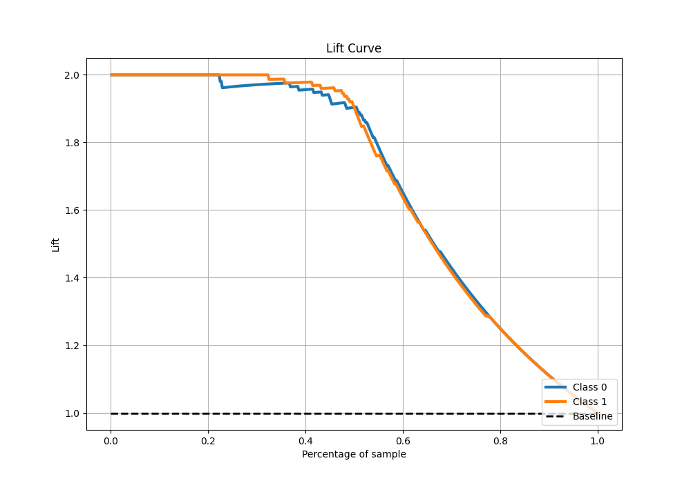

# Summary of 19_RandomForest

[<< Go back](../README.md)

## Random Forest
- **n_jobs**: -1
- **criterion**: gini
- **max_features**: 0.5
- **min_samples_split**: 20
- **max_depth**: 4
- **eval_metric_name**: logloss
- **explain_level**: 1

## Validation
 - **validation_type**: kfold
 - **k_folds**: 5
 - **shuffle**: True
 - **stratify**: True

## Optimized metric
logloss

## Training time

9.2 seconds

## Metric details
|           |    score |   threshold |
|:----------|---------:|------------:|
| logloss   | 0.197129 | nan         |
| auc       | 0.984993 | nan         |
| f1        | 0.951965 |   0.500505  |
| accuracy  | 0.951965 |   0.500505  |
| precision | 1        |   0.861863  |
| recall    | 1        |   0.0191015 |
| mcc       | 0.905174 |   0.565289  |

## Metric details with threshold from accuracy metric
|           |    score |   threshold |
|:----------|---------:|------------:|
| logloss   | 0.197129 |  nan        |
| auc       | 0.984993 |  nan        |
| f1        | 0.951965 |    0.500505 |
| accuracy  | 0.951965 |    0.500505 |
| precision | 0.951965 |    0.500505 |
| recall    | 0.951965 |    0.500505 |
| mcc       | 0.90393  |    0.500505 |

## Confusion matrix (at threshold=0.500505)
|              |   Predicted as 0 |   Predicted as 1 |
|:-------------|-----------------:|-----------------:|
| Labeled as 0 |              218 |               11 |
| Labeled as 1 |               11 |              218 |

## Learning curves

## Permutation-based Importance

## Confusion Matrix

## Normalized Confusion Matrix

## ROC Curve

## Kolmogorov-Smirnov Statistic

## Precision-Recall Curve

## Calibration Curve

## Cumulative Gains Curve

## Lift Curve

[<< Go back](../README.md)
