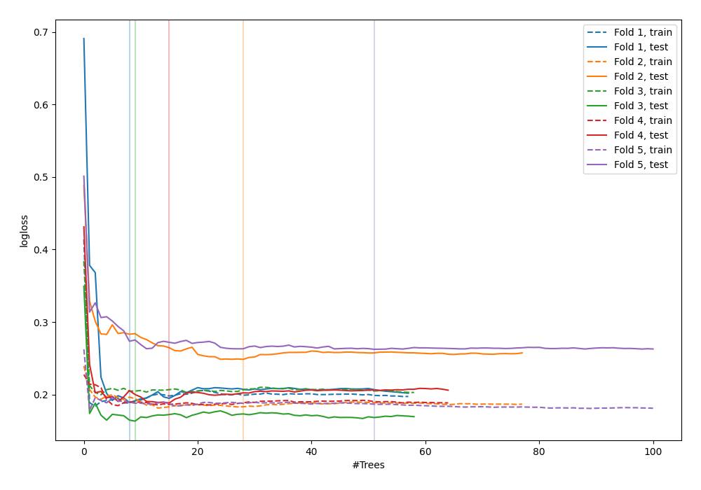
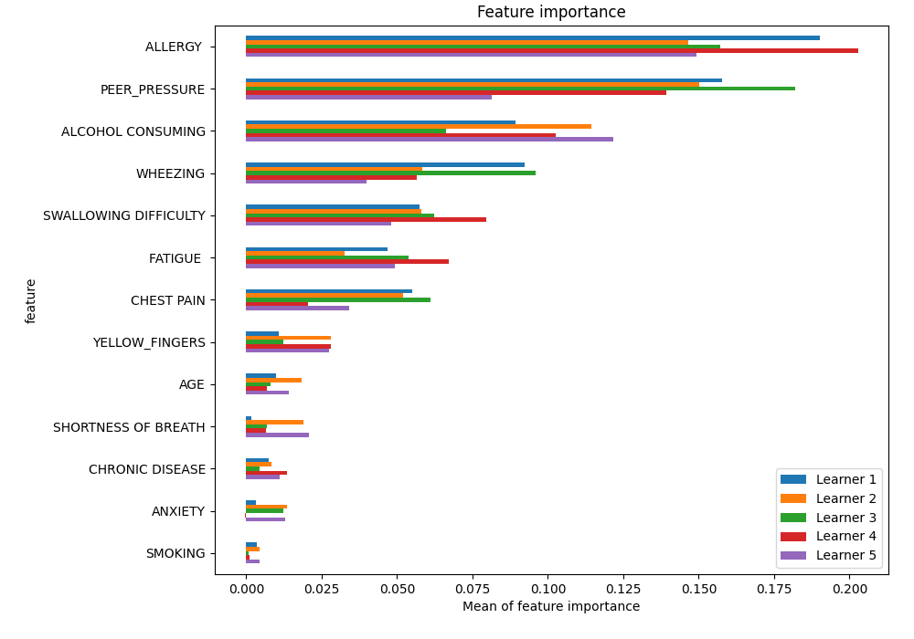
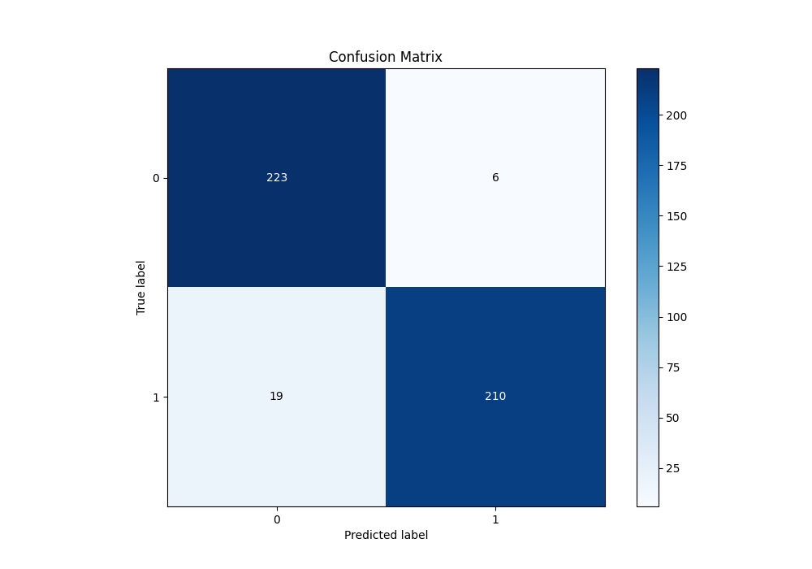
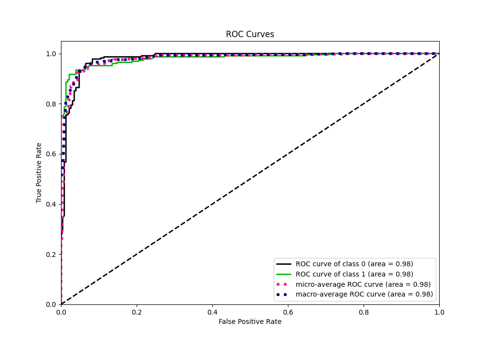
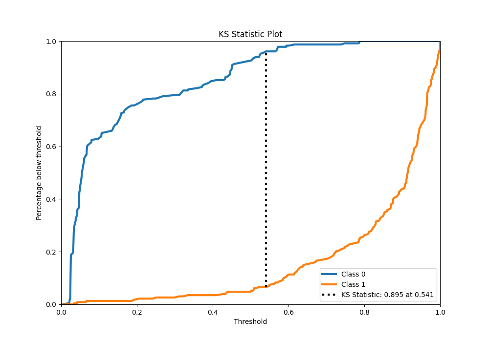
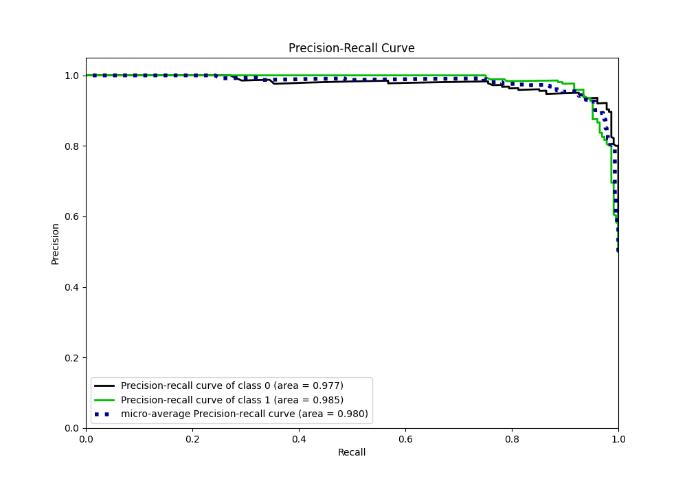
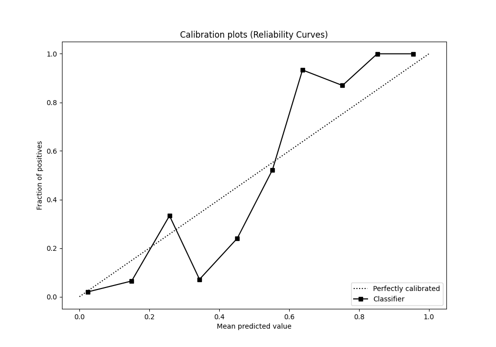
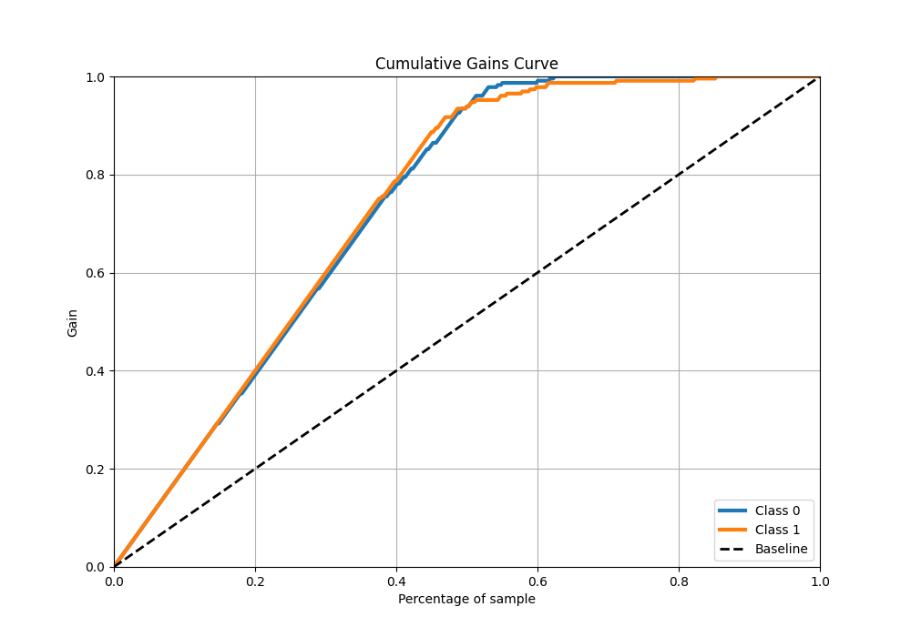
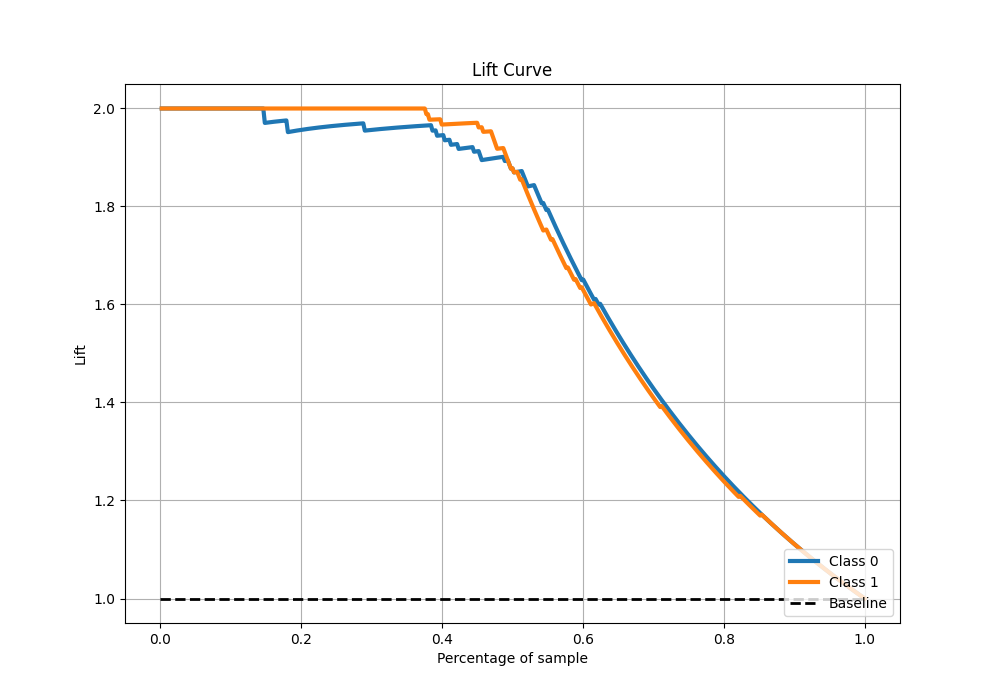

# Summary of 19_RandomForest_SelectedFeatures

[<< Go back](../README.md)

## Random Forest
- **n_jobs**: -1
- **criterion**: gini
- **max_features**: 0.5
- **min_samples_split**: 20
- **max_depth**: 4
- **eval_metric_name**: logloss
- **explain_level**: 1

## Validation
 - **validation_type**: kfold
 - **k_folds**: 5
 - **shuffle**: True
 - **stratify**: True

## Optimized metric
logloss

## Training time

10.8 seconds

## Metric details
|           |    score |   threshold |
|:----------|---------:|------------:|
| logloss   | 0.21026  | nan         |
| auc       | 0.981446 | nan         |
| f1        | 0.94382  |   0.571143  |
| accuracy  | 0.945415 |   0.571143  |
| precision | 1        |   0.8038    |
| recall    | 1        |   0.0191402 |
| mcc       | 0.892269 |   0.571143  |

## Metric details with threshold from accuracy metric
|           |    score |   threshold |
|:----------|---------:|------------:|
| logloss   | 0.21026  |  nan        |
| auc       | 0.981446 |  nan        |
| f1        | 0.94382  |    0.571143 |
| accuracy  | 0.945415 |    0.571143 |
| precision | 0.972222 |    0.571143 |
| recall    | 0.917031 |    0.571143 |
| mcc       | 0.892269 |    0.571143 |

## Confusion matrix (at threshold=0.571143)
|              |   Predicted as 0 |   Predicted as 1 |
|:-------------|-----------------:|-----------------:|
| Labeled as 0 |              223 |                6 |
| Labeled as 1 |               19 |              210 |

## Learning curves

## Permutation-based Importance

## Confusion Matrix

## Normalized Confusion Matrix

## ROC Curve

## Kolmogorov-Smirnov Statistic

## Precision-Recall Curve

## Calibration Curve

## Cumulative Gains Curve

## Lift Curve

[<< Go back](../README.md)
