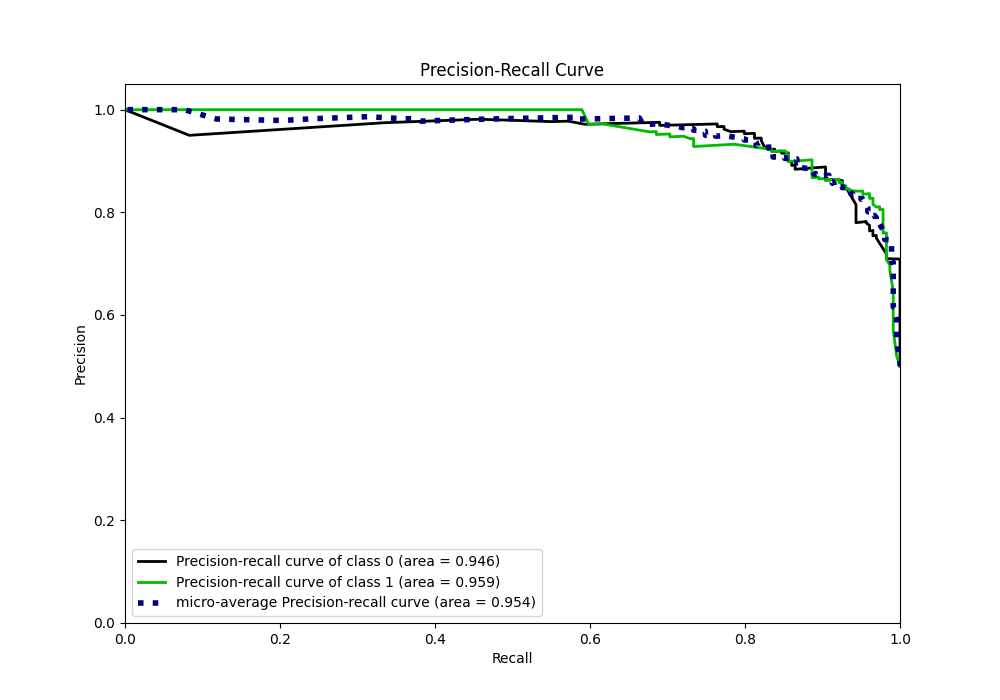

# Summary of 21_RandomForest

[<< Go back](../README.md)

## Random Forest
- **n_jobs**: -1
- **criterion**: gini
- **max_features**: 0.8
- **min_samples_split**: 40
- **max_depth**: 3
- **eval_metric_name**: logloss
- **explain_level**: 1

## Validation
 - **validation_type**: kfold
 - **k_folds**: 5
 - **shuffle**: True
 - **stratify**: True

## Optimized metric
logloss

## Training time

9.5 seconds

## Metric details
|           |    score |   threshold |
|:----------|---------:|------------:|
| logloss   | 0.281769 | nan         |
| auc       | 0.956637 | nan         |
| f1        | 0.894309 |   0.439612  |
| accuracy  | 0.895197 |   0.608282  |
| precision | 1        |   0.76644   |
| recall    | 1        |   0.0344974 |
| mcc       | 0.790514 |   0.608282  |

## Metric details with threshold from accuracy metric
|           |    score |   threshold |
|:----------|---------:|------------:|
| logloss   | 0.281769 |  nan        |
| auc       | 0.956637 |  nan        |
| f1        | 0.894273 |    0.608282 |
| accuracy  | 0.895197 |    0.608282 |
| precision | 0.902222 |    0.608282 |
| recall    | 0.886463 |    0.608282 |
| mcc       | 0.790514 |    0.608282 |

## Confusion matrix (at threshold=0.608282)
|              |   Predicted as 0 |   Predicted as 1 |
|:-------------|-----------------:|-----------------:|
| Labeled as 0 |              207 |               22 |
| Labeled as 1 |               26 |              203 |

## Learning curves

## Permutation-based Importance

## Confusion Matrix

## Normalized Confusion Matrix

## ROC Curve

## Kolmogorov-Smirnov Statistic

## Precision-Recall Curve

## Calibration Curve

## Cumulative Gains Curve

## Lift Curve

[<< Go back](../README.md)
