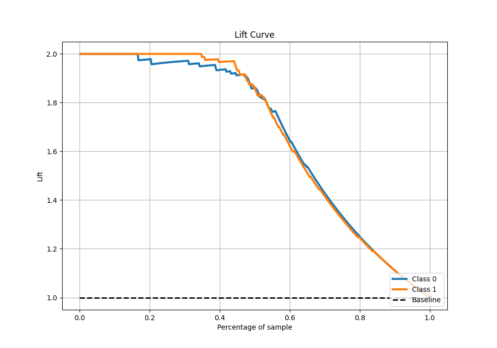

# Summary of 39_RandomForest

[<< Go back](../README.md)

## Random Forest
- **n_jobs**: -1
- **criterion**: gini
- **max_features**: 0.6
- **min_samples_split**: 20
- **max_depth**: 4
- **eval_metric_name**: logloss
- **explain_level**: 1

## Validation
 - **validation_type**: kfold
 - **k_folds**: 5
 - **shuffle**: True
 - **stratify**: True

## Optimized metric
logloss

## Training time

11.8 seconds

## Metric details
|           |    score |   threshold |
|:----------|---------:|------------:|
| logloss   | 0.210377 | nan         |
| auc       | 0.979558 | nan         |
| f1        | 0.933902 |   0.466153  |
| accuracy  | 0.932314 |   0.466153  |
| precision | 1        |   0.824087  |
| recall    | 1        |   0.0119462 |
| mcc       | 0.866025 |   0.573177  |

## Metric details with threshold from accuracy metric
|           |    score |   threshold |
|:----------|---------:|------------:|
| logloss   | 0.210377 |  nan        |
| auc       | 0.979558 |  nan        |
| f1        | 0.933902 |    0.466153 |
| accuracy  | 0.932314 |    0.466153 |
| precision | 0.9125   |    0.466153 |
| recall    | 0.956332 |    0.466153 |
| mcc       | 0.865628 |    0.466153 |

## Confusion matrix (at threshold=0.466153)
|              |   Predicted as 0 |   Predicted as 1 |
|:-------------|-----------------:|-----------------:|
| Labeled as 0 |              208 |               21 |
| Labeled as 1 |               10 |              219 |

## Learning curves

## Permutation-based Importance

## Confusion Matrix

## Normalized Confusion Matrix

## ROC Curve

## Kolmogorov-Smirnov Statistic

## Precision-Recall Curve

## Calibration Curve

## Cumulative Gains Curve

## Lift Curve

[<< Go back](../README.md)
