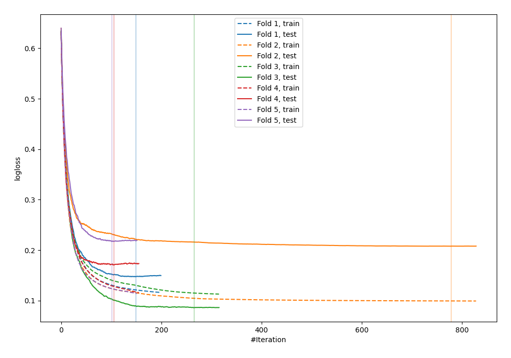
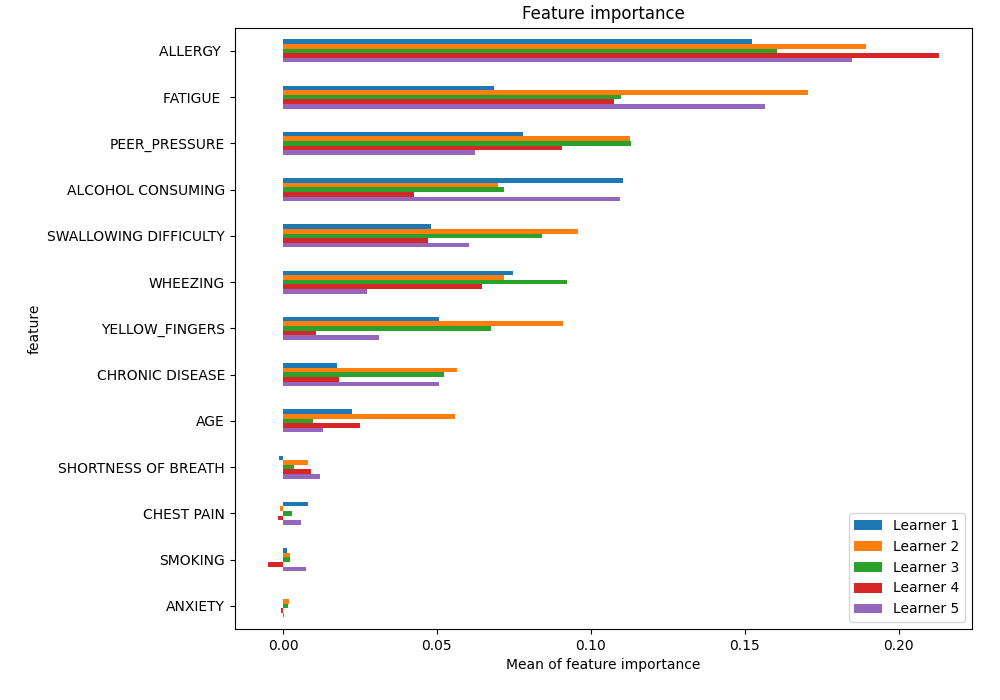
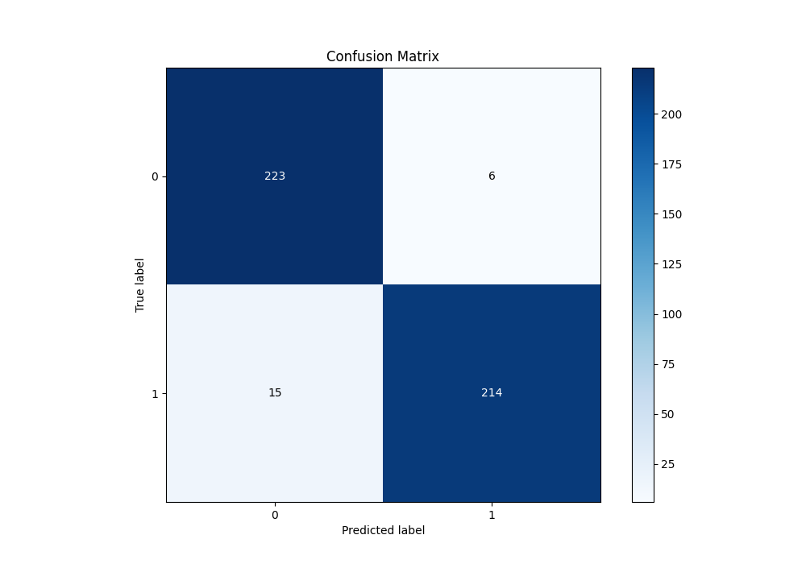
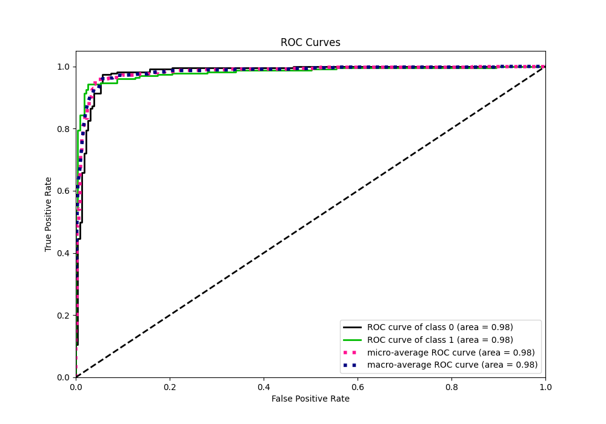
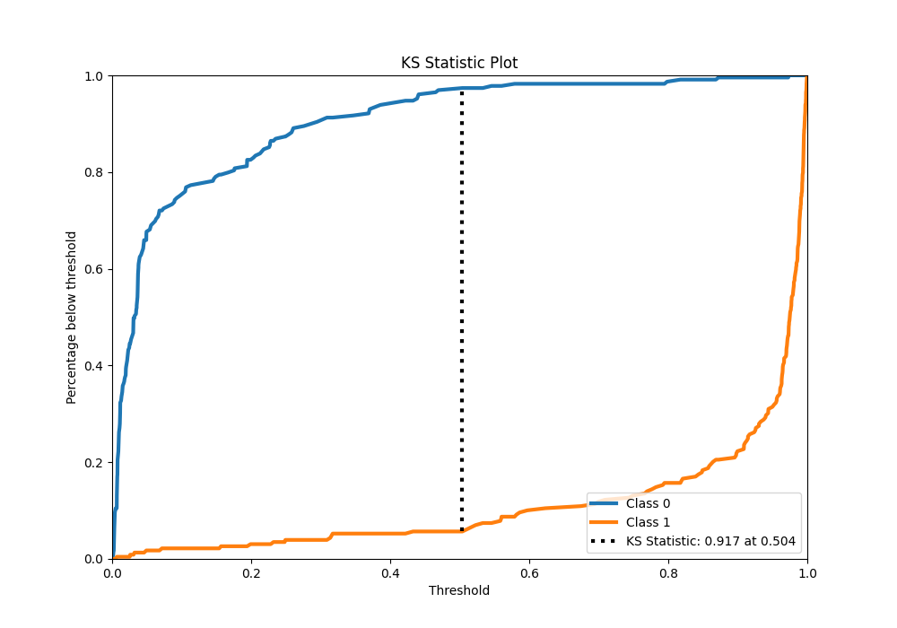
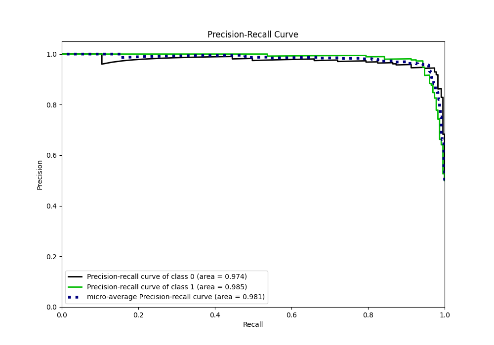
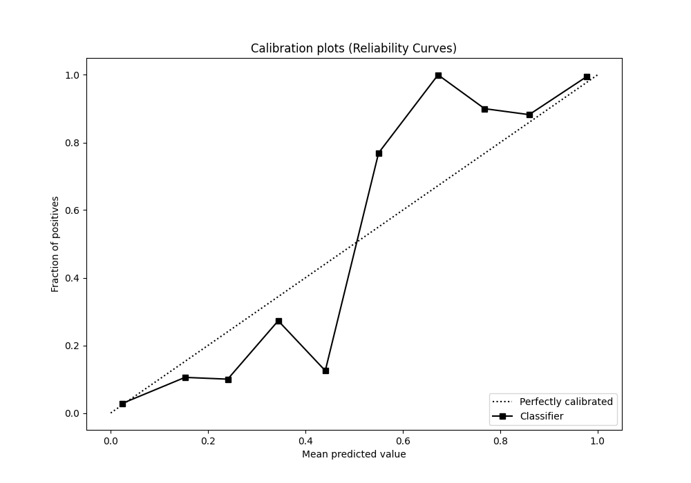
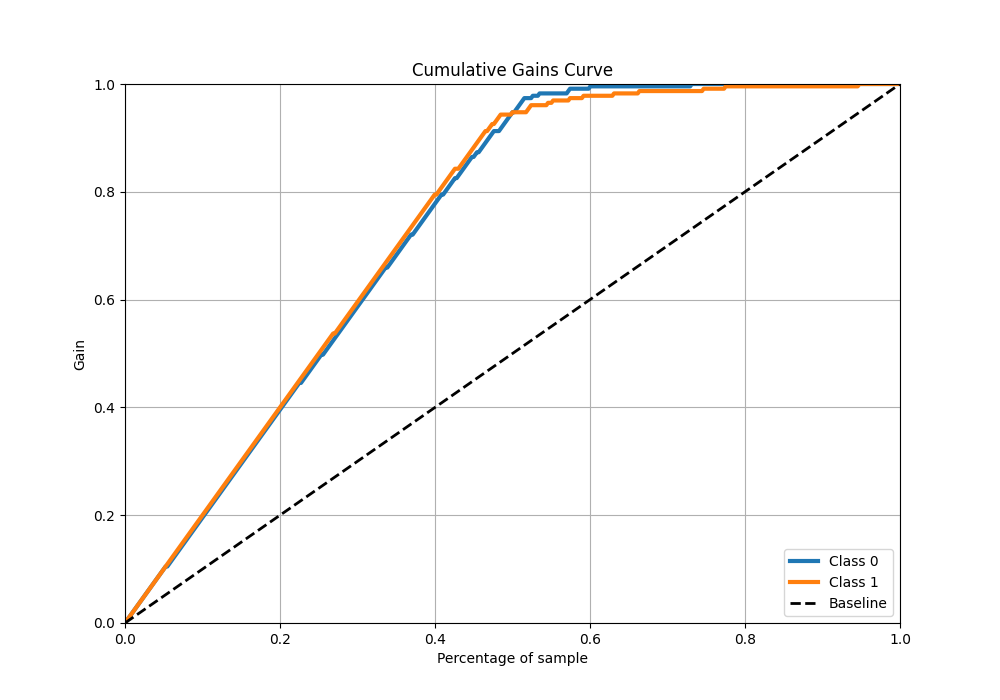
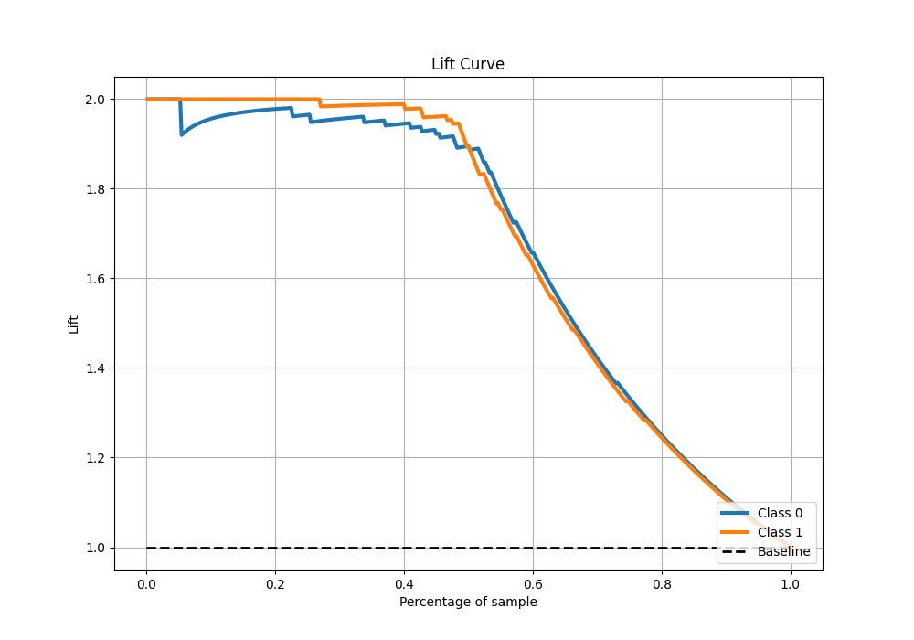

# Summary of 47_Xgboost_SelectedFeatures

[<< Go back](../README.md)

## Extreme Gradient Boosting (Xgboost)
- **n_jobs**: -1
- **objective**: binary:logistic
- **eta**: 0.1
- **max_depth**: 6
- **min_child_weight**: 5
- **subsample**: 1.0
- **colsample_bytree**: 1.0
- **eval_metric**: logloss
- **explain_level**: 1

## Validation
 - **validation_type**: kfold
 - **k_folds**: 5
 - **shuffle**: True
 - **stratify**: True

## Optimized metric
logloss

## Training time

11.4 seconds

## Metric details
|           |    score |    threshold |
|:----------|---------:|-------------:|
| logloss   | 0.165658 | nan          |
| auc       | 0.981084 | nan          |
| f1        | 0.953229 |   0.516514   |
| accuracy  | 0.954148 |   0.516514   |
| precision | 1        |   0.973176   |
| recall    | 1        |   0.00143559 |
| mcc       | 0.908999 |   0.516514   |

## Metric details with threshold from accuracy metric
|           |    score |   threshold |
|:----------|---------:|------------:|
| logloss   | 0.165658 |  nan        |
| auc       | 0.981084 |  nan        |
| f1        | 0.953229 |    0.516514 |
| accuracy  | 0.954148 |    0.516514 |
| precision | 0.972727 |    0.516514 |
| recall    | 0.934498 |    0.516514 |
| mcc       | 0.908999 |    0.516514 |

## Confusion matrix (at threshold=0.516514)
|              |   Predicted as 0 |   Predicted as 1 |
|:-------------|-----------------:|-----------------:|
| Labeled as 0 |              223 |                6 |
| Labeled as 1 |               15 |              214 |

## Learning curves

## Permutation-based Importance

## Confusion Matrix

## Normalized Confusion Matrix

## ROC Curve

## Kolmogorov-Smirnov Statistic

## Precision-Recall Curve

## Calibration Curve

## Cumulative Gains Curve

## Lift Curve

[<< Go back](../README.md)
