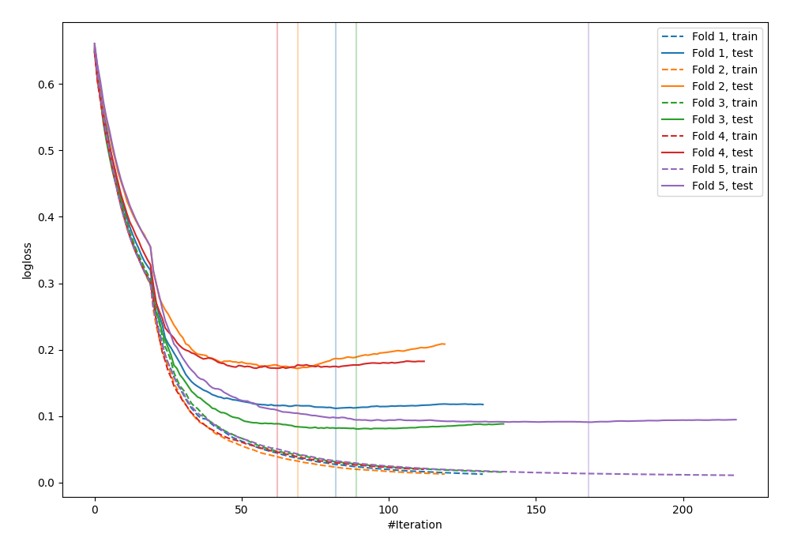
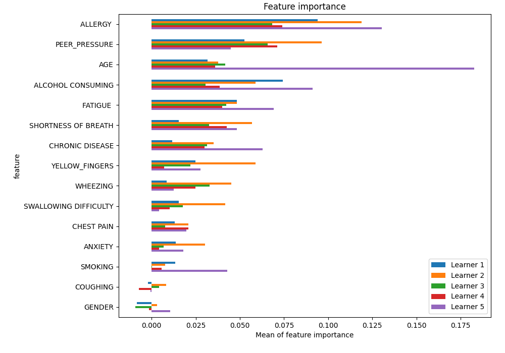
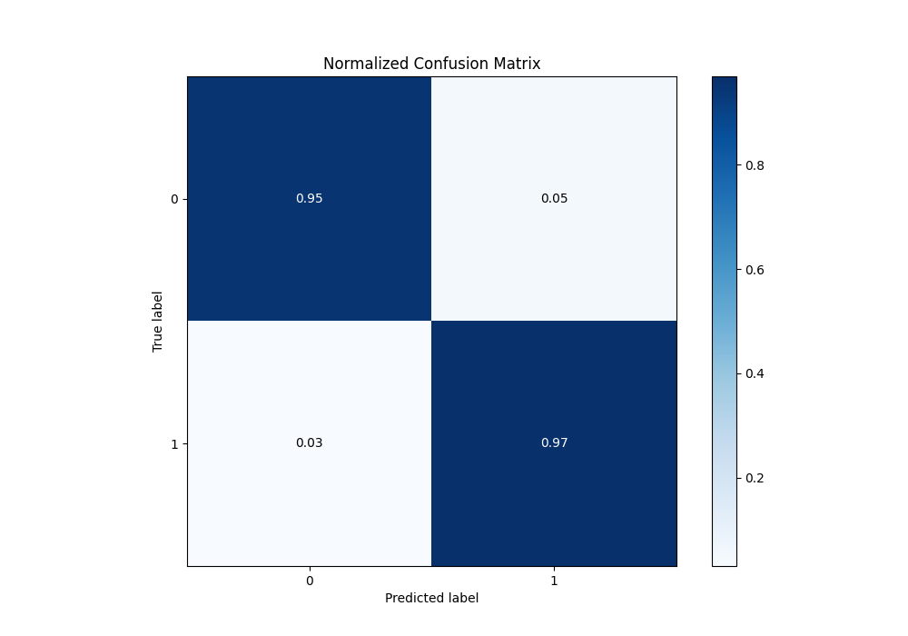
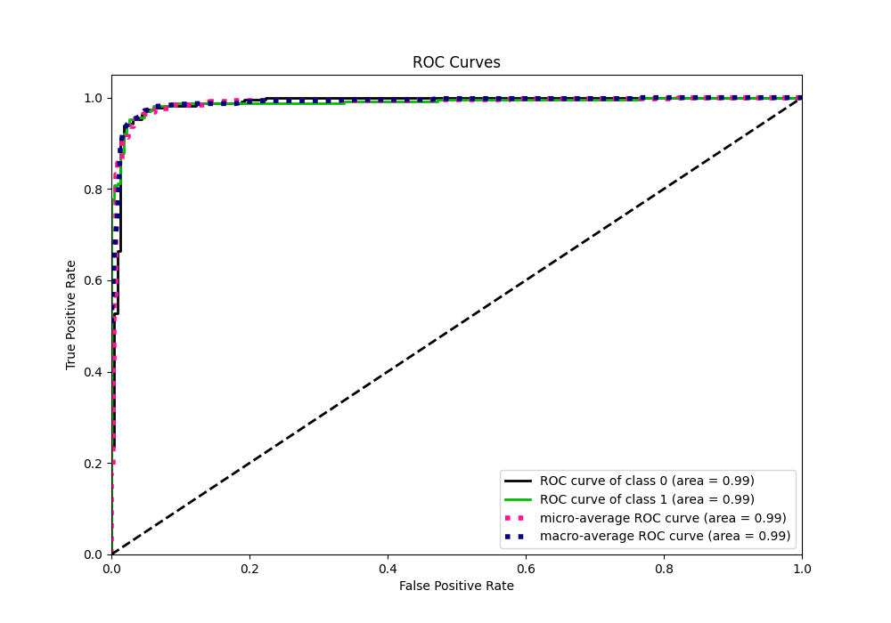
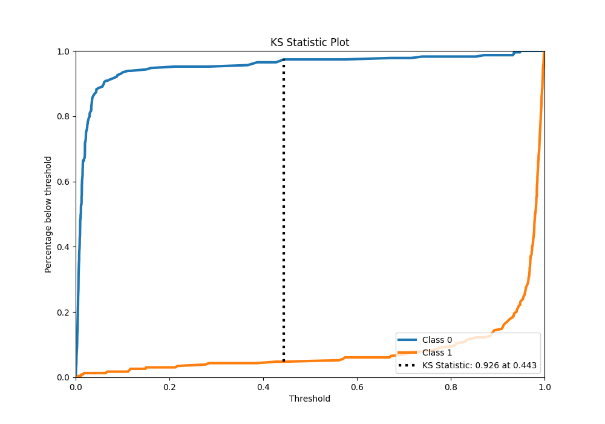
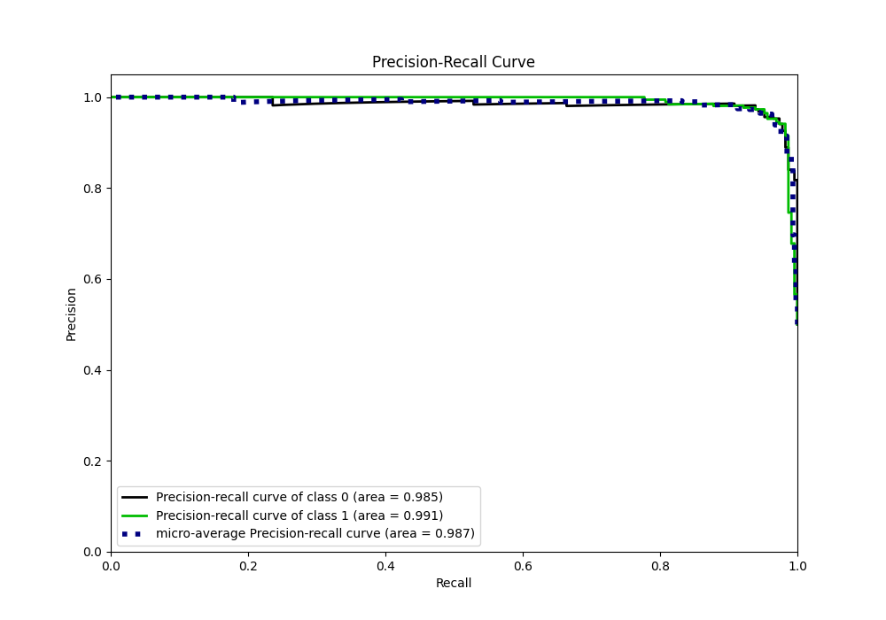
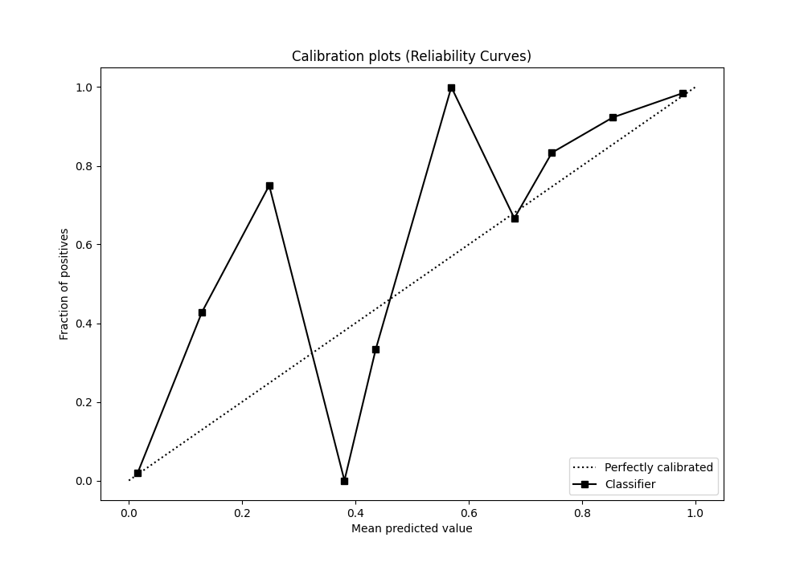
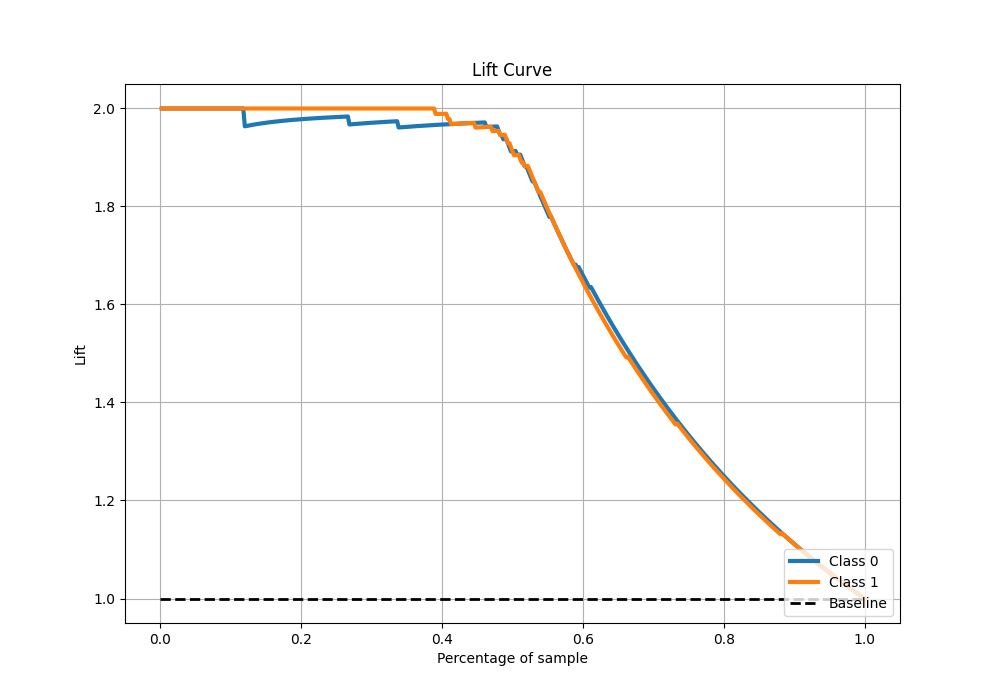

# Summary of 4_Default_CatBoost

[<< Go back](../README.md)

## CatBoost
- **n_jobs**: -1
- **learning_rate**: 0.1
- **depth**: 6
- **rsm**: 1
- **loss_function**: Logloss
- **eval_metric**: Logloss
- **explain_level**: 1

## Validation
 - **validation_type**: kfold
 - **k_folds**: 5
 - **shuffle**: True
 - **stratify**: True

## Optimized metric
logloss

## Training time

4.5 seconds

## Metric details
|           |    score |     threshold |
|:----------|---------:|--------------:|
| logloss   | 0.125332 | nan           |
| auc       | 0.988654 | nan           |
| f1        | 0.961039 |   0.21499     |
| accuracy  | 0.960699 |   0.21499     |
| precision | 1        |   0.948345    |
| recall    | 1        |   0.000334563 |
| mcc       | 0.921538 |   0.21499     |

## Metric details with threshold from accuracy metric
|           |    score |   threshold |
|:----------|---------:|------------:|
| logloss   | 0.125332 |   nan       |
| auc       | 0.988654 |   nan       |
| f1        | 0.961039 |     0.21499 |
| accuracy  | 0.960699 |     0.21499 |
| precision | 0.95279  |     0.21499 |
| recall    | 0.969432 |     0.21499 |
| mcc       | 0.921538 |     0.21499 |

## Confusion matrix (at threshold=0.21499)
|              |   Predicted as 0 |   Predicted as 1 |
|:-------------|-----------------:|-----------------:|
| Labeled as 0 |              218 |               11 |
| Labeled as 1 |                7 |              222 |

## Learning curves

## Permutation-based Importance

## Confusion Matrix

## Normalized Confusion Matrix

## ROC Curve

## Kolmogorov-Smirnov Statistic

## Precision-Recall Curve

## Calibration Curve

## Cumulative Gains Curve

## Lift Curve

[<< Go back](../README.md)
