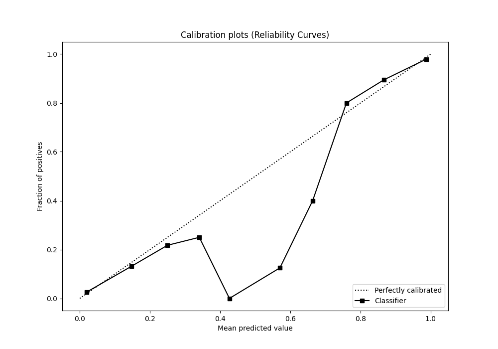

# Summary of 50_NeuralNetwork_SelectedFeatures

[<< Go back](../README.md)

## Neural Network
- **n_jobs**: -1
- **dense_1_size**: 64
- **dense_2_size**: 32
- **learning_rate**: 0.05
- **explain_level**: 1

## Validation
 - **validation_type**: kfold
 - **k_folds**: 5
 - **shuffle**: True
 - **stratify**: True

## Optimized metric
logloss

## Training time

10.2 seconds

## Metric details
|           |    score |     threshold |
|:----------|---------:|--------------:|
| logloss   | 0.178132 | nan           |
| auc       | 0.979024 | nan           |
| f1        | 0.942222 |   0.664605    |
| accuracy  | 0.943231 |   0.664605    |
| precision | 1        |   0.957771    |
| recall    | 1        |   1.52079e-05 |
| mcc       | 0.887004 |   0.664605    |

## Metric details with threshold from accuracy metric
|           |    score |   threshold |
|:----------|---------:|------------:|
| logloss   | 0.178132 |  nan        |
| auc       | 0.979024 |  nan        |
| f1        | 0.942222 |    0.664605 |
| accuracy  | 0.943231 |    0.664605 |
| precision | 0.959276 |    0.664605 |
| recall    | 0.925764 |    0.664605 |
| mcc       | 0.887004 |    0.664605 |

## Confusion matrix (at threshold=0.664605)
|              |   Predicted as 0 |   Predicted as 1 |
|:-------------|-----------------:|-----------------:|
| Labeled as 0 |              220 |                9 |
| Labeled as 1 |               17 |              212 |

## Learning curves

## Permutation-based Importance

## Confusion Matrix

## Normalized Confusion Matrix

## ROC Curve

## Kolmogorov-Smirnov Statistic

## Precision-Recall Curve

## Calibration Curve

## Cumulative Gains Curve

## Lift Curve

[<< Go back](../README.md)
