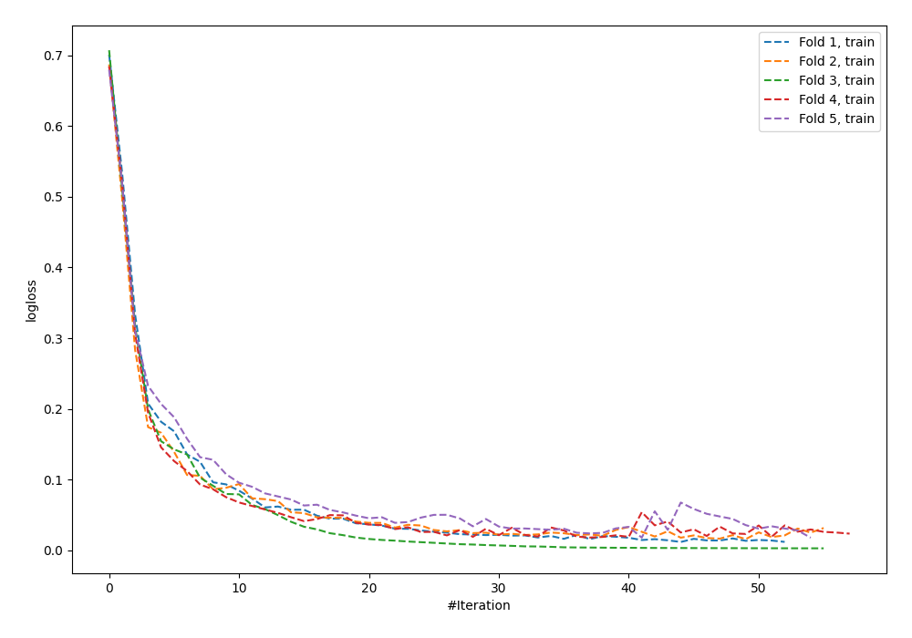
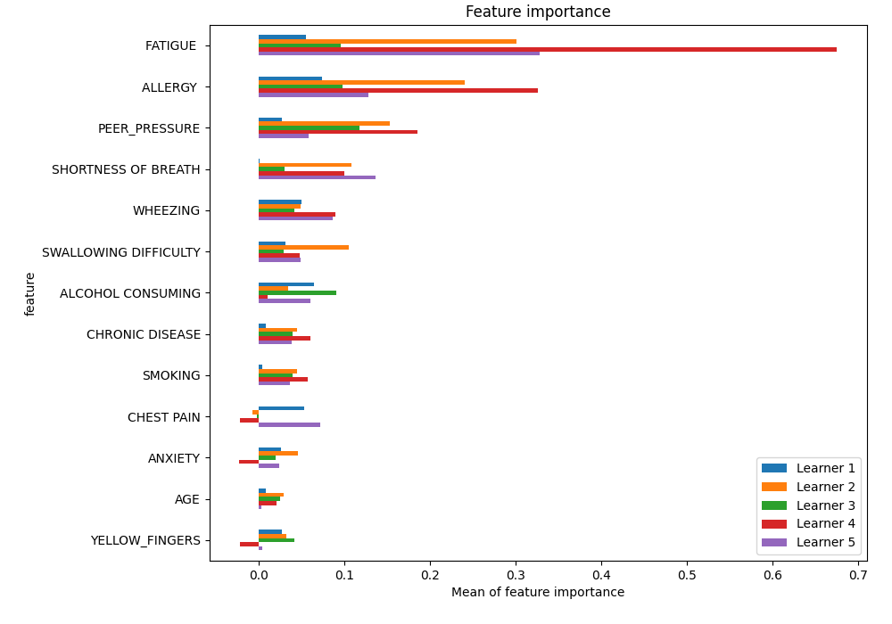
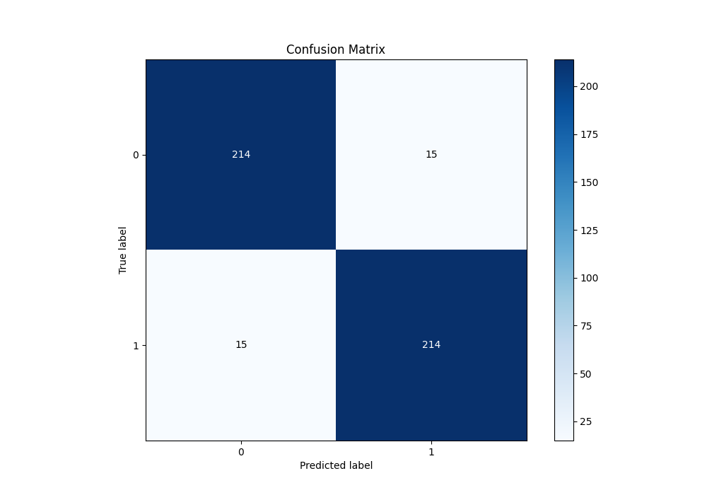
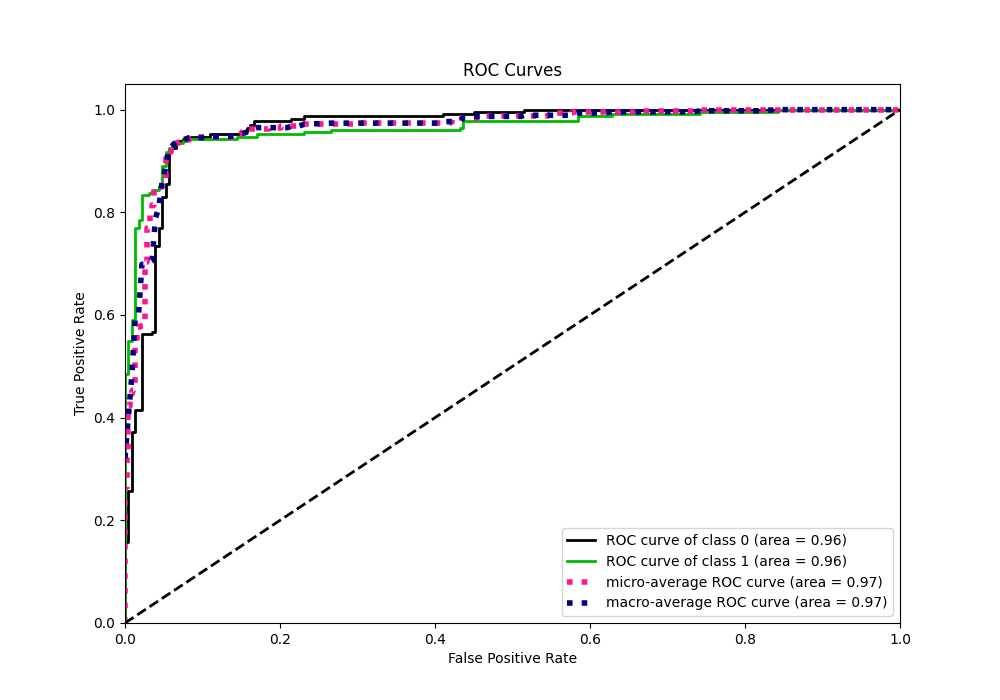
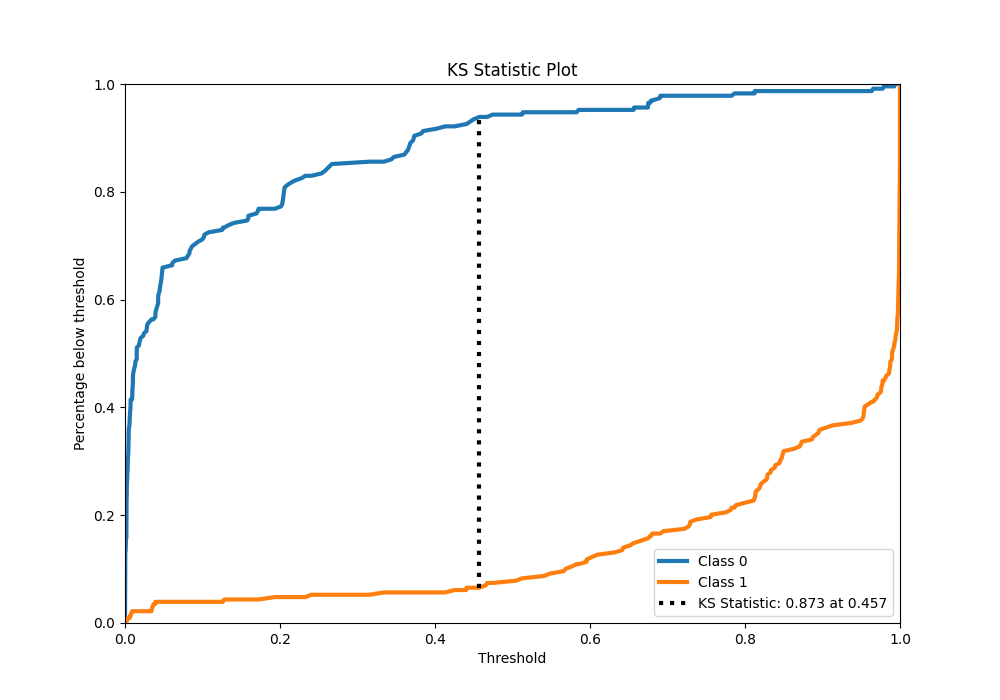
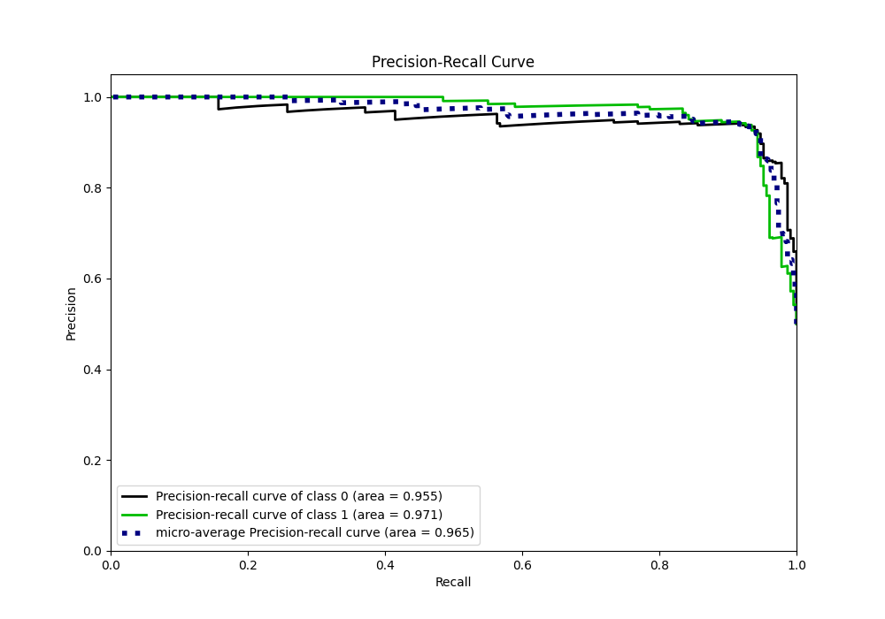
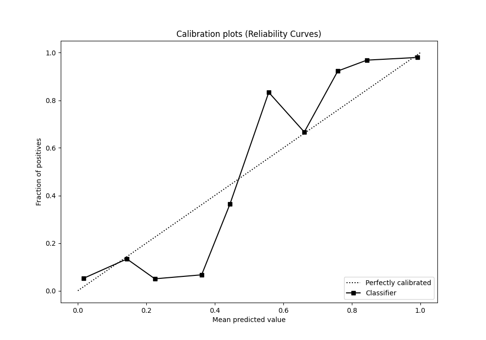
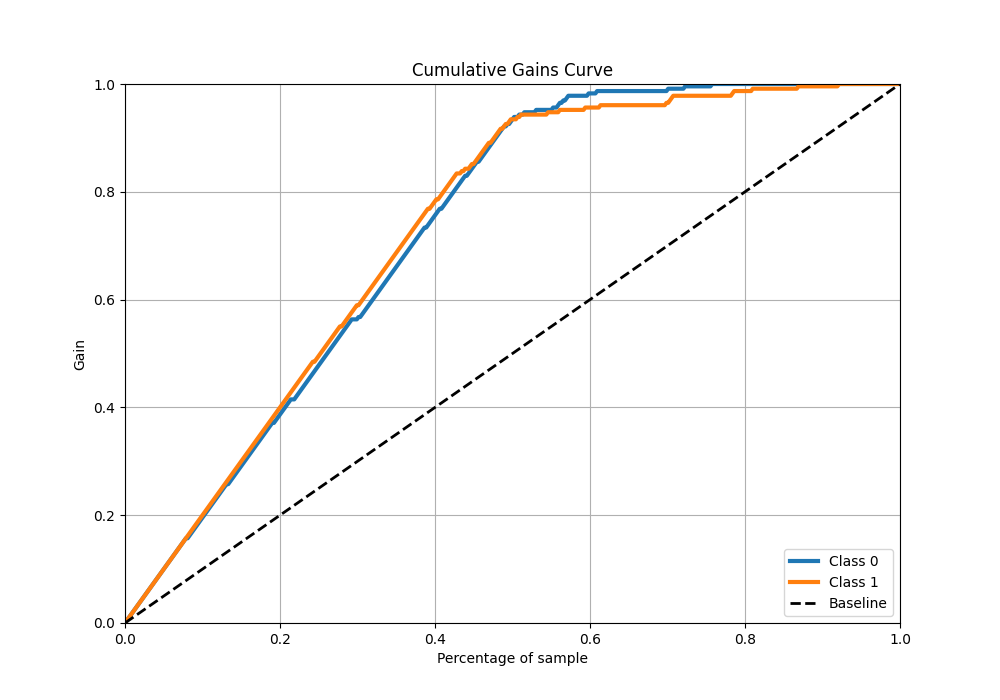
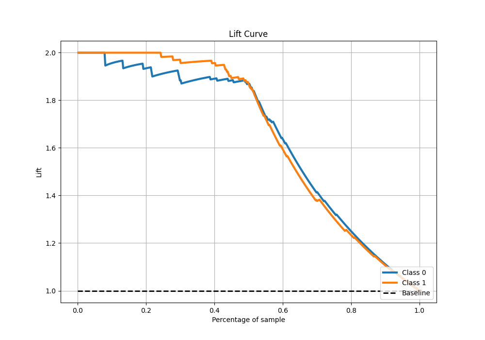

# Summary of 51_NeuralNetwork_SelectedFeatures

[<< Go back](../README.md)

## Neural Network
- **n_jobs**: -1
- **dense_1_size**: 16
- **dense_2_size**: 16
- **learning_rate**: 0.05
- **explain_level**: 1

## Validation
 - **validation_type**: kfold
 - **k_folds**: 5
 - **shuffle**: True
 - **stratify**: True

## Optimized metric
logloss

## Training time

9.6 seconds

## Metric details
|           |    score |     threshold |
|:----------|---------:|--------------:|
| logloss   | 0.249332 | nan           |
| auc       | 0.964112 | nan           |
| f1        | 0.934498 |   0.453542    |
| accuracy  | 0.934498 |   0.453542    |
| precision | 1        |   0.99398     |
| recall    | 1        |   1.31145e-05 |
| mcc       | 0.869128 |   0.489579    |

## Metric details with threshold from accuracy metric
|           |    score |   threshold |
|:----------|---------:|------------:|
| logloss   | 0.249332 |  nan        |
| auc       | 0.964112 |  nan        |
| f1        | 0.934498 |    0.453542 |
| accuracy  | 0.934498 |    0.453542 |
| precision | 0.934498 |    0.453542 |
| recall    | 0.934498 |    0.453542 |
| mcc       | 0.868996 |    0.453542 |

## Confusion matrix (at threshold=0.453542)
|              |   Predicted as 0 |   Predicted as 1 |
|:-------------|-----------------:|-----------------:|
| Labeled as 0 |              214 |               15 |
| Labeled as 1 |               15 |              214 |

## Learning curves

## Permutation-based Importance

## Confusion Matrix

## Normalized Confusion Matrix

## ROC Curve

## Kolmogorov-Smirnov Statistic

## Precision-Recall Curve

## Calibration Curve

## Cumulative Gains Curve

## Lift Curve

[<< Go back](../README.md)
