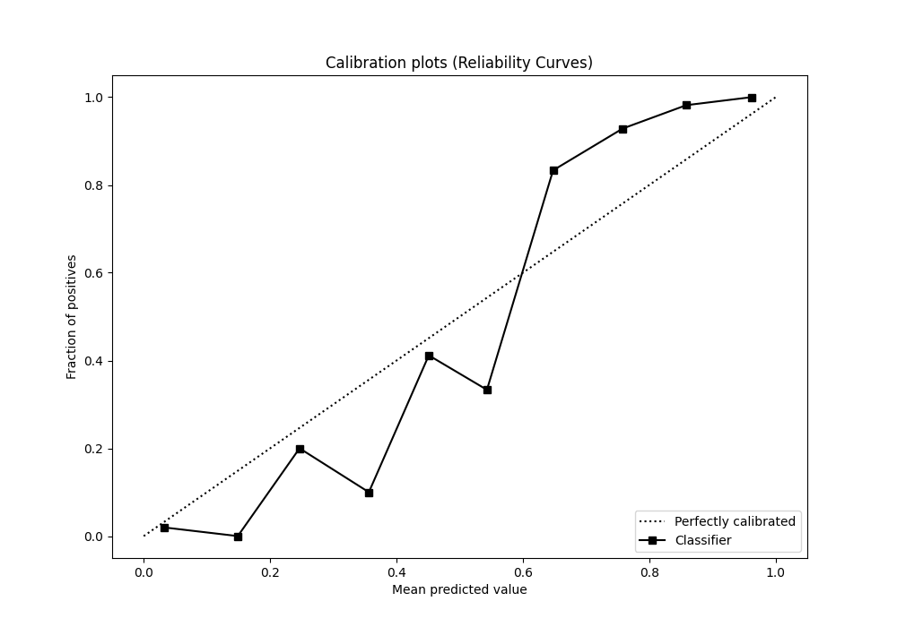

# Summary of 54_RandomForest_SelectedFeatures

[<< Go back](../README.md)

## Random Forest
- **n_jobs**: -1
- **criterion**: entropy
- **max_features**: 0.5
- **min_samples_split**: 20
- **max_depth**: 4
- **eval_metric_name**: logloss
- **explain_level**: 1

## Validation
 - **validation_type**: kfold
 - **k_folds**: 5
 - **shuffle**: True
 - **stratify**: True

## Optimized metric
logloss

## Training time

12.8 seconds

## Metric details
|           |    score |   threshold |
|:----------|---------:|------------:|
| logloss   | 0.206369 | nan         |
| auc       | 0.980674 | nan         |
| f1        | 0.944812 |   0.534069  |
| accuracy  | 0.945415 |   0.534069  |
| precision | 1        |   0.839682  |
| recall    | 1        |   0.0067978 |
| mcc       | 0.891042 |   0.534069  |

## Metric details with threshold from accuracy metric
|           |    score |   threshold |
|:----------|---------:|------------:|
| logloss   | 0.206369 |  nan        |
| auc       | 0.980674 |  nan        |
| f1        | 0.944812 |    0.534069 |
| accuracy  | 0.945415 |    0.534069 |
| precision | 0.955357 |    0.534069 |
| recall    | 0.934498 |    0.534069 |
| mcc       | 0.891042 |    0.534069 |

## Confusion matrix (at threshold=0.534069)
|              |   Predicted as 0 |   Predicted as 1 |
|:-------------|-----------------:|-----------------:|
| Labeled as 0 |              219 |               10 |
| Labeled as 1 |               15 |              214 |

## Learning curves

## Permutation-based Importance

## Confusion Matrix

## Normalized Confusion Matrix

## ROC Curve

## Kolmogorov-Smirnov Statistic

## Precision-Recall Curve

## Calibration Curve

## Cumulative Gains Curve

## Lift Curve

[<< Go back](../README.md)
