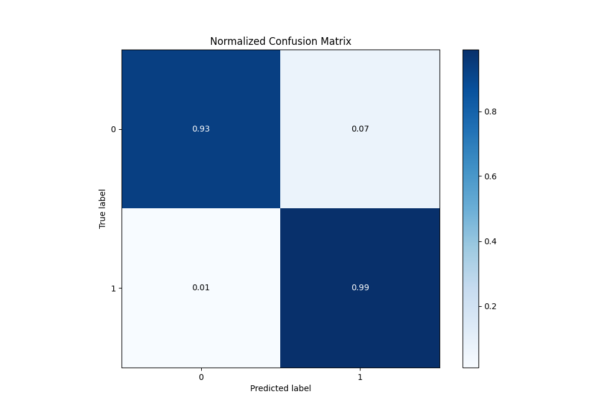

# Summary of Ensemble

[<< Go back](../README.md)

## Ensemble structure
| Model                             |   Weight |
|:----------------------------------|---------:|
| 12_LightGBM_SelectedFeatures      |        2 |
| 26_NeuralNetwork_SelectedFeatures |        8 |
| 30_LightGBM_SelectedFeatures      |        6 |
| 44_CatBoost_SelectedFeatures      |       21 |
| 49_NeuralNetwork_SelectedFeatures |        3 |
| 50_NeuralNetwork_SelectedFeatures |        1 |

## Metric details
|           |    score |     threshold |
|:----------|---------:|--------------:|
| logloss   | 0.10497  | nan           |
| auc       | 0.993745 | nan           |
| f1        | 0.961702 |   0.154249    |
| accuracy  | 0.960699 |   0.154249    |
| precision | 1        |   0.930698    |
| recall    | 1        |   0.000247398 |
| mcc       | 0.922665 |   0.154249    |

## Metric details with threshold from accuracy metric
|           |    score |   threshold |
|:----------|---------:|------------:|
| logloss   | 0.10497  |  nan        |
| auc       | 0.993745 |  nan        |
| f1        | 0.961702 |    0.154249 |
| accuracy  | 0.960699 |    0.154249 |
| precision | 0.937759 |    0.154249 |
| recall    | 0.9869   |    0.154249 |
| mcc       | 0.922665 |    0.154249 |

## Confusion matrix (at threshold=0.154249)
|              |   Predicted as 0 |   Predicted as 1 |
|:-------------|-----------------:|-----------------:|
| Labeled as 0 |              214 |               15 |
| Labeled as 1 |                3 |              226 |

## Learning curves

## Confusion Matrix

## Normalized Confusion Matrix

## ROC Curve

## Kolmogorov-Smirnov Statistic

## Precision-Recall Curve

## Calibration Curve

## Cumulative Gains Curve

## Lift Curve

[<< Go back](../README.md)
