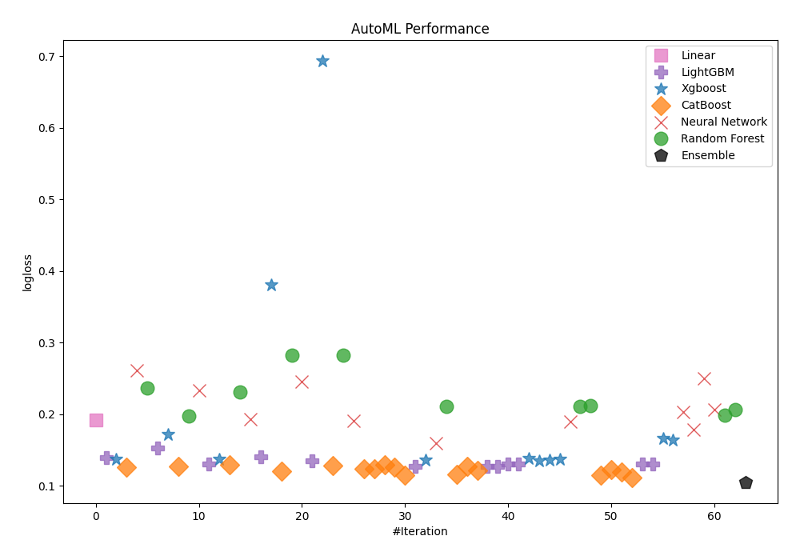
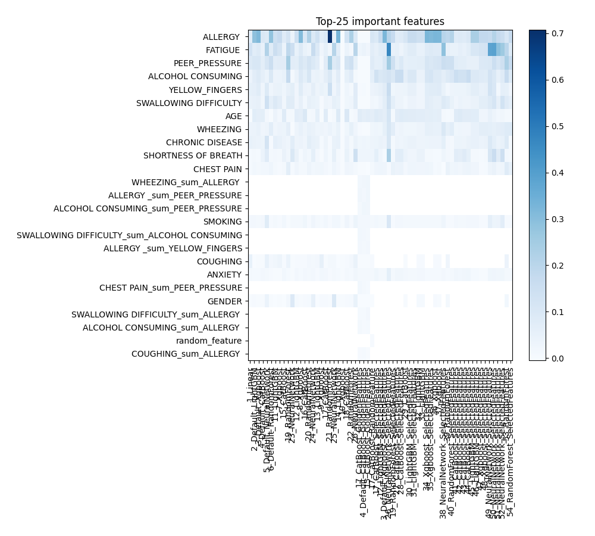
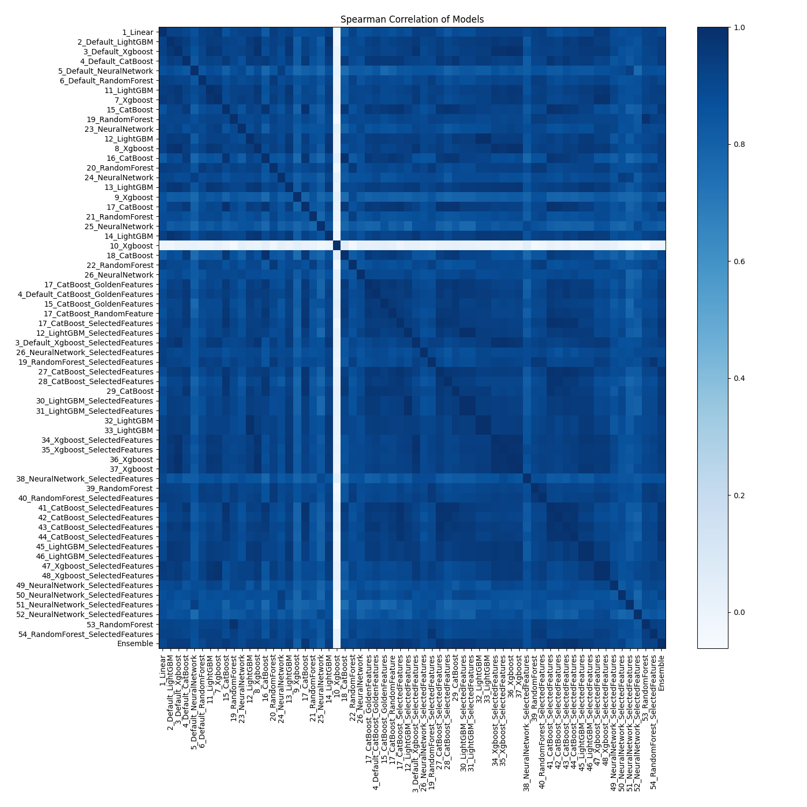

# AutoML Leaderboard

| Best model   | name                                                                               | model_type     | metric_type   |   metric_value |   train_time |   single_prediction_time |
|:-------------|:-----------------------------------------------------------------------------------|:---------------|:--------------|---------------:|-------------:|-------------------------:|
|              | [1_Linear](1_Linear/README.md)                                                     | Linear         | logloss       |       0.192042 |        14.19 |                   0.042  |
|              | [2_Default_LightGBM](2_Default_LightGBM/README.md)                                 | LightGBM       | logloss       |       0.13902  |         5.93 |                   0.0168 |
|              | [3_Default_Xgboost](3_Default_Xgboost/README.md)                                   | Xgboost        | logloss       |       0.1365   |         8.05 |                   0.016  |
|              | [4_Default_CatBoost](4_Default_CatBoost/README.md)                                 | CatBoost       | logloss       |       0.125332 |         5.19 |                   0.0165 |
|              | [5_Default_NeuralNetwork](5_Default_NeuralNetwork/README.md)                       | Neural Network | logloss       |       0.261498 |         4.51 |                   0.041  |
|              | [6_Default_RandomForest](6_Default_RandomForest/README.md)                         | Random Forest  | logloss       |       0.236473 |         7.58 |                   0.165  |
|              | [11_LightGBM](11_LightGBM/README.md)                                               | LightGBM       | logloss       |       0.152876 |         6.06 |                   0.0135 |
|              | [7_Xgboost](7_Xgboost/README.md)                                                   | Xgboost        | logloss       |       0.171097 |         6.54 |                   0.0158 |
|              | [15_CatBoost](15_CatBoost/README.md)                                               | CatBoost       | logloss       |       0.12676  |         8.29 |                   0.017  |
|              | [19_RandomForest](19_RandomForest/README.md)                                       | Random Forest  | logloss       |       0.197129 |        10.01 |                   0.1383 |
|              | [23_NeuralNetwork](23_NeuralNetwork/README.md)                                     | Neural Network | logloss       |       0.232964 |         5.38 |                   0.0523 |
|              | [12_LightGBM](12_LightGBM/README.md)                                               | LightGBM       | logloss       |       0.130602 |         6.08 |                   0.012  |
|              | [8_Xgboost](8_Xgboost/README.md)                                                   | Xgboost        | logloss       |       0.13694  |         6.03 |                   0.0188 |
|              | [16_CatBoost](16_CatBoost/README.md)                                               | CatBoost       | logloss       |       0.129666 |         7.96 |                   0.0144 |
|              | [20_RandomForest](20_RandomForest/README.md)                                       | Random Forest  | logloss       |       0.230631 |         9.4  |                   0.1384 |
|              | [24_NeuralNetwork](24_NeuralNetwork/README.md)                                     | Neural Network | logloss       |       0.192402 |         6.17 |                   0.0421 |
|              | [13_LightGBM](13_LightGBM/README.md)                                               | LightGBM       | logloss       |       0.140203 |         6.97 |                   0.0131 |
|              | [9_Xgboost](9_Xgboost/README.md)                                                   | Xgboost        | logloss       |       0.381057 |         6.72 |                   0.0181 |
|              | [17_CatBoost](17_CatBoost/README.md)                                               | CatBoost       | logloss       |       0.120144 |         7.32 |                   0.0138 |
|              | [21_RandomForest](21_RandomForest/README.md)                                       | Random Forest  | logloss       |       0.281769 |        10.33 |                   0.1615 |
|              | [25_NeuralNetwork](25_NeuralNetwork/README.md)                                     | Neural Network | logloss       |       0.244839 |         6.8  |                   0.0351 |
|              | [14_LightGBM](14_LightGBM/README.md)                                               | LightGBM       | logloss       |       0.134268 |         8.15 |                   0.0129 |
|              | [10_Xgboost](10_Xgboost/README.md)                                                 | Xgboost        | logloss       |       0.693123 |         6.15 |                   0.0157 |
|              | [18_CatBoost](18_CatBoost/README.md)                                               | CatBoost       | logloss       |       0.128354 |         8.59 |                   0.0212 |
|              | [22_RandomForest](22_RandomForest/README.md)                                       | Random Forest  | logloss       |       0.282002 |        10.83 |                   0.1673 |
|              | [26_NeuralNetwork](26_NeuralNetwork/README.md)                                     | Neural Network | logloss       |       0.190663 |         6.95 |                   0.0432 |
|              | [17_CatBoost_GoldenFeatures](17_CatBoost_GoldenFeatures/README.md)                 | CatBoost       | logloss       |       0.123813 |         8.65 |                   0.0347 |
|              | [4_Default_CatBoost_GoldenFeatures](4_Default_CatBoost_GoldenFeatures/README.md)   | CatBoost       | logloss       |       0.123543 |         8.29 |                   0.048  |
|              | [15_CatBoost_GoldenFeatures](15_CatBoost_GoldenFeatures/README.md)                 | CatBoost       | logloss       |       0.129454 |        10.4  |                   0.0416 |
|              | [17_CatBoost_RandomFeature](17_CatBoost_RandomFeature/README.md)                   | CatBoost       | logloss       |       0.125614 |         9.27 |                   0.0223 |
|              | [17_CatBoost_SelectedFeatures](17_CatBoost_SelectedFeatures/README.md)             | CatBoost       | logloss       |       0.11511  |         8.66 |                   0.0148 |
|              | [12_LightGBM_SelectedFeatures](12_LightGBM_SelectedFeatures/README.md)             | LightGBM       | logloss       |       0.126824 |         8.88 |                   0.0197 |
|              | [3_Default_Xgboost_SelectedFeatures](3_Default_Xgboost_SelectedFeatures/README.md) | Xgboost        | logloss       |       0.135841 |         8.68 |                   0.0303 |
|              | [26_NeuralNetwork_SelectedFeatures](26_NeuralNetwork_SelectedFeatures/README.md)   | Neural Network | logloss       |       0.159097 |         7.93 |                   0.0448 |
|              | [19_RandomForest_SelectedFeatures](19_RandomForest_SelectedFeatures/README.md)     | Random Forest  | logloss       |       0.21026  |        11.56 |                   0.1325 |
|              | [27_CatBoost_SelectedFeatures](27_CatBoost_SelectedFeatures/README.md)             | CatBoost       | logloss       |       0.115485 |         8.83 |                   0.0219 |
|              | [28_CatBoost_SelectedFeatures](28_CatBoost_SelectedFeatures/README.md)             | CatBoost       | logloss       |       0.12736  |        10.02 |                   0.017  |
|              | [29_CatBoost](29_CatBoost/README.md)                                               | CatBoost       | logloss       |       0.120864 |         9.01 |                   0.0177 |
|              | [30_LightGBM_SelectedFeatures](30_LightGBM_SelectedFeatures/README.md)             | LightGBM       | logloss       |       0.126824 |         9.11 |                   0.0138 |
|              | [31_LightGBM_SelectedFeatures](31_LightGBM_SelectedFeatures/README.md)             | LightGBM       | logloss       |       0.126824 |         9.07 |                   0.0123 |
|              | [32_LightGBM](32_LightGBM/README.md)                                               | LightGBM       | logloss       |       0.130602 |         9.15 |                   0.0137 |
|              | [33_LightGBM](33_LightGBM/README.md)                                               | LightGBM       | logloss       |       0.130602 |         9.24 |                   0.0136 |
|              | [34_Xgboost_SelectedFeatures](34_Xgboost_SelectedFeatures/README.md)               | Xgboost        | logloss       |       0.138084 |         9.43 |                   0.0212 |
|              | [35_Xgboost_SelectedFeatures](35_Xgboost_SelectedFeatures/README.md)               | Xgboost        | logloss       |       0.13483  |         9.38 |                   0.0166 |
|              | [36_Xgboost](36_Xgboost/README.md)                                                 | Xgboost        | logloss       |       0.136081 |        10.38 |                   0.016  |
|              | [37_Xgboost](37_Xgboost/README.md)                                                 | Xgboost        | logloss       |       0.137424 |         9.55 |                   0.0146 |
|              | [38_NeuralNetwork_SelectedFeatures](38_NeuralNetwork_SelectedFeatures/README.md)   | Neural Network | logloss       |       0.189926 |         9.05 |                   0.0358 |
|              | [39_RandomForest](39_RandomForest/README.md)                                       | Random Forest  | logloss       |       0.210377 |        12.53 |                   0.1249 |
|              | [40_RandomForest_SelectedFeatures](40_RandomForest_SelectedFeatures/README.md)     | Random Forest  | logloss       |       0.211415 |        13.5  |                   0.1831 |
|              | [41_CatBoost_SelectedFeatures](41_CatBoost_SelectedFeatures/README.md)             | CatBoost       | logloss       |       0.114777 |        11.26 |                   0.0229 |
|              | [42_CatBoost_SelectedFeatures](42_CatBoost_SelectedFeatures/README.md)             | CatBoost       | logloss       |       0.122772 |        10.36 |                   0.0184 |
|              | [43_CatBoost_SelectedFeatures](43_CatBoost_SelectedFeatures/README.md)             | CatBoost       | logloss       |       0.118655 |        11.15 |                   0.0237 |
|              | [44_CatBoost_SelectedFeatures](44_CatBoost_SelectedFeatures/README.md)             | CatBoost       | logloss       |       0.111754 |        10.41 |                   0.0159 |
|              | [45_LightGBM_SelectedFeatures](45_LightGBM_SelectedFeatures/README.md)             | LightGBM       | logloss       |       0.130249 |        10.81 |                   0.0148 |
|              | [46_LightGBM_SelectedFeatures](46_LightGBM_SelectedFeatures/README.md)             | LightGBM       | logloss       |       0.130249 |        11.08 |                   0.0125 |
|              | [47_Xgboost_SelectedFeatures](47_Xgboost_SelectedFeatures/README.md)               | Xgboost        | logloss       |       0.165658 |        12.23 |                   0.0175 |
|              | [48_Xgboost_SelectedFeatures](48_Xgboost_SelectedFeatures/README.md)               | Xgboost        | logloss       |       0.163618 |        13.03 |                   0.0176 |
|              | [49_NeuralNetwork_SelectedFeatures](49_NeuralNetwork_SelectedFeatures/README.md)   | Neural Network | logloss       |       0.203407 |        10.54 |                   0.0333 |
|              | [50_NeuralNetwork_SelectedFeatures](50_NeuralNetwork_SelectedFeatures/README.md)   | Neural Network | logloss       |       0.178132 |        10.94 |                   0.0357 |
|              | [51_NeuralNetwork_SelectedFeatures](51_NeuralNetwork_SelectedFeatures/README.md)   | Neural Network | logloss       |       0.249332 |        10.38 |                   0.0332 |
|              | [52_NeuralNetwork_SelectedFeatures](52_NeuralNetwork_SelectedFeatures/README.md)   | Neural Network | logloss       |       0.206625 |        10.83 |                   0.0441 |
|              | [53_RandomForest](53_RandomForest/README.md)                                       | Random Forest  | logloss       |       0.198354 |        14.86 |                   0.1326 |
|              | [54_RandomForest_SelectedFeatures](54_RandomForest_SelectedFeatures/README.md)     | Random Forest  | logloss       |       0.206369 |        13.63 |                   0.1571 |
| **the best** | [Ensemble](Ensemble/README.md)                                                     | Ensemble       | logloss       |       0.10497  |        15.52 |                   0.1125 |

### AutoML Performance

### AutoML Performance Boxplot

### Features Importance

### Spearman Correlation of Models

